# 课程大纲：

1、(优先级2)项目的概念、项目管理的历史

2、(优先级2)项目经理的工作内容、相关技能

3、(优先级1)项目的生命周期

4、(优先级1)项目管理工具

5、(优先级3)项目管理的类型：瀑布项目管理、敏捷项目管理、敏捷软件项目管理（scrum）

# 1. 项目的概念

## 1.1. What Is a Project?

### 定义

**Definition**：

​	为了创造**独特**的产品、服务或**结果**而进行的**临时**努力

**下面分解下概念：**

* time：

​	和例行工作不同的是他有明确的**start date**和**end date**。

* goal：

​	 这个目标通常不是日常目标,而是一些**战略性**的目标,以公司来说这个goal可能会是一款产品能让公司处于行业领先地位。

​	scope=goal+work（可以理解为怎么实现目标）

* cost：

​	为专门完成目标的**资源**

### 项目的管理的三角约束

time、scope、cost

比如你想缩短项目的时间那么就需要减少产出或加大cost

### 为什么公司要执行项目

为了实现商业目的(goal),可能需要投入一些资源(cost或者resource)。更简单的说是effort to benefits。

**常见的resources:**

* financial resource：很直接,就是钱

* organization resources：包括人员、设备等
* time：这是一个很重要的因素,抢先的时间可能就能占领市场。因此可能需要考虑任务的优先级,哪些要推迟哪些要放弃

**常见的benefits:**

* financial：很直接,就是钱
* operational：运营效率
* customer related：可以理解为声誉
* non-profit：比如一些慈善等

### 如何定优先级以及项目选择

常见的需求来源（可以说是理由,一定程度上也是价值）：

- 市场需要：比如开发手机银行,如果一直采用线下服务那么可能会失去客户
- 商业需要：比如面对金融危机,企业需要现金流那么可能需要降本增效
- 技术进步：比如商城的扫码下单,能够提高效率
- 客户需求：一些关键客户可能你需要满足他们的需求
- 法律要求：比如隐私政策的变化,如果没有及时发现那么就可能会面临损失
- 社会需求：政府要考虑的,比如某些基建
- 生态环境改善：比如国家的谈排放指标

如何选择项目以及定优先级：

​	一般来说是两个方面：**价值**和**紧急程度**。常规来说要么项目经理去**说服**管理层要资源,要么是**迫切**的任务。

项目组合管理(Project Portfolio Management):

​	对于管理层而言很可能同时有项目要同时进行,那么他们就要进行**优先级**的选择,并且为项目进行合理的**资源分配**。

## 1.2. What Is Project Manager?

### 项目经理的职责

整体而言:项目经理的职责是在指定时间(time)内利用有限的资源(cost)完成项目(goal)。

以下是一些注意点：

1、项目经理需要**评估**资源和时间能否完成目标, 总之要确保项目三角约束的平衡。

2、项目经理需要对项目的相关工作有**控制权**和**可视性**，在发现事情没有按照计划进展时**立刻**采取行动，并在现场帮助其他人**克服**障碍，保持他们的积极性并让他们在个人的日常职责上。

###  项目经理的技能(skill)和知识(knowledge)

#### 技术技能和知识（technical skills and knowledge）：

* pm triple：项目三角的关系,时间、资源、目标
* theoretical framework：项目的周期,开始(Initiation)、策划(Planning)、执行（Execution）跟踪和管控(M&C)、结束(Closure)
* pm tool and document：各种工具
* personal organization：安排自己任务的能力
* task management：拆分任务,确定有限次序,分配跟紧并完成任务
* critical thinkings：过滤出有效的信息并做出正确的决定
* basic software：利用办公软件跟踪和演示文档 

#### 人际关系处理能力(interpersonal (soft)skills)

* communication：占了90%的时间,主要是在定会议,处理邮件,和成员会面
* team management：了解团队是否按照预期进行工作，保持团队的积极性
* leadership：和管理人员**谈判**和**调节冲突**
* social skills：可能会和各种人打交道,注意不要只谈工作内容,可以聊聊其他比如个人兴趣、爱好和运动,也要保持幽默，整体而言是为了**建立信任**、**缓解压力**、**更好的组建团队**。

#### 行业经验（industry experience）：

行业技能是有用的：

- 更好的规划
- 更少的不确定性
- 预测风险
- 更好的交流

# 2. 项目经理的工作内容、相关技能

## 2.1. What Are the 5 Steps In the Project Management Process?

### Project Initiation

这是项目的起始阶段，项目经理必须通过一系列项目管理文件来证明项目具有**价值**并且是**可行的**。以下是最重要的几个：

* 业务案例：业务案例证明了项目的**必要性**、项目**目标**和投资**回报**。 

* 可行性研究：可行性研究证明项目可以在合理的**时间**和**成本**内执行。

* 项目章程：项目章程传达了项目将要**交付的内容**。 

一旦项目获得批准，项目经理必须组建项目团队并建立项目管理办公室。项目启动阶段以项目启动会议结束，该会议是确定项目目标和范围的时候。

###  Project Planning

项目计划阶段的目标是**创建项目计划**，这是一个详细解释项目如何执行的全面项目文档。以下是项目计划中最重要部分的快速概述：

* 项目进度表：项目进度表定义了任务执行的**时间表**和资源分配。

* 项目预算：项目预算是估计的所有项目**成本**的总和。 

* 范围管理计划：解释了项目范围如何在整个项目期间进行**跟踪**。 

* 风险管理计划：解释了可能影响项目的**风险**，以及**风险消减策略**。

* 资源管理计划：描述了资源在项目期间如何获得、分配和管理。 

* 利益相关方管理计划：确定**责任人**的他们的**职责**。 

项目经理通常使用甘特图软件来制定项目计划，它提供了整个项目进度和项目范围的可视化表示。一些甘特图可以自动识别关键路径活动。

### Project Execution

在这个阶段，项目经理需要**确保项目顺利运行**。

根据项目进展**重新分配资源**或**调整时间**和**产出结果**,另外还需要识别并**解决问题**。

### Project Monitoring and Control

这个阶段与项目执行阶段同时进行。它涉及**监视**项目执行活动的进展，以确保项目团队按计划进行并在预算内。质量控制程序被应用以保证质量保障。

报告也是这个项目管理阶段的关键部分。首先，它使得项目经理**跟踪进展**，其次，它在提供了数据证明项目**执行者正在如期的推进项目**。有许多项目管理报告，如项目状态、时间记录、工作负载、分配和费用报告。

### Project Closure

将项目结果**交付**给stakeholders，然后和stakeholders进行经验讨论，哪些地方做得好，哪些地方做得不好，将来哪些地方可以进行**持续改进**。

# 3. 项目的生命周期

## 3.1. Project Initiation

让我们从项目的第一阶段开始，即启动阶段。这个阶段始于一个想法或组织需求，就像我们之前讨论的那些一样。而积极思考的个人或团队，满足这一需求的，就是项目的**发起人**（项目赞助人）。他们的责任是确定项目**是否能够执行**。组织是否有可用**资源**？项目是否能够实现预期的**利益**？他们还负责纳入项目中可能是最重要的人员，即项目经理。重要的是要注意，项目经理可以在此阶段的任何时候被任命，并且必须尽快跟上项目的进展。虽然项目经理可以帮助发起人建立项目的基础并将其推动以获得管理层的批准，但他们不被认为负责我们将要讨论的任务。项目经理的时间重要的是在后续的规划阶段，这会在后面的内容中详细介绍。

 那么，想象一下，在你的城市，有一个全新的零售园区即将开业。所有大品牌都在那里开设分店，而周边的交通设施也非常出色。超级汽车制造商Lambari的首席营销经理看到了市场需求，以跟上竞争并利用这个时髦的新地区。因此，他们希望启动一个项目来应对这一需求。现在，并不是每个项目都需要经历启动阶段，但它们都源于某种需求。在接下来的几节课中，我们将介绍启动阶段的六个方面，这些是潜在项目必须经历的。在本课中，我们将看看项目的目标如何被定义以及清晰、明智的目标对于项目至关重要。

 那么，我们的目标是什么？一个项目需要一个明确的目标。我们需要知道我们要去哪里。此外，我们还必须问，实现这个目标是否需要一个项目？请记住项目的定义：项目是一个**临时**性的举措，经过协议、规划和执行，以实现**特定**的目标。这个举措是**复杂**的，它为组织提供了**利益**，并符合其**战略**。如果会计部门的珍妮（Jenny）正在产假，那么由会计部门来承担她的工作或招聘替代人员。这不应该需要一个项目。有时管理层会试图将简单的任务标记为项目，但这些任务通常不会经过启动阶段的审查。然而，对于那些必须满足**市场需求**的项目，情况又如何呢？如果我们的**目标**是在新的零售园区内拥有一个全新的顶级陈列室，展示我们最新、最先进的汽车，配以经过专业培训的员工，并在展厅建筑方面设定标准，这是否需要一个项目呢？嗯，这个举措是暂时的。它将拥有有限的资源，这是一个复杂的举措，有利于业务，并符合他们成为全球最大汽车公司的战略。对我来说，这听起来像一个令人兴奋的潜在项目，所以让我们一起制定一个商业案例，以便获得批准。

### goal

所以，确定项目是否值得进行是一回事，但接下来的步骤是什么呢？请记住之前提到的项目选择和项目组合管理，董事会会选择值得组织投入时间和资源的项目，这就是**商业案例**发挥作用的地方。其任务是**说服**董事会投资公司资源到这个项目，而不是其他项目。让我们以陈列室的示例来证明它的价值。商业案例必须遵循已经建立的标准，解释项目的目的，因为对于企业来说，它将增加收入，因为新的零售园区肯定会成为城市中寻找顶级产品的**消费者**的地标，它还将增加品牌**知名度**，因为它将获得大量曝光。在商业案例中，您将看到所有的数字和财务分析，以我们的示例为例。陈列室是一项巨大的投资。我们必须提供详细的**财务分析**，所有的**成本**和潜在**收益**都需要仔细估计，所有的财务元素都必须描述，包括预期的收入、支出、通货膨胀、折现、现金流量（如果我们在讨论数百万美元的项目）、利率、税收等。这是应用净现值和回本方法的时候，我们在附加材料部分一中已经讨论过。但不要过分强调，这是项目发起人和高级领导者准备的。然而，如果商业案例获得批准，通常意味着项目正式启动。我们已经有了一个项目，但有一个项目与了解项目中包括的具体内容是不同的。接下来我们将研究项目的范围，再见。

### scope

请记住，我们在课程项目的开头讨论了范围。项目经理擅长把握事物的范围，他们在规划阶段会进行详细的规划，但在这一点上，我们仍然需要了解项目中的**所有事情**，以实现我们的目标。供展示室供暖的是电还是气？这个问题是当地报纸是否应该写一篇关于展厅详细信息的文章，还是将详细信息更新到公司网站。这是否属于范围，有时候不太清楚问题可能会出现，进展到所谓的领域，团队可能**不确定**某些事情是否属于项目的一部分。因此，项目团队和项目经理（如果已经被任命）要**尽力预测**这些领域的出现，并消除任何疑虑，可以聘请来自生产资源开发、人力资源、供应链等领域的项目专家。项目经理和项目发起人的团队专业知识优势，尤其当所需的专业知识可以由项目经理、项目发起人或已经是组织一部分的人员提供时。项目经理的干系人选择一个经理没有义务提出承诺。因此，任何潜在的**启动都会展示出不切实际的情况**，比如芬兰举办世界杯，并希望在主要体育场旁边为来访的球员建造酒店，他们有足够的预算，项目已获批准。项目经理参与并审核发起人提供的信息，得出结论：在比赛开始前的12个月内没有办法完成建设，这对每个人来说都是最佳的结果，因为组织资源将用于实现更有利的预订整个建成酒店的项目。这是一个现实的项目，可行性研究将在下一课中讨论。

### feasibility study

所以，商业案例详细列出了所有财务信息，范围是项目所涉及的指南，现在是进行可行性研究的时候了，正如其名字所暗示的，它是对项目的**目标**、**范围**和**资源**进行分析，以确定项目的成功**是否是可行的**。需要记住，可行性研究是在中至高级别进行的，项目发起人和项目经理需要在启动阶段迅速完成分析，分析的目的是**确认他们是否可以在可用的时间、预算和资源下继续**，但不用担心，更详细的分析和资源准备将在项目执行过程中进行。目前，项目发起人必须要求组织提供所需的预算、时间、员工和管理关注，以便执行项目。他们是否拥有所需的专业知识，例如工程、培训、项目管理、信息技术等，或者是否需要引入合作伙伴公司？如果需要，那么应该选择哪些合作伙伴公司，以及如何最好地采购资源？例如，Lamari需要为我们提供管理陈列室的新员工，人力资源需要分配人员来**招聘员工**，他们的市场团队需要额外的资源来进行广告宣传，他们需要雇佣**承包商**来进行建筑工作。执行一个项目涉及许多领域，我们必须考虑它们之间的联系，为了使项目继续进行，我们需要**获取所有所需的信息**，以确定我们的项目是否可行，这是一个简单的问题，但其过程并不简单。让我们假设我们对上述问题有了积极的答案，那么接下来就是进行风险评估和期望。下一个重要的任务是准备好承担项目。我们将在下次见面时继续讨论。

### risks,assumption,expectation

**原文:**

项目是可行的。组织拥有执行项目所需的资源。但那些看不见的事情呢？用类比来说，进入一个黑暗的房间时，首先要做的是找到开关。在项目管理术语中，这意味着要**揭示风险**。我们处理不确定性的方式无疑会影响项目是否成功。或者我们是否会重新关上灯，然后抱着最好的希望？**风险必须被识别、分析和应对**。虽然我们将在规划阶段进行更详细的讨论，项目经理也会这样做。但目前，需要解决的一个领域是**每个人的期望**。每个人是否彼此分享相同的愿景？他们是否期望相同的资源？每个人认为谁最终负有责任？这回溯到我们的项目示例。也许我们的某位利益相关者想象我们的陈列室面向家庭，所以期望有更多轿车，而另一位则知道这个城市的这一部分非常畅销豪华跑车，所以期望更多的车型是两厢敞篷车。或者赞助人可能认为员工的招聘不在项目范围内，而利益相关者认为项目在陈列室开业前不算完成。我们必须花时间与利益相关者一起从各个角度审视项目的发展，看看是否有些东西在别人看来有所不同。他们越早发现并解决期望差距，就越好。忽视这些期望可能会产生灾难性的结果。好的，现在我们已经完成了初步检查，当然在规划阶段，我们将进一步详细讨论。但在启动阶段结束之前，必须创建一个项目章程，这是一个清晰的高级文件，详细记录了启动阶段中所做的一切。

**小结:**

这个阶段我们需要进行风险评估,这里主要讲的是需求对其,得和甲方尽可能得明确需求。这里是否没有考虑技术的可行性?

### project team

假设项目仍然可行，团队非常热衷于启动这个项目，我们需要给它一个**护照**。否则，它将在每个边境被拦下并受到详尽的审查。这会浪费大量时间。这个护照就是项目章程。它是一个高层次的文件，这意味着它**易于理解**和**迅速查阅**，必须包含有关项目的所有基本信息。通常由项目所有者编制。以下是一个章程的示例。必须包括在章程中的部分有：项目ID、项目名称、组织名称。有时会为项目添加一个编号作为ID，这对于包含许多项目的项目组织特别有用。然后是项目描述。这里包括了项目的目标(project goal)，进行项目的原因。之后是项目目标，即在项目进行期间将发生什么。还会添加时间表和里程碑。项目范围也是关键信息，可以在此处看到。它说明了项目所涵盖的内容。这里列出了主要利益相关者的名单，包括客户、赞助人和项目经理。他们为什么参与，以及他们受到了什么影响？还包括一个主要风险以及如何准备应对它们的部分。然后是预算，约束是什么，谁提供财务支持？如果需要，还可以将商业案例作为附件添加。创建项目章程时重要的一点是不要使它过于技术化。它是为了方便参考，因此任何人都可以查看它，找到他们需要的信息并继续前进。如果他们需要更多细节，章程将告诉他们要查找的确切位置，高效吧？你可以在这里找到一个模板。它们不应该超过一页或两页。当然，如果与项目相关，不同的项目可能会包含额外的部分。但是，我提到的是项目章程的基本内容。好了，启动阶段完成。好了，大家。回顾一下。启动阶段主要是关于评估和批准。这里的分析通常是高层次的，但绝不是不重要的。这是整个项目的基础，它为整体愿景和方向奠定了基础。在我们继续之前，还有一件事要记住。项目经理在启动阶段的任何时间都可以被任命，甚至可以在编写章程后的最后阶段。所以不要把这视为明确的时间顺序。但可以确定的是，在项目经理查看了一切之后，项目不会进入规划阶段。那么规划阶段会发生什么呢？请在下一节课中加入我们了解。

**小结:**

需要一个项目表来说明项目的基本信息,这个项目表要求**易于理解**和**迅速查阅**。

### project charter

### case study

Lambari是一家专门生产小型时尚豪华汽车的制造公司，是一家中等规模的公司，拥有悠久的历史。60多年前，他们生产了第一辆Lamb Orari汽车。该公司的主要优势之一是其工程部门。购买Lamb Orari汽车的客户非常满意，称赞这些车辆的舒适性、驾驶体验以及产品的耐用性。与同类汽车相比，维修需求相对较少。当然，在商业中，存在一种权衡。这些汽车价格昂贵。近年来，Lambari注意到**销售额下降**。尽管客户满意度很高，但主要原因是市场竞争激烈，**新进入者**不断涌现。销售额和收入的下降趋势令人担忧，因此高层管理层组织了一次为期三天的商务之旅，以集中讨论这个问题并在为时已晚之前决定应采取什么措施。考虑到问题出在销售方面，责任落在销售经理Sonia身上，她要离开会议。在头脑风暴会议之后，管理团队选择了两项举措，以重新拉动销售并**实现增长**。

第一项举措是一项**广告活动**，与专注于高端市场部分的领先**旅行社合作**。该公司组织前往马尔代夫、塞舌尔、加勒比海和南美等异国情调目的地的旅行，提供五星级体验。可以想象，大多数客户都很富有，这符合Lambari的目标客户群。这是一个扩大销售的良好途径。

第二项举措是在纽约市一个时尚地区**建立展厅**，公司可以在那里举办将于2020年底发布的新车型的展览。在那里，公司将展示最先进的汽车技术，融入引人入胜的设计中。其**目标**是以一种**互动和引人入胜的方式呈现给最终客户**。展厅将配备最新的可视化技术，包括一款增强现实应用程序，使用户能够以全新而引人入胜的方式体验汽车。

现在是2019年10月，Sonia作为关键负责人开始着手启动这两个战略项目。在接下来的几周里，他们进行了可行性研究，估算了高层次的预算需求，并审查了关键风险。最终，项目章程被创建并提交给了CEO。一切看起来都很顺利，公司管理层批准了该项目。Sonia被任命为项目赞助人。太好了。销售经理最重要的任务是确定谁可以领导这两个项目，特别是第二个项目。公司以前进行过各种广告活动，但从未像展厅那样的项目。在回家的路上，Sonia开着她的红色Lambari，回想起以前的几个项目，记得财务部门的一位年轻而充满动力的业务分析师在分派给她的所有项目活动中都表现出色，甚至独立领导了她的项目工作流，并取得了出色的成绩。她叫什么名字？

第二天早上，Sonia走了一趟，与Ray进行了快速的交谈。她解释了即将开始的项目，并询问Ray是否有兴趣担任项目经理的角色。Ray简直无法相信。她一直想要管理项目。她参与过各种项目，但从未担任过项目经理的职务。这正是Sonia所期望的反应。为了正式确定任务并获得上级经理的批准，他们需要的是，不过，上级经理们正在度假，将在下周回来。为了充分利用时间，Sonia建议Ray查看项目信息，并起草一些关于如何执行该项目的想法。Ray捏紧了手指，希望她的经理会批准。这是一个绝佳的职业机会。她决定充分利用接下来的几天，专注于任务，直到本周末。Sonia已经向她发送了项目章程，附带了商业案例和其他支持材料。Ray决定审查项目的**目标**和**范围**中列出的**主要活动**。激动人心的想法。

超级汽车。花哨的小玩意。展厅旨在通过向潜在购买者展示与全新的汽车互动方式的全新视角来吸引他们。除了展出的所有汽车外，访客还可以在现场使用LA Mary全新的增强现实应用程序，该应用程序在平板电脑上运行。该应用程序将使用设备的摄像头自动检测指向汽车的新型号，并提供更改颜色、轮辋和车身类型，或查看发动机和X射线模式，甚至设计自己的外部车漆。而且这一切都是实时的。随后，客户将能够将他们创建的任何定制型号带回家，只需在应用程序中输入其电子邮件地址。这反过来为Lambari提供了自然的销售入口，以接触更多潜在用户。Ray重新思考：我将尝试想象如何执行这个项目。好吧，现在是十月，开业计划定于明年八月。听起来时间很充裕。让我们看看这些活动。她一边思考一边在笔记本上绘制，逐一列出活动，

**制造**。好吧，这不应该太难。我们是一家汽车公司。一两个月应该足够了。

**开发AR应用程序**。我参与了去年的网站升级工作。我们做了一些花哨的东西。但这并不容易。我们不得不协调各种专家，市场营销、销售、网站开发人员，最后还有管理层的批准。但我认为我知道如何在这样的环境中工作。等一下，我知道在展览空间装配视觉效果系统将需要相当长的时间。它们需要在某个地方进行装配，对吧？所以展厅必须在供应商部署和测试新系统之前进行建设。这会使工作变得更加复杂。

**建筑**何时准备好？哦，我说了建筑吗？天啊。对，我们需要进行建筑工作。她感到非常害怕。我对此毫无经验。这需要工程师和建筑师。我没有任何工程背景。等等，更糟糕的是，距离八月还有十个月。我记得我朋友的家人搬到新楼花了两年多的时间。为什么我们要在10个月内完成呢？哦，实际上会更短，因为我们还没有雇佣建筑公司。我认为我不适合这个项目。我**缺乏这方面的知识**，对我来说似乎不可能。Ray继续进行员工招聘。需要招聘约10名员工来经营展厅。我从未面试过任何人。我怎么能管理好？我没有资格。我感到非常失望。我真的很想成为一个项目经理，但我没有所需的专业知识。建筑人力资源。噢。她感到很沮丧，第二天她与Sonia见面。

Sonia带来了一个好消息，Ray的经理同意将她分配给项目，为期10个月。然而，Ray的反应并不如Sonia所期望的那样。她似乎很难过。Sonia问：怎么了？Ray解释说，非常遗憾，她不能成为这个项目的项目经理。她解释了她的分析结果，明显缺乏工程技能、人力资源技能等。Sonia然后做了一件奇怪的事情。她笑了，说：“你错了。你将成为项目经理，你具备所需的技能。”Ray既感到困惑，又感到惊讶，稍微高兴。但是如何呢？周日进行得很顺利。**项目经理的角色是能够在各个领域的专家的帮助下管理任何类型的工作**。你认为建筑工程师能够管理人力资源和软件视觉效果部分，或者人力资源专家能够管理建筑工程吗？一个优秀的项目经理必须**迅速学习和适应**，但只需成为一种专家，那就是项目管理。Ray仍然感到困惑？Sonia问：你有软件开发背景吗？Ray回答说：没有，我是商业管理专业毕业的。尽管如此，去年你管理了网站升级的工作流程，做得相当不错，Sonia赞叹道。Ray承认：是的，我学到了很多东西。一切都进行得很顺利。当然，它进行得很顺利，Sonia微笑着说。你已经证明了自己是一个**快速学习者**，非常有积极性，是一个出色的**协作者**。你帮助不同的专家**共同**实现了共同的目标，这就是你现在要做的事情。已经很久以前失去的自信感开始回来。但是建筑还是太新了。她向Sonia寻求更多信息。Sonia解释说，已经选择了供应商。Ray需要联系他们并商定开始日期。Ray问：是否有可能在不到10个月的时间里从零开始建造一栋建筑？我的朋友们买了一套新公寓。Sonia打断了她，说：“这是你的一个很好的担忧，Ray。这表明你正在进行**可行性检查**。作为项目发起人，我已经做过了。由于我们正在建造一栋一层楼的建策，供应商确认可以按时完成，但你需要与他们的代表一起解决具体细节。”Ray松了一口气。好吧，现在看起来好多了。至于招聘，我想我会寻求人力资源部门的帮助。Sonia点头表示赞同。至于汽车？我一点也不担心，应该没问题。Sonia的脸突然变得严肃。哦，Ray疑惑。Ray，不要低估了这六辆汽车的制造，它们是全新的型号，具有新的特性和设计。一切都可能出现问题。我会给你转发一封有关这个话题的电子邮件。我们已经开会与制造部门负责人和市场经理商定了具体细节。这些笔记对你会有帮助。Ray再次感到有点紧张。Sonia是对的。她怎么能忽视这一点呢？Sonia再次微笑。Ray，不要担心。我知道有很多问题，你在项目方面的经验有限，但我不会让你毫无准备地冒险。我已经为你订阅了365个项目管理课程。它将从零开始，慢慢地教你项目经理在任何项目中需要做的所有事情。没有问题，Sonia说。祝你在准备过程中好运。我会在启动会议上见你。Ray再次感到困惑。什么是启动会议，它何时举行？Sonia再次微笑。这个问题你必须自己回答，亲爱的项目经理。Ray深呼吸。好的，我必须把消极的想法放在一边，保持积极。让我们开始学习项目管理。现在呢？让我们加入Ray，开始学习项目管理中最佳实践，看看最常见的错误是什么，以及如何消除它们。我们在那里见。

**小结：**

第一段讲了项目的背景、原因、目标(**goa**l).

第二第三段讲了为实现目标的举措(**scope**)或者方案。

第四五段讲的是任命项目经理的过程。

第六七八段讲的是可行性分析(**feasibility study**)，要完成目标分别涉及汽车制造、软件开发和展示厅建筑。其中展示厅建筑我们并不具备相关的背景知识,无法进行评估

第九段讲的是项目经理的定位，项目经理在项目中是作为**协调者**。由于不同的项目可能涉及的知识差距很大，项目经理需要有**快速学习能力**对涉及的领域有一定的了解即可，不需要成为该领域的专家，能够完成协调工作即可。当ray和Sonia汇报时，还发现由于没有进行**需求对其(**risks,assumption,expectation)，项目经理低估了汽车制造的成本。

##  3.2.Project Planning

### conception

#### what is planning

好的，我们知道什么是项目。它是一个临时的、复杂的、独特的倡议。那么，我们的启动阶段完成了。项目经理是那个具备技能和经验使项目变为现实的人。等等，我在Lambari项目中的任务还没有确定。谁可以承担如此重要的任务呢？怎么样？你。太好了。欢迎加入。

 现在，我们已经达到了董事会批准项目、项目经理和项目团队已经被聘用的阶段。可行性研究和风险评估已经进行。我们有一个完善的项目宪章，一切看起来都井然有序。那么接下来是什么？是时候规划一个项目了。所以拿起一支铅笔。从晚餐桌上拿起揉皱的餐巾纸，花5分钟时间画一个思维导图。是的。如果事情真的那么简单就好了。规划是一个详细的过程，是成功的秘诀。在接下来的部分，我们将深入了解规划过程的内部和外部。

让我们从最简单的问题开始。什么是规划？**它是事先分析、评估、决策和组织活动的过程**。我们可以总结为三个基本步骤。

* 第一，明确目标（define the goal）

* 第二，评估选择/方案评估(evaluate options)

* 第三，选择并确认实现目标的最佳选择(choose and confirm the best option to achieve the goal)

复杂的人类努力涉及两个层面的规划。

* **战略性**（strategic）:我们应该这样做吗？

* **战术性**（tactical）:我们应该怎样做？何时以及应该花费什么资源？

但规划在我们的工作和业余时间中有多重要呢？这是一个很好的问题。那么考虑以下示例。

* 体育经理。他们不会只是出现在比赛中，然后开始对球员大喊大叫。在比赛之前，他们分析了多个方面。制定进攻策略，攻击对手的弱点，如何防守自己，如果最初的策略不奏效，还有备用计划。

* 好莱坞演员。他们有严格的饮食和锻炼计划，以便锻炼得足够强壮，能够令人信服地扮演你最喜欢的超级英雄。这些计划包括昂贵的健身教练和营养师，他们整天都要安排严格的生活。

* 可能是像购物这么简单的事情？在去购物之前，我们会查看我们的储藏柜，看看我们需要什么，然后制定一个清单。通常情况下，如果我们没有制定清单，我们回家后会花掉平常的三倍的时间和金钱。我们买的东西不能组合成合理的一餐，所以我们最终点了披萨。

* 好吧，最后一个示例是规划不善的小规模失败，但你知道悉尼歌剧院最初计划耗时6年，耗资700万美元，而实际上它花了16年才建成，耗资1.06亿美元吗？在风险评估或评估范围时，肯定漏掉了一些东西，对吧？

* 那么，2016年奥斯卡奖的失败，由于缺乏适当的控制措施，导致错误地宣布了最佳影片，更多的是金钱和时间的损失，那也是事实。

说到这里。你可以从这些例子中得出什么结论呢？让我帮你总结一下。规划是我们个人生活和工作中的重要部分，而没有妥善规划可能会导致灾难性的结果，另一方面，出色的规划将使你或你的公司获得回报。这就是我在这里的全部内容。感谢观看，我们下节课见。

**小结：**

这部分引出了规划(planning)的三个步骤明确**目标**、评估选择/方案**评估**、**选择**并确认实现目标的最佳选择。以及策略和战术的定义。最后通过一些例子表明了规划的重要性。

#### why planning is so critical

项目计划是项目经理的基本工作。这是他们大显身手的时候。规划阶段是项目经理创造最大价值和展示他们专业知识的阶段。

​	他们必须规划项目的所有组成部分，这就是**规划的广度**

​	需要达到足够详细的水平，我们称之为**规划层次**。

一般来说，我们可以说在做这个工作时有两个主要领域需要解决。

​	项目经理知道并可以控制的事情，

​	以及项目经理不知道并无法控制的事情。

当规划细节时，项目经理创建**任务清单**，以最高效的方式排列项目，并**分配最合适的人员执行任务**。

然后还有项目经理不知道和不能控制的事情。项目经理需要进行创造性思考。风险评估、估算和预测都是这个过程的一部分，**项目经理负责消除或减少对项目的不利影响**。他们如何做到这一点呢？通过认真的规划。任何未知的风险，比如明年秋天的天气如何，不能提前一年考虑，但项目经理会为任何天气情况做好准备，等等。正如你所了解的，良好的规划是优化工作、确保每个人的期望一致并避免昂贵错误的绝佳机会。未来总是充满不确定性，所以规划得越多越好，对吧？是的。项目经理为**越多事情制定计划，他们成功完成项目的机会就越高**，他们可以实现目标、时间表和预算。还有不要忘记人员。人们在知道该做什么、如何做以及何时做的情况下能更好地工作。我无法再强调这一点了。规划是成功的策略。

我们如此强调这一信息是因为规划经常被严重低估。人们认为越早进入执行阶段越好。但事实并非如此。就项目经理的工作而言，通常情况下是相反的。可以将其视为80/20法则。**在规划阶段投入更多的精力，执行阶段需要的精力就会减少**。更少的规划意味着更少的自由规划和重新组织，这可能会导致延误。虽然这种误解可以理解，但我们作为人类往往会不耐烦。我们渴望达到最终目标，感觉需要做一些事情才能提高生产效率，但实际上，在项目管理中，如果做得正确，规划是我们可以取得的最大生产力。那么，让我们在下一节课中看看糟糕的规划如何会影响项目。见到你那里。就这些。

小结：

规划和执行投入比遵循8/2原则（现实真的如此吗？）,好的规划能减少延误。

#### what is cost of change in project

改变的成本是指**项目中发生变更所产生的成本**。为了真正强调规划的重要性，如果你还没有在听的话，这节课将讨论改变的成本。让我们把话题回到我们的项目，穿上项目经理的鞋子。

假设你已经计划好在8月底完成展厅。但当7月到来时，Lambari决定要增加一个额外的楼层。很明显，由于秋季天气恶劣，施工现在不会在10月之前完成，可能会更长。

为了**适应**这种变更所需的**额外**预算、时间、资源和协调工作就是成本。还记得我们的三大约束吗？如果一个变更发生并影响了我们的其中一个约束，它们都将受到影响，而且更重要的是，变更发生的时间很重要。如果变更发生在项目的后期，你可以放心地打赌你的度假储蓄基金，**影响会比在早期发生时更严重**。如果这个决定早点做出，完整的建筑已经开始，而天气也更好，成本将会低得多。看一下下面的图表。随着时间的推移，从启动到规划和执行，变更的成本增加。这很简单，但如果你不太擅长理解图表，我们也可以看一个例子。

想象一个公司计划开始生产悠悠球。在某个时候，高级管理层决定悠悠球已经不再流行，想要改为生产扯铃。如果这个决定在项目的早期做出，可以想象其影响不会太大。但如果这种决定是在所有购买了悠悠球制造机器之后才做出的，项目甚至可能无法继续下去。

你可以想象在规划阶段**期望**和**范围**的相关问题对项目干系人非常重要，如果项目经理在他们的计划中没有覆盖到一切，那么事情可能会走得很糟糕。这就是为什么项目经理需要规划的原因。是的，没错。下一节课我们将告诉你如何规划以及为什么要这么做。再见

**小结:**

项目进行中难免会产生变更，由于三大约束(time、scope、cost)的关系，那么我们可能需要调整投入，并且发生变更时间越早成本越低。最常见的变更原因时期望(或者说需求)，所以我们在做计划规划时必须考虑可能会存在的变更问题()

#### What to do before you start?

我知道这听起来很傻，但规划你的规划是制定高效计划与我在前几节课中提到的餐巾纸思维导图之间的区别。规划你的规划确实需要相当多的时间和精力。对于项目经理来说，有很多事情需要考虑。

首先，项目经理必须评估他们对**所需工作的了解程度**。这是否足够制定详细的计划？

其次，他们是否了解**干系人**？如果不了解，他们需要联系并讨论干系人在项目中的参与方式。他们将**被期望做什么**？例如，如果项目经理不知道财务团队是谁，就无法制定支付施工团队的计划。

第三，他们必须记**住已经学到的经验**。没有必要重复发明轮子，对吧？他们或者他们的团队是否曾在类似的项目上工作过？如果是这样，他们从中学到了什么经验可以运用到当前的项目中？

最后，还有什么**知识空白**吗？项目经理是否缺少某些专业知识？是否需要为规划的某些领域引入额外的支持？一个好的项目经理不是一个什么都知道的人，而是一个能看到自己的不足之处，并找到适当的人来弥补的人。

项目经理需要确定他们需要多少时间来将项目计划的各个部分整合在一起。他们将决定需要与谁保持联系，以及是否需要再次确认期望。回顾上述四点肯定会有助于这项任务。至于与干系人举行的会议和研讨会，他们必须确保有明确的议程、明确的目标和全面的议题列表，以确保他们能够尽可能少地遭遇阻力而获得所需的答案。看，项目经理确实需要考虑一切。这就是为什么下一课将全面介绍如何规划你的计划。等等，我们将进行一个简短的访谈，解释一些有用的规划小知识。下次见。

**小结:**

在开始项目前需要确保四件事:1、对工作是否了解的足够详细 2、事对应的人是有安排 3、利用经验 4、对于缺乏知识的地方需要知道找谁去咨询

#### Project Management Insights.

在我们继续进行规划之前，我只想插入一些值得了解的要点。因为我们会帮助你。第一个要点是来自PMI的建议，所以你知道这是值得你时间的。下面是这些建议。规划是非常重要的。我们已经明确指出，规划涵盖了项目的各个部分，从**时间线**到**风险**再到**期望**。但重要的是要注意，在规划完成之前，你经常需要对已经规划好的阶段进行修改。新的信息可能会改变你已经制定的计划。

例如，假设你在虚拟现实展区的时间线之前进行规划。**去年**，你在另一个展厅添加了一个类似的部分，花了两个月的时间。因此，在规划时间线时，你使用了**相同**的持续时间。

不久之后，你开始规划资源，发现自去年以来，技术团队已经有两名成员离开，使你的员工数量减少了20%。这很可能会影响你的时间线，你将不得不返回并修订它们，**调整**项目的时间和资源。

规划是一个领域。要有耐心，直到所有领域都被分析和规划完毕，最好用铅笔书写你的计划。然后我们有所谓的非直接的任务。有时候。我们可以想象它们将如何完成以及需要多少时间。看，一个任务是组织一个研讨会。项目经理查看所需的参与者，找到适合每个人日历的好时间，预订一个房间，放置一个翻转图，发送邀请。这个过程很容易预测执行者，对吧？然而，也有这些非直接的任务。在我们的项目中，假设你计划在汽车上投影动态元素和动画，比如天气和不同的涂装工作。为了使这个工作，你需要招聘一位有经验的软件开发人员。让我们称这个任务为估算招聘时长。听起来很简单，对吧？你需要分析并分配几周的时间来招聘这个人。你决定两天足够多，以获得估算所需的信息。所以你写了封电子邮件给人力资源部，询问他们需要多长时间来招聘合适的工程师。当天下午你看到了来自人力资源部的回复。太好了。看起来你将在两天而不是两天内得到估算。你打开电子邮件，上面说他们不能给你一个估算，直到你告诉他们更多关于理想的候选人。有多少年的经验？他们曾参与什么样的项目？需要什么样的编程语言？等等。你盯着电脑屏幕发呆，因为你一无所知。第二天，你给IT部门的同事打电话，问他们需要的细节。他们很快回复，提供了大部分信息，但建议你在进行之前获得Sandra的正式验证。然而，Sandra在接下来的两天内度假。你别无选择，只能等待。Sandra回来后，她很乐意帮助，但需要一天时间来查看信息并进行验证。最终，第二天，你得到了信息，并将其发送给人力资源部。他们审查了信息，为你提供了七周的估算。真棒，任务完成，尽管不是两天，而是八天的时间来估算招聘时间并将其纳入你的计划中。这样的任务，尤其是那些涉及其他人和项目经理不完全熟悉的信息的任务，可能会产生意想不到的结果，使过程复杂化，从而改变计划。在我们进行下一课和真正的规划之前，请记住这一点。一切都已经准备就绪了。做好准备，下次见。

**小结:**

这个项目中举了大量在实际工作中遇到的项目管理的例子，项目经理对于项目的**不够了解错误**的评估的时间，**项目干系人变动**导致的问题，**知识面不足**需要招聘相关的专家。这里既包括了项目前几规划的不合理导致的问题，同时也有项目变更存在的问题，项目经理得学会灵活应对，对此我们可能需要更多去了解细节。

### Scope management

#### Scope Planning
**翻译:**
欢迎！你准备好看项目经理如何规划项目了吗？在接下来的几堂课中，我们将讨论整个规划过程的每一步，到最后，你将充分了解规划阶段在项目生命周期中的重要性。在这个阶段，项目经理应该拥有开始规划所需的一切。那么从哪里开始呢？没错，首先是范围（scope）。
在项目规划中，范围有其自己的结构，以便项目经理可以**涵盖所有领域**。因为正如我们所知，**计划越详尽**，项目经理就越**不太可能**需要在项目的后期花费资源来修复问题。记住广度和深度。
所以我们从什么地方开始呢？是的，范围。在任何工作开始之前，项目经理需要确切了解他们的项目涉及什么。这是很明智的，对吧？
以我们的展厅项目为例，为了准备建设展厅并使其成为所有其他汽车展厅的标杆，你需要确切了解这个项目涉及什么。展厅应该是什么样子？有多少层楼？要生产什么汽车？选择什么颜色方案？建筑的朝向是什么？这就是为什么范围是你首先需要规划的事情。在制定项目范围之前，你需要明确了解项目团队在任何工作开始之前需要做什么。
你负责将项目的**目标转化为可交付成果**，然后**转化为任务或一组任务**。总体来说，这些都构成了范围，而范围只回答一个问题：

​	项目团队到底需要**做什么**？这不是一个简单的问题，但它非常重要。

所以我们的目标是在新的零售园区拥有一个最新款的陈列室，展示我们最先进的汽车，设有训练有素的员工，并在展厅建筑方面设立标杆。可交付成果是项目的构建块，它们一起达到目标。
例如，建设展厅就是一个可交付成果，需要完成以下任务：

	1. 搭建基础
	2. 建立墙体和框架结构
	3. 铺设地板
	4. 涂漆外部

这只是范围的一部分。请记住，范围是一个更广泛的概念，不仅仅是产品，或在我们的案例中，展厅和工作人员本身。它还包括所有必须完成的额外工作，以确保产品不仅被创建，而且满足项目利益相关者的要求和期望。
如果你发现在建展厅的土地上已经有一栋建筑物，你需要将其拆除。这不是建设可交付成果的一部分，但需要在任何其他**工作开始之前完成**。因此，它也属于范围。如果这没有被考虑到，建设将会受到延误，成本将高于计划，不会满足利益相关者的期望。
因此，你需要考虑产品——也就是为了**生产产品而需要完成的任务**，以及项目范围——也就是为了实现项目目标，包括**产品范围**，而需要完成的所有工作。
如果项目经理对项目范围有了全面的了解，就会有一个便于参考的文档，以便项目经理或其他利益相关者确定某事是否值得他们的**时间**和**资源**。

**总结:**
在这一节课中，我们学习了项目管理中的项目范围规划。**项目范围**是确保项目成功的关键因素之一，因为它定义了项目的目标和交付成果，以及必须完成的任务。关键要点包括：

* 1. 项目经理需要在项目规划阶段明确定义项目范围，包括项目的**目标**、可交付成果和相关任务。
* 2. 范围规划需要非常**详细**和**全面**，以确保不会遗漏任何重要的细节。
* 3. 范围规划不仅包括项目的产品范围（即要创建的内容），还包括项目范围，这是实现项目目标所需的所有工作。
* 4. 项目经理必须明确了解项目范围，以便制定详细的计划，满足利益相关者的期望，并确保项目不会受到不必要的延误或额外成本的影响。
* 5. 范围规划的目标是为项目提供清晰的方向，确保所有相关方都了解项目的范围，并提供一个易于参考的文档，以便在项目执行期间进行参考。
	下一步，我们将更深入地研究项目经理如何分析高层信息、处理利益相关者的期望，并如何以用户友好的方式记录范围。

**翻译**
在上一课中，我们学习了项目范围规划的逻辑流程，包括分析项目范围的高级信息，收集详细的**需求**和**期望**，以及**文档**范围。本课将更详细地研究这一过程的各个步骤：

* 1. **分析高级信息**：项目经理首先从项目目标和范围中获得高级信息，这些信息来自项目启动阶段的项目章程、与赞助人、客户和利益相关方的讨论以及其他项目沟通。
* 2. **收集详细需求和期望**：在这一阶段，项目经理需要与项目的发起者、高级管理层和其他受益方或受影响方进行讨论和会议，以获取详细的项目需求和期望。这些讨论和会议通常需要处理来自不同利益相关方的不同期望，因此项目经理需要协调和调整。
* 3. **文档范围**：一旦范围足够详细，项目经理需要正式文档化范围，通常使用范围说明书。这个文档作为项目经理与其他利益相关方之间的正式合同，用于明确项目的范围，包括哪些工作包含在项目中，以及哪些不包含。

​	此外，项目经理还需要创建一个**工作分解结构**（Work Breakdown Structure，WBS），将项目工作分解成可管理的交付**成果**和**活动**，并最终创建一个**活动清单**（Activity List），详细列出每个活动的**执行者**和**负责部门**。这三个文档都包含相同的信息，但以不同的方式呈现，以适应不同的需求和利益相关方。
​	下一步，我们将深入研究如何制定项目的时间表和计划。敬请期待下一课！

### Schedule management

####  How to estimate when planning?

**翻译**

项目经理，你已经在范围说明书中定义了需要完成的所有内容，并且拥有了高水平且用户友好的工作分解结构和活动列表。但仍有很多你还不了解。特别是，你不知道这些任务将花费多长时间，它们将按什么顺序执行，哪些任务可以独立完成，哪些需要其他任务已经完成，以及哪些可以与其他任务同时进行。这将是接下来几堂课关注的内容。时间表和计划。

在规划时间表和计划时，项目经理应该遵循一个逻辑过程。首先，他们应该估算每个活动或任务的持续时间。然后，他们应该添加缓冲时间，然后对任务进行排序，最后他们将准备构建项目的时间表。逻辑性相当清晰，对吧？现在让我们详细了解这些步骤。

首先是估算活动的持续时间以完成可交付成果。对于这个任务，没有一种固定的方法，但以下是一些建议的最佳实践。项目经理需要估算每个活动或任务需要多少小时、天、周、月，甚至年。她或他可以并且应该利用团队中的专家，以提供可能的最准确的估算，但最终决策权在项目经理手中。毕竟，他们是项目成功的负责人。话虽如此，项目经理通常不会将团队说的话视为不可否认的事实，至少在审校之前不会。你可能想知道，如果你最终会估算出不同的时间，为什么一开始要询问他们呢？好吧，我们来看个例子。

见到吉米·吉米兹。经理让他估算早上从家到办公室需要多长时间。他在这里工作了一段时间，总是在早上8:30离开家，所以他自信地回答半小时。经理要求他提供更详细的信息。吉米回答说，交通状况不好时可能需要40分钟，但如果没有交通，他可以在20分钟内到达办公室。他认为这些是他到达的最短和最长时间，使30分钟成为平均时间，因此也是他最有可能到达的时间。吉米的上班路上的情况看起来像一个钟形曲线或正态分布。他的经理并不真的认为吉米的估算完全准确，因此他要求吉米帮助他进行一个小实验。在接下来的一周中，吉米必须记录他离开家和到达办公室的时间。一旦收集和审查了数据，一些有趣的事情浮出水面。吉米并不像他自认为的那样守时。事实上，他在30分钟内只有一次到达办公室。数据显示，吉米平均需要34分钟才能到达办公室。他的估算超过了10%。吉米，从现在开始最好提前一点设置你的闹钟。这就是我们所说的规划妄想的例子，我们都容易受到它的影响。因此，下一堂课我们将讨论规划妄想是什么，为什么会发生，以及优秀的项目经理是如何应对的。很棒。

**总结：**

在这堂课中，我们探讨了项目经理在规划项目时需要关注的时间表和计划方面的内容。以下是主要要点：

1. 时间表规划的逻辑过程：项目经理在制定时间表和计划时应遵循逻辑过程。首先，他们需要**估算每个任务的持续时间**，然后**添加缓冲时间**，对**任务进行排序**，最后构建项目的时间表。
2. 活动持续时间的估算：估算任务的持续时间是一个关键步骤。项目经理可以借助团队中的专家提供尽可能准确的估算，但最终决策权在项目经理手中。项目经理通常会审查团队提供的估算，并在做出最终决策之前进行核实。
3. **规划妄想**（Planning     Fallacy）：引入了规划妄想的概念，即高估任务完成时间的趋势。通过一个例子说明了人们在估算任务时间时往往存在的错误和倾向，以及项目经理如何应对这种规划妄想。

### The planning fallacy, optimism bias, illlusion of control

**翻译:**

回忆一下前一课中提到的吉米和我提到的规划幻想吧？当然记得，那么让我们讨论一下。因为吉米实际上并不是一个很糟糕的时间管理者。或者至少不比大多数人更糟糕。那么到底是什么呢？我们花点时间思考这个问题。吉米说他最少需要20分钟才能到达办公室。我们就相信吉米的这一点。我们可以说20分钟是一个坚实的最小值，没有交通，最短的路线和按照速度限制行驶。现在让我们考虑最大值。吉米说他到达办公室的最长时间可能是40分钟。但如果下雨或下雪呢？星期一通常交通更拥挤。他在估算时是否考虑到这一点？如果吉米在办公室周围找停车位花费了10分钟会怎么样？现在这种可能性较小，但仍然有可能。如果他碰到很久没见的朋友，在上班前一起喝杯咖啡会怎么样？如果他爆了车胎怎么办？如果外星人入侵呢？有很多事情可能会减缓他的速度。即使它们不像被困在交通堵塞中那样可能，它们仍然是可能的，如果考虑进去，将影响吉米最初的估算范围。因此，在考虑了这些新知识后，我们需要重新调整上次制作的图表。他在估算时忽略的所有可能的减速都需要添加到我们的图表右侧，以更好地反映现实。如果你现在看图表，你会注意到40分钟实际上远未达到吉米可能花费的最长时间。因此，如果拉伸图表以考虑吉米可能遇到的延迟，以及这些事情发生的可能性，它可能会看起来像这样，吉米的平均行程时间也会更靠右。但正如我所说，这并不是吉米的错。事实上，他并不是唯一一个看不到这些事情的人。这是一种普遍的人类行为。那么为什么人们会陷入规划幻想呢？讨论一下。

规划幻想是由丹尼尔·卡内曼和阿莫斯·特沃斯基在1979年发现的一种人类行为现象，他们指出人们经常低估完成未来任务所需的实际时间。他们相信事情会变得顺利，这是由于乐观主义偏见。乐观主义偏见是一个用来描述人们相信自己面临的风险较小的行为的术语。想想那句老话，“我从没想到会发生在我身上”。这几乎是一种普遍的认知功能。因此，乐观主义偏见是人们在规划时忽视每一种最坏情况的可以理解的原因。影响我们良好规划能力的另一个因素是对控制的幻觉。这就是它听起来的样子。在最广义的意义上，人们通常高估他们控制事件的能力，关注他们能够控制的事物，而不是他们无法控制的事物。例如，想象一下赌博行为。当人们参与掷骰子游戏时，他们倾向于更努力地投掷大数和更轻松地投掷小数，好像这会有所不同。好吧，通过对人类认知的这次探索，我们学到了这一点。人们通常很糟糕地规划，他们经常陷入规划幻想中，低估完成任务所需的时间或资源。现在让我们回到项目管理。项目经理是必须意识到这些人类偏见的人。项目经理试图让自己意识到可能减缓任务进度的事件的一个有效方法是执行SWOT分析。因此，在利用所有可用的机会并发挥优势的同时，项目经理还可以限制弱点，并防范威胁，以创建一个现实的计划。总之，估算需要大量的深思熟虑和信息。它绝不像吉米最初的猜测那样简单，对吧？哦，最后一点。如果项目经理真的很困扰，他们可以使用以下公式。三点估算。但请记住，项目经理应首先依赖他们的技能和经验。但如果有必要，他们可以将每个任务看作有三个时间估算。乐观的时间估算称为O，最有可能的或正常的时间估算称为M，悲观的时间估算。通过将值代入以下公式来估算预期的时间。输入数字，您就会得到一个时间估算。虽然平均值是放置估算的一个好点，但如果你仔细想想，有50%的机会在我们的估算之前完成，有50%的机会超过它。那么你会不会在项目启动会上向团队展示项目计划，并说我们有大约50%的成功机会，这个计划我已经制定好了呢？这就是下一课的用途，我们将在那里讨论缓冲区。到时见。

**总结:**

当我们考虑估算任务所需时间时，我们应该避免**规划幻想**。规划幻想是人们对未来任务完成时间的低估，通常是因为**乐观主义**偏见和对控制的幻觉。通过案例分析吉米的通勤时间，我们了解到人们往往会忽视可能的延误和最坏情况，并低估任务所需的时间。为了对抗规划幻想，项目经理可以执行**SWOT**分析，同时还可以使用三点估算法，考虑最乐观、最有可能和最悲观的时间估算。这有助于创建更现实的项目计划。在下一课中，我们将探讨缓冲区的概念。

#### How much to buffer

**翻译:**

大家好，欢迎回来。在规划时间表的话题上，有一件事情需要注意，那就是墨菲定律。任何可能出错的事情迟早都会出错。当然，因为我们是认真的人，我们必须提到这个定律是荒谬的。尽管如此，项目经理知道他们无法控制一切，他们必须以使无法预防的事件对项目造成的损失最小为目标来构建他们的项目。优秀的项目经理会有备用计划，而在这种情况下，备用计划中的B代表缓冲。任何计划可能有着现实的估计，但现实情况并不总是按计划进行。这就是为什么在估算时间表时，成功的项目经理会添加一个额外的时间缓冲，希望能够覆盖可能导致延误的意外事件。缓冲可以添加到单个任务、任务组或整个项目。然而，项目经理应该添加多大的缓冲呢？好问题。不幸的是，没有一个公式或经验法则。原因是缓冲的大小严重依赖于任务或项目的类型。你会给Jimmy上班的行程和Lambari展厅建设相同的缓冲吗？可能不会，但别担心，我们是专业人士，不会把问题留在那里。我们将为您提供一些建议，以帮助您确定缓冲的大小。首先，项目经理必须评估任务周围的不确定性水平。简单地说，不确定性水平越高，他们需要的缓冲时间就越长。例如，假设你负责一个项目，HR团队的一个新任务是估算招聘将需要多长时间，因为你对这个领域没有专业知识。然而，你以前从未与这个HR团队合作过，所以不确定性水平相当高。关于他们擅长招聘展厅销售人员的情况，是一个未知的变量。因此，你将为他们的估算添加比与你合作过的HR团队的估算更大的缓冲。在此提一句，值得一提的是，当项目经理依赖他人的专业知识时，他们仍然必须了解他们的估算方法并进行验证。在每个阶段 accountability 总是要出现。然后，还有任务的关键性。如果有一个任务如果延迟将损害项目或与其他任务密切相关，那么较长的缓冲就是明智的选择。如果墙还没建好，你将无法继续进行展厅工作，所以这个任务的关键性将高于安装互动显示器的任务。与显示器相关的任务较少，不依赖于它的任务较少。判断关键性的最佳方式之一是使用关键路径图，我们稍后将详细讨论。最后，任务的所有者也是一个因素。与招聘负责人合作多年、业绩卓越的招聘负责人，她的任务将有较短的缓冲，而刚刚聘请的软件工程师的缓冲将较长。这并不是说他们在工作中表现不佳，但不确定性程度更高。除了我们提出的这些因素，我们将为您提供两个在规划过程中作为项目经理需要问自己的重要问题。第一个问题是在哪里集中缓冲。在每个活动之后还是在项目到期之前的最后一个项目活动之后？我们建议不要走极端。避免在每个活动之后都放置大缓冲，因为这通常会影响工作的效率和动力。另一方面，如果您将所有缓冲放在一起并放在最后，赶在结束日期之前完成，这是非常可能的，发起人会推动缩短计划，追求更早的结束日期。现在另一个问题是如何呈现这些缓冲。这是一个重要的因素，必须谨慎处理。即使将缓冲呈现为缓冲也可能是危险的，你的项目团队可能会认为这是额外的时间，这可能会降低他们的生产力。一个好的方法是将其呈现为验证，或者是用于安全检查的时间。这样，您可以在保持所有人都保持高效的同时覆盖任何延误。当然，防止延误的另一种重要方式是以最有效的方式安排任务的顺序。没有什么能像无聊地等待任务完成然后才能开始另一个任务那样拖慢项目的速度。在我们的下一节课中，我们将详细介绍任务排序以及有效执行此任务的最佳方法。太棒了。

**总结:**

在这段视频中，提到了在项目管理中**添加缓冲**的重要性。项目经理需要考虑**Murphy's Law**（任何可能出错的事情迟早都会出错），并为项目中无法预防的事件**设置备用计划**，即缓冲。缓冲可以应用于单个任务、任务组或整个项目。确定缓冲的大小没有固定的公式或经验法则，而是依赖于任务或项目的类型。项目经理应根据任务的**不确定性水平**、任务的**关键性**以及任务**所有者的可靠性**等因素来**判断缓冲的大小**。此外，项目经理在规划时需要回答两个关键问题：缓冲应该集中在每个活动之后还是项目到期之前的最后一个活动之后？以及**如何呈现缓冲**，以避免降低团队的生产力。最后，视频还提到了下一节课将介绍如何有效地安排任务的顺序。

#### Identifying dependencies

**翻译:**

在这一点上，一切都进展顺利。我们已经有了工作分解结构和活动列表。我们对它们的持续时间进行了估计，并加入了一些缓冲以防万一。哇，干得好。但目前情况有点像连接的乱糟糟。我们需要整理这个混乱，看看活动之间的关联。换句话说，我们需要了解它们之间的依赖关系。一些任务彼此依赖并不难想象。没有展厅，你就无法交付汽车；没有开始挖掘，你就无法建造展厅；没有现场机械，你就无法开始挖掘。但你可以开始招募销售团队。所以，让我们看一下导致任务之间存在依赖关系的四个主要**原因**。

首先是**逻辑依赖**。这就像我所描述的那样。在建造墙之前，你无法在展厅中安装窗户。

其次，我们有**资源约束**。资源不足会影响任务的顺序。假设你的展厅项目有两个工作包，一个是对两位潜在室内设计师进行财务比较，另一个是准备关于差旅费用的详细报告。但你只有一名业务分析师，没有其他合格的人来执行这些任务。这两个任务无法同时完成。因此，你的业务分析师必须在开始另一个任务之前完成一个任务。

第三，我们有**外部依赖**。这些可以是任何受到外部因素影响的任务，比如需要市政府批准的建筑工程或只能在好天气下完成的油漆工作。你懂的，那些受到外部来源影响的活动。

第四，我们称之为**软依赖**。这是由项目经理自己设置的，可能包括一项任务在项目经理检查前一项任务之前不能继续进行。它们被称为软依赖，因为它们很容易进行调整，这是因为项目经理最初设置了它们。

现在让我们看看依赖关系的类型。这里数字四再次起到了魔力数字的作用。

首先是**完成-开始**，第二个任务必须等到第一个任务完成后才能开始，比如在涂漆之前，不能开始整个房间的涂漆任务。

其次是**完成-完成**，第二个任务只有在第一个任务完成后才能完成。例如，在完成第四堵墙的涂漆任务之前，不能完成整个房间的涂漆任务。

第三是**开始-开始**，第二个任务只能在第一个任务开始时才能开始。例如，在整个房间的涂漆任务必须停止，以便可以开始第一堵墙的涂漆任务。

最后，它们不太常见的是**开始-完成**，第二个任务必须在第一个任务完成之前开始。对于这一点，让我们暂时离开涂漆的例子，想象一下建筑工地需要24小时安保。God Two的班次必须在God One的班次完成之前开始。这样就不会有间断，以便进行监视，防止窃贼说话。

像往常一样，项目经理必须考虑所有这些因素，因为任何遗漏的依赖关系都有可能导致项目延迟和成本增加。一旦项目经理确定了依赖关系，我们就可以应用之前学到的关键路径方法，来找出可能完成项目的最短时间。

**总结:**

在这一部分，讲述了在项目管理中如何理解和处理任务之间的依赖关系。

首先，介绍了四种主要的**依赖关系的原因**：**逻辑依赖**（任务的顺序和逻辑上的依赖）、**资源约束**（由于资源不足导致任务无法同时进行）、**外部依赖**（受外部因素影响的任务）以及**软依赖**（由项目经理设定的、相对容易调整的依赖关系）。

然后，讲解了四种类型的**依赖关系**：完成-开始（第二个任务必须等到第一个任务完成才能开始）、完成-完成（第二个任务必须等到第一个任务完成才能结束）、开始-开始（第二个任务只能在第一个任务开始时才能开始）以及开始-完成（第二个任务必须在第一个任务完成之前开始）。

了解和考虑这些依赖关系对于项目经理至关重要，因为忽视了任何依赖关系都可能导致项目延迟和成本增加。一旦项目经理确定了任务之间的依赖关系，就可以应用之前学到的关键路径方法，以找到可能完成项目的最短时间。

#### Identifying the critical path

**翻译:**

嘿，是时候来看看关键路径法了。这是项目经理在制定项目时间表时最好的工具之一。让我们跳到 Lambari 项目，假设因为你是一个出色的项目经理，你已经完成了截至目前的所有工作。当然，你仍然像黄瓜一样冷静。你有你的活动清单和它们的持续时间，还有缓冲时间，请记住这只是一个项目中可能涉及的活动的一部分。稍后会更加详细。但出于时间考虑，我将用一个较短的活动清单来演示我们需要的内容。

作为项目经理，你必须确定完成项目所需的最长的一系列依赖活动，这被称为**关键路径**。它是关键的，因为对这条路径的延迟肯定会导致整个项目的延迟。绘制关键路径的最佳方法之一是将信息放入具有方框和箭头的网络图中。这很有效，因为它在方框中显示了所有任务和所有持续时间，而在箭头中显示了所有依赖关系，使绘制关键路径变得非常容易。

好的，使用我们的工作分解结构和活动清单。让我们开始。先生，我们有四个工作流，分别是展厅建设、汽车选择和生产、视觉效果开发以及员工招聘和准备。每个流可以并行执行，分别从A、O、K和L开始。

现在让我们看看每个流是如何流动以及它们是否交织在一起的。所以，挖掘地基在准备施工作业之后。建造地基结构在挖掘地基之后。建造展厅空间在建造地基结构之后。等等。这些大多数是**逻辑依赖**，但请记住，始终要考虑到可能存在的资源、外部和软依赖关系。例如，如果设计室内必须在 C 建造地基结构之后进行，这些看起来似乎不相关。然而，总工程师需要参与设计活动，尽管他在主要施工完成之前没有足够的时间。这使它成为一种资源约束。现在我们看到了，从 A 到 I 是最长的流。这是你需要最密切关注的部分，因为这里的任何延迟都会推迟整个项目。这就是关键路径。

对于非关键路径，你有额外的时间，延迟的任务不会影响总体时间表，这被称为浮动时间。如你所见，汽车选择和生产流有两周的浮动时间。因此，如果在此浮动时间内延迟了任务，它不会直接影响项目。但是，如果延迟超过浮动时间，那么这个非关键路径就会变成关键路径。

是的，关键路径是**动态**的，并且在项目进行中你需要仔细监控它。你在这里所做的是创建项目时间表的一个重要步骤。但还有一件事可以进一步帮助你，那就是制作甘特图。在下一课中，我们将仔细研究它。非常感谢。

**总结：**

在这段视频中，详细介绍了项目管理中关于**规划项目时间表**和了解**任务之间依赖关系**的关键步骤。

首先，强调了规划时间表时添加缓冲的必要性，以应对不可预测的事件。

其次，介绍了任务之间可能存在的**四种主要依赖关系**：逻辑依赖、资源约束、外部依赖和软依赖。通过Lambari项目的例子，解释了如何确定关键路径，即最长的依赖活动链，任何关键路径上的延迟都可能导致整个项目的延迟。

最后，讲解了**浮动时间**的概念，以及如何使用甘特图来可视化和监控项目进度

#### Using the Gantt chart to plan the project work streams

**翻译:**

哇，这个项目现在真的是飞速进行中。还记得上一堂课我说工作流可以并行执行吗？当然记得。问题是，并行执行并不意味着它们一定同时开始。我们需要一种方法来列出活动，以便我们可以看到它们何时开始和何时结束。准备好你的日历，因为游戏来了。这就是我们在历史课上提到的那个游戏，还记得吗？甘特图代表一种非常简单但非常有用的东西。它在表格的Y轴上列出了来自我们活动列表的所有活动。一个带有天、周和月的日历位于表格的顶部，即X轴。活动的持续时间直接绘制在日历天的下方。现在你可以看到任务的开始日期和结束日期，它们之间的差异等于任务的持续时间。现在你看到了可视化我们项目活动有多容易吧？持续时间、依赖关系、开始和结束日期也很清晰。然而，现在让我们看看我们的活动如何适应这个表格。我们将从关键路径开始。有道理，对吧？所以A是我们的第一个任务。这是简单的部分。然而作为项目经理，你的工作是决定何时执行其他串流，所以考虑一下。M招募人员是一个很好的快速活动，你可以立即开始，紧接着是N面试过程。这意味着你可以在第11周完成整个串流，但这在展厅计划开业之前还有很长时间。如果你雇佣和培训的员工找到其他工作或忘记培训怎么办？雇佣更多员工并培训他们将为项目增加时间和成本。因此，考虑到这一点，似乎最好的做法是在项目完成前的第23周开始这个过程。但是如果我们遇到像前几堂课中的非直接任务那样的情况会怎么样呢？还记得我们的一个任务，获取一个候选人档案，花费的时间比我们估计的多了四倍吗？在项目完成前精确地开始11周意味着你将没有缓冲来应对这样的延迟。作为项目经理，你的任务是评估风险，并考虑可能发生的任何与计划相关的问题。举例来说，假设我们在项目的第18周开始这条路径。这似乎为我们留下了足够的缓冲。然而，这并不是一门精确的科学。每个项目经理必须根据他们的经验和专业知识评估和确定自己的时间表。现在让我们看看如何填写我们的图表。嘿，看起来不错。这项工作的好处是，你可以看到所有活动在日历中是如何结合在一起的，如果关键路径有任何变化，它将帮助你制定策略。在这一点上，你应该已经具备了开始安排项目的良好基础。这是所有这些方法一直在构建的目标。所以抓住你的帽子，我们下一堂课再见。

**总结:**

这段视频介绍了项目管理中关于活动排程和了解关键路径的重要步骤。引入了甘特图，一种以表格形式清晰列出活动、持续时间和时间线的工具。通过甘特图，可以直观地了解项目活动的安排、依赖关系和关键路径。以Lambari项目为例，解释了如何决定活动开始的时间，特别强调了对风险和潜在问题的评估。最后，鼓励项目经理根据经验和专业知识制定适合项目的时间表。这一步骤使项目经理能够开始进行项目排程，将各种方法整合起来，为项目的顺利进行奠定基础。

#### Building the project schedule (+ MS Project tutorial)

**1. 翻译:**

 到目前为止，你所做的一切，工作分解结构，活动列表，估算持续时间，应用缓冲，排列活动，关键路径分析，甘特图，所有这些都是为了这一刻。喝一杯好茶。开个玩笑。项目经理可没时间喝茶。是时候开始建设项目了。为所有你的信息安排这个万能的项目计划。

现在我们将向你介绍如何使用Ms. Project，这是一个超级工具，可以让你输入日期，将活动相互关联，并添加所有可能需要的额外信息。嗨，欢迎来到我们的Ms. Project教程。这是一个非常有用的工具，用于安排涉及许多活动的大型项目。该工具提供许多功能，帮助你最有效地创建、更改和控制项目进度。而且使用起来非常简单。它的工作方式类似于Excel，只是它是定制用于安排工作的。让我们看看主屏幕上有什么。左边是主表，需要列出和安排任务。右边是甘特图字段，随着你输入任务，它会自动填充。上方还有一个时间线指示器，你可以手动添加选择的任务。专注于主要部分。我将扩大主要部分，将甘特图部分移到右侧。好的，让我们从任务名称开始。你需要在字段中输入名称。然后是持续时间，在这里你可以选择以天、周或月为单位的持续时间。然后有开始和结束。这是你需要选择任务将开始和结束的日期。继续向右移动，你有前置任务。这是指示任务之间依赖关系的字段。然后是资源名称。在这里，你输入负责当前任务的人的名称或角色。最后一个是添加新列，从下拉菜单中你可以看到许多其他选项可以添加。我们没有查看它们，但为了给你一个例子，完成百分比。通过点击它，创建一个新列。在这里，你可以输入到目前为止在某个任务上完成的总工作量的百分比。让我们看一个例子。假设你需要重新装修你的房间。你会有以下任务。清除旧家具。在开始任何工作之前，你需要清空房间。你认为两天是适当的持续时间，并填写。然后你需要说出它应该在什么日期开始。春天听起来不错。我们说4月8日。通过输入，工具会自动计算结束日期。资源。让我们看看，你的兄弟是搬运重物的人。接下来。在绘画过程中覆盖地板，以防止在绘画过程中弄脏。假设一天。现在这个应该在我们清理了家具之后开始，对吧？所以我们有了一个依赖关系。我们需要使用前置任务字段。有两种方法可以做到这一点。选择这两个任务，然后点击链接任务。完成。它会自动填充开始日期，即在第一个任务完成后的第二天。资源。假设你的父亲将负责覆盖和绘画。接下来。绘画房间。假设五天。同样，这取决于地板覆盖。我们将采取相同的步骤。但这次我们将向你展示另一种方式。你可以直接在前置任务字段中输入该任务依赖的任务编号，所以在绘画之后，我们将安排新的家具，假设两天。我们将再次使用依赖性，输入3。最后，使用相同的逻辑和分配你的系统进行一些装饰。完成了。你有一个计划。现在让我们看另一个重要的功能。摘要任务。我们想要更详细地查看绘画活动。我们想在其下方添加一些额外的任务。类似于Excel，我们选择下方的5行，右键单击并插入任务。完成了，增加了5行。在这里，我们想计划何时绘制墙壁和天花板。我们以相同的方式输入它们，但现在它们显示为新的独立任务。我们需要指示它们是绘画房间父任务的一部分。所以我们选择它们并使用缩进任务按钮。现在它们都是主任务绘画房间的子任务。以相同的方式填充它们的持续时间和日期。最后一点，你也可以双击每个任务以打开一个窗口。在这里，你可以看到许多细节，包括我们看到的所有功能。例如，前置任务选项卡提供有关所有依赖关系的信息。还有备注，你可以在任务上键入有关任务的其他信息。完成计划后，右侧可以看到Ms. Project为你自动创建的甘特图。好的，现在你知道如何使用这个工具进行安排。项目计划是什么样的。让我们看看。你可以在右侧看到带有持续时间、开始和结束日期以及前置任务指示的活动列表。请注意，这是高层次的摘要版本。然而，我们有144行。这意味着我们有完整的列表，包括许多子任务。所有活动的右侧都有一个+，并且是粗体的是摘要任务。只需点击加号即可展开。让我们看看其中一些。展开，为施工准备土地。它有三个子任务，组装、设置和定位安全栏杆、清理视线等。为六辆车安排日程。通过展开它们，你可以看到所有已识别的生产步骤。招募人员。同样。 正如一开始解释的，Ms. Project易于使用且非常有用。也请尝试类似的工具，易于使用且在规划项目时非常有用。它也类似于Excel，所以如果你没有Ms. Project，你也可以尝试使用它。感谢观看。哇，项目经理需要深入了解很多细节，对吧？利益相关方如何希望跟踪项目的进展？好了，项目经理为他们创建了一个里程碑表。加入下一课，看看我们为什么这样做以及如何做。谢谢。

 **2. 总结:**

 这段视频介绍了如何**使用Ms. Project进行项目排程**的教程。Ms. Project是一个强大的工具，可用于输入日期、关联活动、添加附加信息，并有效地创建、更改和控制项目进度。教程展示了Ms. Project的主要界面，包括任务名称、持续时间、开始和结束日期、前置任务、资源名称等字段。通过示例，演示了如何创建任务、设置依赖关系、指定资源，并介绍了摘要任务的概念。还展示了如何使用Ms. Project的甘特图功能，可视化项目计划。最后，提到了类似的工具，如Excel，可以在没有Ms. Project的情况下使用。教程以对项目经理如何创建里程碑表的提及结束，为观众引入了下一堂课的主题。

#### How to build a milestone table and its uses

**1. 翻译:**

 拥有这样一个令人惊叹的项目计划，你不太可能错过任何细节。你已经完成了所有的工作并考虑到了一切。但是，想象一下项目利益相关方想要了解项目的进展。于是，他们查看项目计划，面对着1000行的任务，每个任务都有自己的状态。他们可能会吓得要命。他们绝对无法迅速找出任何问题或看到它们的影响。我们知道高级管理人员没有太多时间。因此，我们有了总表，将所有信息提升到一个高水平。通过这个表格，我们可以看到关键操作、可交付成果和项目里程碑。项目的主要阶段被写成参考点，以检查项目是否在顺利进行。计划的原因是将关键路径图与此并列也是一个实用的想法。那么我们来展示一下里程碑表可能是什么样子？请注意，我们说的是里程碑。里程碑，顾名思义，是项目中的重要成就。它们在总表上标有零持续时间。在这里，你可以看到主要建设完成、人员准备完成、隆重开幕等是Lambari项目的一些里程碑。此外，我们已经正式涵盖了项目经理在安排项目时所需的一切。所以来总结一下。项目经理首先通过创建工作分解结构，将项目分成工作流、可交付成果和工作包，并分配所有者给这些包。这很好地转化为一个活动列表，但几乎没有顺序，因此项目经理会解决所有的依赖关系，从而确定关键路径。太棒了。现在项目经理可以使用甘特图围绕关键路径安排任务的执行。在所有这些都有序之后，项目经理将创建低级项目计划和高级里程碑表。这样，项目经理就拥有了一个准确反映情况的项目计划。而甘特图和里程碑表则使任何人都能够追踪项目的进展。太好了。这就是我们时间轴课程的结尾。现在是时候进入预算了。我们将看到项目经理如何控制成本并以最有效的方式获得所需的东西。下一课再见。

 

**2. 总结:**

 本段视频介绍了如何使用总表和里程碑表来使项目进展易于追踪。当项目计划变得庞大且包含大量任务时，利益相关方可能**难以从中迅速了解项目的状态**。为了解决这个问题，项目经理使用总表，将所有信息提升到高水平，以便轻松查看关键操作、可交付成果和项目里程碑。**里程碑**被定义为项目中的**重要成就**，它们在总表上标有零持续时间。整个过程的目的是为了让项目经理和其他利益相关方能够追踪和理解项目的进展。最后，视频总结了整个项目计划的创建过程，包括工作分解结构、活动列表、关键路径分析、甘特图、总表和里程碑表的制作。下一步将进入预算部分，了解项目经理如何控制成本以及以最有效的方式获取所需资源。

### Cost management

#### The process of budgeting

**1. 翻译:**

 

欢迎来到规划过程的另一个重要阶段。对于任何大学生而言，一个让人生畏的词就是"预算"。正如你可以想象的，规划项目的成本并不是一项简单的工作。项目经理需要提出并获得答案的问题有很多。

- 他们需要哪些财务资源来创建可交付成果？

- 是否会有额外的开支？

- 他们是否需要为任何任务准备货币缓冲？

- 他们需要多少资金？

- 资金将从哪里获得？

- 总预算是多少？

- 谁将控制成本？

- 如何控制？

当然还有更多问题。回答这些问题的最佳方式是什么？你明白了，那就是一个详细的项目预算。方便的是，构建这些预算遵循了构建项目进度的类似过程。

- 首先，从工作分解结构或活动列表中识别需要资金的活动。

- 然后估算每个工作包、任务和可交付成果的成本。添加缓冲并考虑不确定性。在那一点上，你应该已经准备好安排支出。这可以使用甘特图完成。

- 最后，将所有内容整合到一个项目预算中。

但在我们深入研究构建预算的过程之前，有一些需要注意的事项。预算往往会超支，因为就像吉米的时间记录开销习惯一样，它容易**受到乐观主义偏见的影响**。因此，项目经理再次必须超越他们的自然本能，制定具有足够广度和深度的预算。他们必须考虑项目的每个可能需要花费资金的部分，并尽可能准确地估算需要多少资金。在下一堂课中，我们将详细介绍这个过程，并看看如何避免任何陷阱。在那里见，项目经理。

 **2. 总结:**

 本段视频介绍了**项目预算的建立过程**，强调了与构建项目进度相似的步骤。项目经理需要回答许多关于项目成本的问题，包括所需的财务资源、额外开支、货币缓冲、资金来源、总预算等。为了回答这些问题，项目经理需要建立一个详细的项目预算。该过程包括从工作分解结构或活动列表中识别成本活动，估算每个工作包、任务和可交付成果的成本，添加缓冲以及考虑不确定性。视频强调了预算往往会超支的问题，因为项目经理需要超越乐观主义偏见，制定足够全面和深入的预算。下一堂课将深入研究项目预算的建立过程，并介绍如何避免潜在的问题。

#### The process of budgeting (continued)

**1. 翻译:**

 成本规划的第一步是识别所有产生成本的活动。我相信此时无需告诉你，如果漏掉任何活动，它将立即影响项目预算。那么让我们来看看 Lambari 项目，看看你可以如何处理这个过程的这一部分。

现在最好的做法是查看你的工作分解结构和活动列表。让我们仔细看看我们有的三个主要工作流，好吗？

从展厅准备流开始，我们可以安全地假设 Lambari 没有在薪水单上有一个建筑团队，将不得不雇佣至少一家专业公司。你需要与各种供应商进行谈判，还需要评估是否有任何公司不支付的费用，比如在建筑之前清理或准备土地。必须制定一份详细的合同，列明供应商将提供的服务，并将其纳入项目预算，以及您已经确定的其他费用。

至于车辆准备，Laborare 的核心业务是生产汽车，因此不会为生产支付任何财务款项。但是，汽车成本确实需要记录，因为仍然需要核算汽车。你的做法取决于公司。一些公司要求部门之间的交易通过公司间费用进行。你需要项目发起人指导如何计算成本。当然，公司的内部结构在这里扮演了重要角色，因此与相关人员的沟通至关重要。不仅如此，还必须识别所有与产生成本有关的相关活动。例如交付、汽车测试、保险等。

现在转向员工准备。在这里，与人力资源部门的合作至关重要。你需要确定需要多少员工，他们将担任什么工作，招聘将产生什么费用。然后，费拉利会使用自己的人力资源部门还是支付人力资源公司的服务？然后你需要考虑培训。你会进行内部培训还是雇佣一家公司？你会在现场面试和培训，还是租用外部培训中心？

这里有很多需要考虑的事情，但如果你建立了一个详细而广泛的活动列表，那么确定产生成本的活动应该会容易得多。请注意，成本规划可能会揭示在规划项目进度时未考虑到的任务。好了，现在我们已经有了一个详尽的所有产生成本的活动列表，是时候估算这些成本是多少了。

在这里，一些非常规的流程可能会出现。一些任务，比如购买油漆，很容易估算，而你在之前项目中可能已经估算过的任务，比如使用特定的人力资源公司，可能会轻松解决。然而，对于其他项目，你可能需要将你团队的信息与专业估算相结合。有时你还需要与供应商进行谈判。毫无疑问，其中一些可能需要花费数天甚至数周的时间，如果需要联系许多不同的人。正如前面提到的，尤其是在这个阶段，利用组织过去项目或活动的信息是一种非常有用的策略。

当然，不要忘记乐观主义偏见和添加缓冲。一旦所有产生成本的活动都估算出了成本，就需要计划何时需要支出和同时获得资金。使用甘特图来进行计划，然后将其汇总到项目预算中，可能会看起来像这样。跟踪实际支出非常重要，因此增加一列进行跟踪是有意义的。但是由于有许多不同类型的项目，没有一种适合所有项目的项目预算模板。查看课程资源以获取更多示例，以更好地了解。但请记住，项目经理的工作是编制最适合其项目的项目预算。资源采购是预算制定中更为波动的领域之一，因为项目经理将与外部供应商合作，因此他们将面临更大程度的不确定性。下一堂课？我们将讨论在采购资源时项目经理可能面临的情况以及他们如何更好地为此做准备。在那里见。

 **2. 总结:**

 这段视频介绍了成本规划的第一步，即识别所有产生成本的活动。在 Lambari 项目中，展示了如何逐步处理不同工作流的成本生成活动。对于展厅准备、车辆准备和员工准备，项目经理需要考虑各种费用，并与供应商、内部部门和人力资源部门进行合作。建议**与公司内相关人员进行沟通，以确定内部结构和流程**。在建立了详细的活动列表后，项目经理需要估算每个活动的成本。视频提到一些任务的估算较为简单，而其他任务可能需要与团队成员和供应商合作，甚至进行谈判。最后，项目经理需要利用甘特图规划资金的支出和获取，并将其整合到项目预算中。项目预算的模板因项目类型而异，但项目经理需要根据项目的特点选择合适的模板。在接下来的课程中，将讨论项目经理在采购资源时可能面临的挑战以及如何更好地做好准备。

#### Procuring non-financial resources

**1. 翻译:**

在这一课中，我们不只讨论财务资源，因为这里我们将讨论项目所需的非财务资源。主要而言，非财务资源是人力，这就是我们现在要关注的，**人力资源**。让我们来谈谈。是时候进行另一次分析了。它有四个部分。

首先，定义资源的类型。

然后，**估算**你将需要多少**时间**。验证那些你需要的人是否可用。

最后为他们**分配角色和责任**。

作为项目经理，你应该做的第一件事是拿出之前的工作分解结构，并了解执行项目所需的支持类型。无论你需要的专家是外部的还是已经在组织中受雇的，现在是识别的时候。需要注意的一点是，管理工作也应该被计算在内。许多人错误地认为管理人员默认是可用的。但是，如果你的分析师为了在截止日期前完成工作而努力工作，只是因为你没有为检查他们的工作分配所需的两天而导致管理批准推迟，不仅会有一些不高兴的分析师，而且还推迟了整个项目。项目经理是忙碌的人，他们并不总是有时间，除非你提前计划。这个过程的第二部分是估算。你需要估算每个专家需要为**完成每个活动付出多少时间**。不要忘记你的乐观主义偏见和**添加缓冲**。到目前为止，我们使用的策略和图表在这个领域也很好地转化了。

**2. 总结:**

 这节课讨论了项目中所需的非财务资源，主要集中在人力资源上。

讲解了人力资源分析的四个部分：定义资源类型、估算所需时间、验证人员的可用性以及分配角色和责任。

首先，强调了项目经理应该利用工作分解结构，明确项目执行所需的支持类型，无论是外部专家还是组织内已有的人才。重要的一点是管理工作也需要被纳入考虑，而不应默认可用。

其次，介绍了时间估算的重要性，需要对每个专家完成各个活动所需的时间进行估算，并考虑到乐观主义偏见和添加缓冲。最后，指出了接下来的两个部分将在后续课程中介绍，因为涉及到与拥有不同时间表和工作负载的人合作，因此更加复杂。

#### Planning HR

**1. 翻译:**

现在你已经确定了你需要谁以及他们需要投入多少时间到你的宏伟项目中，你必须弄清楚他们何时能够为你提供时间。

首先，你应该使用一个简单的模板创建一个日程安排。详细说明**谁需要做什么**以及为什么。当然，你需要随时准备好你的日历。在这一部分，**跟踪员工的日程安排**非常重要。你还需要从部门负责人那里获得确认，因为有可能在某些时间他们会需要他们，或者拒绝让你使用他们，这种情况下你将需要与项目赞助商合作找到替代计划。你还必须核实他们的个人可用性，包括任何计划中的假期。你不能指望人们在海滩上享受时光的时候给你发重要的邮件。

让我们回到展厅。对于为互动展示开发软件的工作流程，你的会议进行得如何？这就是创建日程安排的工作原理。

首先，有**任务名称**、**负责人**和**预期持续时间**的列。

然后，有一个包含月份和工作日的日历。不要忘记检查假期并标记它们。例如，在美国，7月4日是国家假日。之后，我们可以标记负责人无法在项目任务上工作的日子或周数。

最后，为了获得额外的细节，你可以在Excel中添加负责人可以为项目任务提供的时间量。是的，这与我们喜欢的甘特图非常相似。

因此，在我们填写了细节之后，我们可以看到在这个工作流程中有两名开发人员。另一方面，史蒂夫负责交付，并将管理和协调他们的工作。莫妮卡被指定进行软件测试，她每隔几天就需要测试创建的软件并提供反馈。使用这个日程安排来管理这应该不是一个问题，但我们承认这不是组织方式最高层次的方式，特别是在有大量员工的情况下。一个好的主意是清晰地定义每个人的角色和责任，所以下一步我们就来做这个。

**2. 总结:**

在这节课中，介绍了如何创建项目团队的**日程安排**。首先，强调了使用简单模板来列出**任务名称**、**负责人**和**预期持续时间**的列。然后，通过创建一个包含月份和工作日的日历，检查并标记假期，以及标记员工不可用的时间。在Excel中，可以添加额外的细节，包括每个人可以为项目任务提供的时间量。演示了如何创建一个简单的日程安排来跟踪团队成员的可用性，确保项目任务按计划完成。虽然这种方式适用于小型团队，但对于大型项目，需要更高级的组织方式，如定义每个人的角色和责任。

#### RACI matrix - assigning roles

**1. 翻译:**

 我们的最后一步是定义所有项目团队成员的角色和责任。拥有一个易于遵循的人员清单及其责任的清单非常有用，将使项目更加顺利运行。我现在将向您展示两个用于记录角色和责任的绝妙工具。

第一个是一个**简单的列表**，就像这个。足够简单，对吧？每个人都有明确的任务，因此每个人都能看到谁负责什么。

第二个工具称为**RACI矩阵**。它略微更为复杂，但更容易看出谁参与了特定的任务。根据矩阵，每个任务有四个角色，分别是负责人（Responsible）、负有责任的人（Accountable）、协商人（Consulted）和知悉人（Informed）。

第一位是负责人，直接负责**执行**工作的人。

第二位是负有责任的人，负责实现活动的**整体目标**，项目经理通常负有最终责任。

第三位是**协商人**，为活动提供信息、专业知识或**支持**的人。

第四位是**知悉人**，需要在活动进展中得到通知的人，例如，项目赞助人必须随时了解项目的健康状况。

每种工具都有其优势，第一个是高层次的视图，非常实用且快速创建。它**以人为本**，显示了谁负责什么。

另一方面，RACI可能是一个更为正式的文档，但它突出了任务并显示了关于**谁参与特定活动**或工作的更多信息。

与往常一样，项目经理必须选择最适合他们的项目、任务类型和参与人员的方法。可以是其中之一，也可以是两者的混合。现在只有一件事可能会影响三重约束：质量变化。无论项目的目标是什么，都必须达到质量标准。因此，在下一课中，我们将看看项目经理将如何定义这些标准以及如何在整个项目中保持它们。到时见。

 

**2. 总结:**

 本课程介绍了两种用于**记录项目团队成员角色**和**责任**的工具。

第一个工具是简单的列表，每个人都有明确的任务，因此每个人都能看到谁负责什么。

第二个工具是RACI矩阵，它更为复杂，但更容易看出谁参与了特定的任务。RACI矩阵通过四个角色（负责人、负有责任的人、协商人、知悉人）定义了每个任务的角色和责任。

每种工具都有其优势，第一个提供了高层次的视图，非常实用且快速创建，以人为本，显示了谁负责什么。

另一方面，RACI矩阵是一个更为正式的文档，突出显示任务并提供了有关谁参与了特定活动或工作的更多信息。项目经理需要根据项目、任务类型和参与人员的情况选择最适合的方法，可以是其中之一，也可以是两者的结合。最后，本课程提到了一个可能影响项目的三个约束的因素：质量变化。下一课将探讨项目经理如何定义质量标准以及如何在整个项目中维持这些标准。

### Expectations, Assumptions,Risk management 

#### Planning expectations management

1. **翻译:**

所以我们已经涵盖了项目的明显部分，时间、范围和成本。现在我们要看看项目的**非明显部分**。格罗、德彪西和莫扎特曾说过，音乐是音符之间的沉默，在许多方面，我们的项目与未被看到的事物一样重要，甚至比被看到的事物更重要。而真正伟大的音乐家会意识到音符之间的间隙，一个出色的项目经理将对项目周围的**期望**、**假设**和**风险**有敏感的洞察力。

所以让我们从解释如何处理项目的**多方利益相关者的期望**开始。在那之后，我们将对假设采取相同的方法。在项目经理澄清了这些领域后，风险变得更加明显，因此我们将介绍风险评估的过程，当然还包括风险预防和响应。好的。

你还记得我们讨论与利益相关者讨论他们对项目的期望吗？当然。嗯。项目经理。能够理解人性和心理是很重要的。一个项目涉及很多人，**如果期望在各方之间不一致，那么其中一些参与者会感到失望**，因为项目没有满足他们的期望。

期望是我们在脑海中为将来事件创造的符号图。根据情况，设定期望并预测结果可能很容易。例如，您订购了一辆出租车，期望它在五到十分钟内到达。只有在出租车司机未能完成任务并迟到时，您才会真正感到失望。然而，**如果给一个人更多的想象空间，那么失望的机会可能会更高**。现在想象一下，您订购的出租车应该带您参加一次学校聚会，您对此感到兴奋，因为您期望能够重新点燃一段旧情。他们将像15年前一样有趣而美丽。您期望他们会为您倾倒，就像小时候一样。然而，Sam期望每个人都对他们最近的求婚感到非常兴奋。对Sam来说，聚会可能是成功的，但对您来说肯定不是。当有更多的解释空间时，我们很可能用自己的主观观点和欲望填满我们的想象力。

而且，**参与想象某事可能会有什么结果的人越多，期望就可能有所不同**。如果在项目投入了所有时间、金钱和努力之后，项目到达终点时，利益相关者，特别是项目的客户，公开表示他们的期望完全不同，那么项目就自动失败了。

这就是为什么项目经理必须从一开始就对项目有清晰的了解，并且**有必要让所有利益相关者达成一致**。现在，在定义范围、与利益相关者见面的研讨会期间，主要是在这个阶段完成的时候，使所有人达成一致的过程大致完成。项目经理必须能够明确传达他们的期望，并以一种鼓励利益相关者分享期望以识别任何差距的方式进行会议。项目经理可能会问的一些示例问题是：您认为项目的最终产品对组织有用吗，或者您认为可以添加一些内容以显著改善结果吗？您是否同意项目文件中对此书的描述，等等。**问题越详尽越好**。

项目经理调整所有利益相关者的期望的工作并不止于此。项目经理不仅必须在通过此阶段进行的各种会议中让所有利益相关者保持最新状态，而且必须在整个项目期间保持不断的沟通，以便及时通报任何变化。始终保持所有人持续参与的整个想法是为了消除利益相关者的想象力放纵的机会。现在涵盖了期望。下一课，我们将讨论如何以最安全的方式进行假设。到时见。

2. **总结:**

这一课程讨论了项目管理中**对利益相关者期望的管理**。期望是人们对未来事件的符号性构想，而在项目中，如果各方之间的期望不一致，可能导致某些人感到失望。项目经理需要在项目初期**明确**项目的整体情况，确保所有利益相关者达成一致。通过在定义范围时与利益相关者举行研讨会，项目经理可以促使他们分享对项目的期望，并识别任何差距。保持持续的沟通对于消除利益相关者的想象力放纵的机会至关重要。下一课将讨论如何以最安全的方式进行假设。

#### How to control assumptions

**1. 翻译:**

 除了期望之外，项目还涉及大量的**假设**。假设是指在没有确凿证据的情况下认为某事为真。尽管规划过程旨在澄清项目的所有领域，但我们**必须假设有些领域我们无法百分之百确定**。例如，我们无法百分之百确定所有**团队成员将像他们通常一样高效**，但我们必须假设他们会。当然，如果项目经理以前与团队合作过，他们对自己的假设会更加肯定，但这仍然是一种假设。

项目经理拥有的**过去数据越多，他们的假设就越安全**。想象一下，Lambari需要雇佣一定数量的技师来处理展示车可能遇到的任何问题。作为项目经理，你可以查看以前的数据，了解以前一位受过类似培训的技师如何能够妥善照顾五辆车。你计划展示20辆新车。因此，你可以假设你需要雇佣四名技师。虽然仍然存在一定程度的不确定性，但与没有以前数据相比，这要少得多。当然，其他团队成员和专家也可以进行估算，在这种情况下，作为项目经理，你的工作是审查和理解所做的计算和假设。你需要知道有多少不确定性已经得到解决，需要多少缓冲，以及有多少工作暴露于可能对其产生负面影响的事件。这些事件当然就是风险，也是我们下一个课题的主题，我们将在那里见到你。

 **2. 总结:**

 这一课程讨论了项目中的**假设**。假设是指在没有确凿证据的情况下认为某事为真。尽管规划过程旨在澄清项目的所有领域，**但在项目中总会有一些无法百分之百确定的领域**。项目经理可能需要**依赖以前的数据来进行假设**，这些过去的数据越多，假设就越安全。例如，可以通过查看以前类似项目的数据来估算所需的资源数量。项目经理还需要审查其他团队成员和专家进行的估算，并了解其中涉及的不确定性、所需的缓冲以及工作暴露于可能产生负面影响的事件。下一节课将讨论项目中的风险。

#### Planning Risk management

**1. 翻译:**

 当达斯·维达是死星的项目经理时，他做得相当出色。那时，这样一个项目的范围和成本一定是天文数字。这艘飞船是工程技术的巅峰，维达先生认为自己已经考虑到了一切。任何星际飞船，无论多大，都不可能对一个可以摧毁行星的超级武器产生影响。因此，维达先生把脚搁在他最喜欢的扶手椅上，准备收割银河的统治果实。然而，哦，达斯维达并没有假设一些微小的经验可能会攻击像死星那样大的行星。把它炸毁。**这说明适当的风险管理不仅可以通过消除延迟使项目更加高效，甚至可以拯救项目免于彻底失败**。那可能有点过于自信和狭隘了，没有给热量排气口加上盖子。或者也许他只是超出了预算。

对于未来的项目经理寻求征服宇宙的一代来说，可以通过遵循这个三步过程来避免这个问题。

第一步是**识别风险**。在规划阶段，项目经理将在**风险日志中列出他们遇到的所有风险**。他们必须在所有利益相关者会议和研讨会中不断添加信息。当然，这不是一个简单的过程。这些信息不是坐在那里背着写着“风险”的。他们必须运用自己的技能、知识、直觉和团队来发现。风险日志将看起来像这样。我们识别了哪些风险呢？

下一步是对它们进行**分析**。我们可以通过审查两个维度来做到这一点。如果事件发生，它会有多糟糕，以及事件实际发生的可能性有多大？换句话说，后果的**严重性**和发生的**概率**。严重性指的是事件对范围、预算或时间表的影响程度，以及项目活动对这种事件的暴露程度。我们用高、中、低来记录严重性。但我们是否可以将其转化为像预期的延迟或财务损失这样具体的东西呢？事件发生的可能性是指事件发生的可能性有多大。同样，可以使用高、中或低概率的简单刻度，或者根据项目的需要，也许可以通过百分比来衡量。显然，100%将不再使其成为风险，而是一种确定的问题。让我们用我们的实验项目填写一些潜在的风险。太棒了，看起来不错。但项目经理，你要怎么处理这些信息呢？我们在下一课中将讨论如何一起处理这些风险。

**2. 总结:**

 本文讨论了项目管理中的**风险管理**。通过以达斯·维达在死星项目中的经验为例，强调了适当的风险管理对项目的重要性。在项目计划阶段，项目经理需要识别可能影响项目目标的各种风险，并在风险日志中记录它们。接下来，项目经理对这些风险进行分析，评估它们发生的严重性和概率。文章还介绍了风险的管理过程，包括规划如何应对和回应风险。最后，项目经理需要不断与团队和利益相关者沟通，以确保及时了解项目的风险情况，并采取适当的措施来**减轻**或**处理风险**。

**Building a Risk log**

**1. 翻译:**

 现在是准备行动的时候了。在面对风险时，你可以做两件事。提前改变某些事情以消除或**减轻风险**，比如在夏季而不是冬季进行建筑作，或者为风险变为现实制定**备用计划**。前者的格式称为**缓解**，而后者是**应急**。

在缓解方面，你有两个选择，首先是消除风险。你计划在你的展台顶部放上发光的大型现代字母，以使整个展台更加壮观。但这个区域在夏季容易受到强风的影响，存在字母出现故障的风险。要完全消除这个风险，你可以计划将字母相互连接，或者使用印刷的字母。当然，如果选择保留原始的LED，保险公司将不会 cover 任何损坏的财务风险。如果风险不可行或不值得额外成本，那么你可以致力于减小风险。例如，如果在秋冬季节延迟建设不可行，那么你可以通过培训团队适应恶劣天气条件并存放可能在恶劣天气期间受损的设备来准备损害控制。如果你勤奋，你可以在不停工的情况下防止重大成本。此外，你还可以减小发生的可能性。如果你注意到团队成员动力不足，而其低生产率的风险可能导致项目失败，那么你可以采取积极措施通过找出可能存在的问题或通过给予激励来**激励**他们。在项目进行期间，如果这些方法**没有奏效**，你可以让团队成员**离职**或雇佣一双额外的手。现在，你可能已经猜到，这些方法可以根据项目的要求进行组合和个性化。

那么现在让我们谈谈**应急计划**。除非你完全消除了风险，否则备用计划总是一个好主意。记录你和团队需要采取的措施以限制事件造成的损害，并将其记录在风险日志中。例如，以我们的模型为例，考虑三维可视化效果。这项技术旨在投射车辆在不同颜色和变体下的外观。如果它尚未准备好，展会开幕时我们仍然可以以老式的方式展示，使用照片和展示。虽然这不是理想的情况，但比没有备用计划要好。

因此，如果你将**风险日志视为一个不断更新的活文档**，那么在任何时候风险都可能出现，并且先前识别的风险可能发生变化，而项目经理将不断更新他们的风险日志。正如我们提到的，风险以及项目计划的许多其他方面通常在沟通声明中被识别。那么我们花点时间讨论一下项目经理如何与项目中的所有相关人员进行沟通吧？

 **2. 总结:**

 本文介绍了项目管理中的风险处理方法，包括**缓解**和**应急**计划。在面对风险时，项目经理可以通过提前改变某些事情来消除或减轻风险，或者制定备用计划以应对风险的发生。缓解的方法包括**消除风险**、**减小风险**和**降低风险发生的可能性**。应急计划则是在**无法完全消除风险时制定的备用方案**，以限制风险事件造成的损害。文章强调了将风险日志作为不断更新的活文档，并指出风险通常在沟通声明中被识别。

### Change  requests

#### How to deal with and record change requests

**1. 翻译:**

 你是否曾经开始做某事，然后在中途发现一直以来都有更好的方法？当然，我们都有过这样的经历。在勺子发明之前，每个人都用匙子吃汤。当然，在项目中，频繁的变更会导致预算、范围、质量或时间的过度成本。项目经理试图通过详细的计划尽量减少这些成本。但一个优秀的项目经理也不固执己见，会**适应变化**。一方面，项目经理的工作是限制对变更的需求，另一方面是以项目受益的方式高效管理变更。现在让我们讨论一下。

首先是我们在课程中一直在做的，**通过全面规划限制潜在变更的可能性**。但是使用我们一直在讨论的方法，任何项目经理在执行阶段将会少漏掉一些细节，因此不需要进行任何变更。如果确实需要进行变更，项目经理应该实施一个**变更控制流程**。在进入执行阶段之前，必须同意如何进行变更，并且与计划过程的大多数部分一样，需要建立。那么让我们来看看其中的一个。开始这个流程的是被请求的变更，该请求需要进行分析。**变更的好处是什么**，**实施变更需要什么**，**变更对项目有什么影响**？当然，必须创建一个正式的文件来收集这些数据，即变更请求表。项目经理必须了解填写表格的提案，然后将其发送进行批准。项目经理将变更请求表发送给谁呢？当然是项目赞助人。因为他们提供了所需的资源，所以他们也应该确定额外的需求是否值得。如果项目经理得出结论认为变更将对项目有益，那么他们必须说服项目赞助人。甚至可能有些情况下，对项目没有好处，只是在赶超原始目标的过程中进行的变更。如果额外的资源是巨大的，并且项目不再具有积极的价值，那么项目可能会被取消。这强调了详细计划的重要性。现在假设变更对项目有益且赞助人**批准了变更请求**。

然后，项目经理必须**重新规划和更新项目计划**，并评估受影响的区域以及其方式。是计划受到影响还是预算、范围、资源、质量？还是它们全部都受到了影响？使用我们讨论过的相同方法，项目经理必须重新评估这些方面，考虑新的信息。值得注意的是，项目经理将决定一个被提出的项目是否实际上需要经历这个先前的过程。例如，一个团队成员请求休息几天不会增加额外的资源，并且将由缓冲区覆盖，因此根本不需要进行冗长的过程。记住，范围说明书是项目经理的护身符。如果某个利益相关者挑战项目经理，说某个方面不符合他们的预期，那么项目经理可以拿出他们详细的范围说明书来反驳这一挑战。然而，如果利益相关者有一些道理，关键部分缺失，那么可能会启动流程。我们完成了。

计划完成了。恭喜。虽然不容易，但现在我们有了一个坚实而详细的项目计划。包括范围、时间和成本的基本要素，以及不那么明显的期望、假设和风险，我们已经计划了如何进行沟通，并采取措施**为可能发生的任何变更做好准备**。关于计划，我们学到了，如果项目经理希望在时间和预算上成功完成项目，那么他们必须花足够的时间、精力和努力来进行计划。变更和倒退的机会，这当然会导致项目的延迟和损害。计划涉及许多非直观的任务，这意味着项目经理必须与各种利益相关者打交道，以向他们提供有关假设和计划的信息。这两者都适用于计划是迭代的事实。新的关于变更的信息可能会出现，这意味着项目经理可能不得不回过头更新计划。我们还了解到，项目经理负责理解产品，识别重要部分，并投入适当的时间来计划每个部分并考虑所有依赖关系。他们必须揭示所有可用的数据，并与不同的利益相关者合作以获取对计划至关重要的信息。当他们确定了项目的期望时，他们必须解决任何分歧。最后，他们必须最终确定和正式制定计划，并提交给项目赞助人进行批准。这就是我们要做的了。计划完成后，我们终于要进入执行阶段了，就像我们现在即将要做的那样。

 

**2. 解释:**

 这一部分强调了在项目中处理变更的必要性。首先，通过全面规划，项目经理可以尽量减少在执行阶段需要进行的变更。其次，如果确实需要变更，项目经理需要实施变更控制流程。这个流程包括变更请求的分析、批准、重新规划和更新项目计划等步骤。关键是变更需要通过项目赞助人的批准，以确保变更是合理的、有益的，并且值得额外的资源。此外，项目经理在变更过程中需要维护详细的变更请求表，以记录变更的各个方面，包括对项目的影响和重新规划的步骤。最终，强调了项目经理在处理变更时的灵活性和适应能力，以确保项目的成功完成。

## 3.3. The execution phase 

### Meetings

####  Introduction to Execution and KO Meetings

**1. 翻译:**

 好吧，他会的。我们已经完成了项目生命周期的前两个阶段。启动阶段，项目的基础被奠定，并指定了项目经理，然后是规划阶段，项目经理利用他们的许多技能创建了一个出色的项目计划。那接下来呢？嗯，如果这是一个滑雪场。你已经穿好了所有装备，在YouTube上观看了无数小时的滑雪视频，你已经在心里为滑雪的旅程做好了准备，现在你站在斜坡的顶端。你已经尽一切人力可能准备好了。但现在是时候让自己滑下山，看看你的努力到底有什么效果了。在项目管理的术语中，这个山坡被称为执行。所以尽量不要头朝前撞到树上。正如我们一再强调的，计划越详细，执行就越容易。请注意，我说的是更容易，而不是容易。无论计划得多么好，项目都需要项目经理在整个过程中管理工作、人员和所有的沟通。虽然项目团队负责项目的实际执行，但项目经理负责整个执行阶段。当然，执行阶段的具体情况会根据项目而异，但别担心，在接下来的课程中，我们将为您介绍一些确保顺利执行的通用方法。好吧，您可能已经注意到，执行阶段与监控和控制阶段并行进行。而不是同时解释这两个阶段，我们将在执行的一半时停下来解释监控和控制活动。这样会更清晰一些。相信我们在这一点上，我们会回来的。那么让我们从开始说起。启动会议。在下一节课中，我们将讨论它是什么以及如何进行。太好了。

 **2. 解释:**

 这段文字比喻项目的执行阶段就像站在滑雪场的斜坡顶端准备滑下一样。在此之前，已经经历了启动和规划阶段，现在是时候将计划付诸实践了。

执行阶段是项目生命周期中的下一个关键步骤，需要项目经理在**整个过程中管理工作、人员和沟通。**强调了计划越详细，执行越容易，但也强调了执行并非轻松。此外，提到了执行阶段与监控和控制阶段并行进行，而后续课程将解释监控和控制活动。最后，提到了启动会议，将在下一节课中进行讨论。

#### What is involved in a kick-off meeting

**1. 翻译:**

 好吧，这只是执行阶段的开始，而且他们做得很好，不会涉及任何实际的踢球。

项目经理与客户、赞助商、项目团队和任何其他关键利益相关者会面，审查计划并展示他们将如何执行项目。这将是最后一次。在此阶段，项目经理的**计划可能会受到挑战**，因为这是计划得到验证的时候。

会议的参与者还必须确定**项目的规则**，例如交付物将由谁以及如何批准，以及项目经理将多频繁发送项目报告。基本上，这是一个解决所有剩余细节的机会。就是这样。启动会议还是项目经理必须向客户展示他们及其项目将实现目标的地方。这将是项目经理首次必须确切地了解期望。迄今为止，他们是否做得不错？他们是否了解涉及的内容？他们是否有信心会成功？

当然，对于我们的Lambari项目，您知道这些问题的答案是肯定的。但是您需要证明它，并在利益相关者中建立信心。但如何做到这一点？没错，就是规划。哦，你以为我们在执行阶段已经结束谈论规划了吗？

嗯，项目经理永远不会停止以一种或另一种方式进行规划，所以。计划启动会议将在何时何地进行，提前5到10天，您应该预订一个合适的房间，并提前发出邀请。当然，确保投影仪工作。也许可以准备一场会前会议。关键是，您不能简单地对自己说：“好的，两天后我有启动会议了。让我们看看我需要做什么。”这就像没有真正强有力的开局的冲刺。没有一个良好的开始，你很难取得胜利。因此，虽然您已经将所有您的专业技能和经验充分利用，并制定了出色的项目计划，但您需要以引人入胜且有意义的方式呈现这一点。因此，让我们谈谈演示。**演示文稿**总是一个不错的选择。使用我们制定的所有计划，以高层次的方式总结它们，但务必涵盖所有关键领域。您必须让利益相关者和客户满意，**让他们相信项目在您的能力掌握之中**。这是最好的方法。

首先介绍项目的**目标**，然后详细介绍项目**范围**。展示高层次的项目**进度**、甘特图、关键路径和里程碑。

然后介绍项目**预算**。解释需要哪些**资源**，质量期望是什么，以及如何满足它们。告知他们涉及的**风险**，更重要的是，用您的**预防性解决方案**给他们留下深刻印象。

介绍项目工作的其他可能对您正在处理的项目重要的领域，比如法律方面或沟通方法。

当然，您可以为展示所有内容准备一个幻灯片。但请记住，即使在一场精彩的演示之后，**仍然需要与每个人讨论细节**。这更难准备，但仍然有方法可以使会议的交付非常顺利。介绍每个人和项目后，通过逐一审查计划来验证计划。您有一个极其详细的计划，因此回答任何问题应该很简单。

然而，有可能**一两个利益相关者与其他人意见不同**。在这里，一些外交手段会很有帮助。试图理解为什么，如果事情无法解决，可能需要在会议之外进行讨论。让项目赞助商参与其中也是一个选择。

最后，与组员讨论项目批准流程**将如何工作**，谁将批准交付物。通常，客户会对项目成功与其范围和质量检查进行评判。您还可以讨论谁将负责批准自身交付物。例如，部门负责人是在工作流程的各个阶段进行批准的明智选择。在最后总结之前，确保与组员达成一致，项目经理应该**多频繁提供有关项目健康状况的状态更新**。无论项目是否在**轨道上**、**有延迟风险**或已经延迟。

**每周**召开一次会议被认为是最佳实践。也可以是每**两周**或每月一次，具体取决于项目。

再次强调启动会议的最重要目标之一是让客户和利益相关者离开时**对项目充满信心**。加入我们下一课，获取一些建议，了解如何让他们满意。

 **2. 解释:**

这段文字介绍了项目执行阶段的启动会议，强调了在此时验证和展示项目计划的重要性。

在启动会议中，项目经理会与客户、赞助商、项目团队和其他关键利益相关者一起**审查计划，演示将如何执行项目**，并确立项目的规则和流程。

该会议为项目经理提供了展示项目计划的机会，向利益相关者展示项目的目标、范围、进度、预算、风险等关键信息。演示中使用演示文稿的方式进行高层次总结，以确保利益相关者和客户对项目充满信心。同时，强调了即使有了出色的演示，仍需要与每个人讨论细节，并提到了在会议中可能出现的**挑战的外交手段**。最后，强调了启动会议的目标之一是让客户和利益相关者离开时对项目充满信心。

#### Tips to handle meetings

**1. 翻译:**

 那么，您想要一些关于如何处理启动会议以及其他会议的宝贵建议吗？当然想要。

第一个建议是**交叉检查**一切。理想情况下，在规划阶段，您应该一直这样做，但与**专家核实事实**是必须的。工程师、建筑师、IT开发人员，他们在各自领域都比项目经理更有知识。与他们进行**二次检查**将使您能够证明您的规划决策。

然而，即使您已经从几乎每个角度进行了咨询和规划，**仍然会有一些困难的问题，您根本不知道答案**。如果发生这种情况，最佳策略是**承认**如果您没有专业知识回答这个特定问题，那么没有人会怀疑您管理这个项目的能力。这里更重要的一点是接下来要做什么。一个优秀的项目经理将不得不证明这个差距将立即得到解决，**并向团队展示您将在第一时间找到必要的信息并提供答案**。然后，只需相应地更新您的计划并履行您的承诺。您还可能遇到那些对计划不信任的人，即使您认为没有更好的方法或计划来解决这些问题。当发生这种情况时，一个聪明的做法是将他们的担忧添加到**风险日志**中。当人们看到他们的担忧被记录并受到认真对待时，这有助于解决问题。

正如您可以想象的那样，在回答问题和讨论项目时有很多要避免的词汇和短语。例如，如果您感到回应以下句子：“这是不可能的。”但考虑以不同的方式表达，比如。“考虑到可用的时间或预算，我们以较低的概率能够按照这些期望交付。”当然，这样的例子还有很多，但让您的团队失去对您的信任的两个最大的是“我不知道”和“我希望”。正如我们所说，如果您不知道。以积极的态度对待这种情况。不幸的是，我现在不能确认这一点。让我在明天进行复习，我将在答案出来后回复您。同样，通过说“我希望”，您实际上是在留下一些事情由机会决定。相反，尝试。“我们已经审查并计划实现目标。如果我们发现进展不如我们的期望，那么我们将迅速采取措施将其恢复正轨。”这表明即使偶然发生了一些事情，您也将采取行动来解决问题。请

注意，在上述引用中，项目经理说的是“**我们**”而不是“我”。这是一种智慧的促进团队精神和动力的方式。您和项目离开他们将一无所有。我们知道您很出色，但您的团队也一样出色，您需要确保他们也知道这一点。激发热情。毕竟，您将与一群拥有不同技能和背景的多样化人员一起创造出色的东西。激励您的团队。如果您对他们的成功充满信心，他们也会同样。

现在，在启动会议之后，不要忘记发送**会议纪要**。会议纪要不仅作为提醒，还作为同意的**承诺**的正式文档。说到承诺，追踪您自己的承诺。展示对行动负责日期概念的第二天性。您问了什么是行动负责日期概念吗？加入我们下一节来找出答案。

 **2. 解释:**

 这段文字提供了关于**如何处理启动会议**以及**其他会议的宝贵建议**。

首先，建议在规划阶段就进行**交叉检查**，尤其是**与领域专家核实事实**。即使经过仔细规划，仍可能面临一些困难的问题，对于这些问题，建议承认自己不知道答案，并表明将在第一时间获取必要信息。

文章还提到**遇到对计划不信任的人时**，可以将其担忧添加到**风险日志**中，以展示对这些问题的重视。在回答问题和讨论项目时，建议**避免使用一些负面的词汇和短语**，例如“不可能”、“不知道”和“希望”，而应采用更积极的表达方式。文章强调了展示团队合作和激发团队热情的重要性，同时提到在**启动会议后发送会议纪要**，并**跟进**自己的承诺。

### Project Diary

#### What is action-owner due date

**1. 翻译:**

 现在，您应该对启动会议涉及的内容有了很好的了解。因此，现在是时候谈论“**行动负责人截止日期**”概念了。通过标题不那么神秘，您可能已经猜到这是一种项目日记，用于在执行过程中**跟踪各项行动**。但让我们详细讨论一下。

正如我们之前多次提到的，项目是复杂的举措，即使我们可以进行精心计划，如果我们不细心，执行阶段仍然会出现失误。由于涉及许多活动、部门、专业知识、人员、教练和新任务，**必然会发生沟通不畅和理解差距的情况**。除非在项目日记中记录，否则这可能导致低效。每当项目进行中有正在进行的行动或达成的协议时，记录的三个维度是必须**完成什么**，**由谁完成**，**截止日期**是什么时候。让我们依次看一看。

首先是行动或任务？您必须**清楚地描述任务**。这样，您将避免给人们以解释的自由。

然后是记录责任方。我们都遇到过那些每个人都认为有人已经完成的任务，然后它们被完全忽视，每个人都责怪其他人。指派一个人负责任务意味着每个人都清楚知道谁负责完成任务。

最后是截止日期。人类以拖延症而臭名昭著，无论是在工作中还是在业余时间。很少有人能够相信自己不会分心，更不用说别人了。除此之外，我们从规划幻想中知道，我们在预测未来方面并不那么擅长。设定时间限制可以**增加关注度**。

因此，项目日记是一份正式文件，明确规定了“是什么”，“由谁”和“何时”。这非常有用。所以让我们看一看使用Lambari项目的项目日记会是什么样子，在下一课中，穿上您的项目经理鞋子，我们会在那里见。

 **2. 解释:**

 这段文字介绍了“行动负责人截止日期”概念，即**在执行过程中使用项目日记跟踪各项行动**。在复杂的项目中，由于活动众多，部门繁多，专业知识丰富，可能会出现沟通不畅和理解差距的情况。

因此，作者建议使用项目日记记录正在进行的行动或达成的协议，其中包括**清晰描述任务**、指派**责任方**和设定**截止日期**等关键信息。项目日记作为一份正式文件，明确规定了“是什么”、“由谁”和“何时”，对于提高项目执行的关注度非常有用。在下一课中，将通过使用Lambari项目来展示项目日记的具体样式。

#### Filling in the project diary

**1. 翻译:**

 **即使有计划，项目也会发生变化和发展。这需要被正式记录**，我们将会这么做。

在你进行启动会议时，Lambari的人力资源经理问是否需要雇佣会说除英语之外的其他语言的人。这是一个你没有考虑到的好点。市场经理也在场，他们确认与预期客户交往时，至少有一名会说西班牙语的员工和一名会说俄语的员工是个好主意。人力资源经理表示这是可行的，但招聘过程所需时间将是11周，而不是最初计划的8周。**这意味着你的行动是更新项目计划中的“招募人员”活动**。你是需要完成这个任务的人，正如你所知，这是一个你可以在一天内完成的任务。你也记下了这一点。值得指出的一点是，即使有一个相对简单的任务，你是负责人，也不要假设你会记得，因为首先，这可能导致错误。其次，项目中的其他人需要知道发生了什么，并且信任你在执行中是认真的。第三，这可以成为未来类似行动可能在计划中帮助你的记录。

现在想象一下，你的项目进行了一个月，你进行了一个项目更新会议。市场经理分享了关于“订购家具和技术”的活动和子任务“选择供应商”（顺便说一下，这是你项目计划中的第45行）的问题。他们告诉你，设计公司在接下来的两个月内无法准备工作，因为他们已经为其他客户过于繁忙了。但你已经估计了5周来创建家具。两个月是不可以的。你的项目现在已经到了第22周，建筑公司已经在进行最后阶段的施工，屋顶工程正在进行。因此，**你要求市场总监寻找另一家设计公司**。然而，他们解释说他们可以帮忙，财务经理在与供应商的沟通后设置了两周的截止日期，并将其填写到你的。做得好，项目经理。正如你所看到的，**项目会发生变化和发展，但通过清晰而简明的项目日记，每个人都可以看到他们的承诺，当项目经理掌控局面时，延迟和错误的空间就会减少很多**。

项目日记是执行阶段的一个很好的工具，但由于工具只有用户使用得当才能发挥作用，项目经理需要能够管理所有参与其中的工作和人员。在接下来的几节课中，我们将讨论项目经理如何做到这一点。请记住，这个工具的流行名称是“项目行动”。你的下一个项目使用这个作为你的日记的花哨封面。在下一课中见。

 **2. 解释:**

 这段文字讨论了在项目**执行过程中使用“项目日记”来记录变化和发展**。

文章强调了即使是相对简单的任务，项目经理也**不应假设自己会记得**，因为这可能导致错误，而且团队中的其他人也需要了解发生了什么。

在项目进行过程中，市场经理分享了有关订购家具和技术的问题，指出设计公司无法按计划进行工作。项目经理采取了行动，要求市场总监**寻找另一家设计公司**，并在**两周内**找到解决方案。

文章最后指出，通过清晰的项目日记，可以减少项目延迟和错误的可能性。在接下来的课程中，将进一步讨论项目经理如何管理项目中的工作和人员。

### Managing the Project

#### How the Project Manager manages tasks

**1. 翻译:**

 嗨。现在在执行阶段相比规划阶段增加了一定的压力。项目不断消耗时间和成本资源来创建范围。然而，优秀的项目经理可以比释放阀更好地处理压力。他们通过管理项目来做到这一点。

每一个合格的项目经理都会从查看详细的项目计划开始他们的一天。在这里，项目经理可以看到每项任务的**进行情况**，**截止日期**的接近，哪些活动**即将开始**。他们必须问自己，事情是否按计划进行，任务是否准备就绪。

除此之外，项目经理还必须查看项目日记，看看是否有**未完成**的任务，并询问这些任务的负责人是否符合他们的承诺。只有在这之后，他们才能继续管理项目。

实际上，项目经理管理两个方面，即工作和责任人。

在本课中，我们将讨论工作管理。好。在考虑管理工作时，**监督关键路径绝对是关键的**，项目经理必须确保这些活动的生产力。如果关键路径延迟，那么整个项目都会延迟。

生产力是输入和输出之间的比率，对吧？在项目管理世界中，这分别是范围和资源。因此，**良好的生产力是指产出高，投入低**。在建筑场景中，生产力可以通过建造的楼层数来衡量。另一方面，对于软件设计，可以通过功能数量来衡量。无论产出是什么，项目经理必须确保速率是完美的。然而。如果接下来的活动尚未准备好开始，生产力几乎没有意义。就像我们在Lambari项目中看到的那样，建筑团队非常高效，但与设计代理商存在问题。这意味着接下来的任务将无法按计划开始。在团队的帮助下，你能够迅速采取行动，聘请一家新的公司按时开始。当然，这不仅仅是保持任务，当然。你将时刻寻找优化工作流程的方法。随着你和团队对手头的工作变得更加熟悉，机会将会出现。你必须不断问自己是否有更好的方式来安排工作，并保持与团队沟通，以提出更多的想法。

项目经理的水平取决于他们的团队，出色的项目经理知道这一点。关键路径很重要。但你不能忘记其他活动。它们也值得关注，因为如果被低估或没有受到监督，它们很容易受到延迟并变得更为关键。幸运的是，有了详细的项目计划和项目日记，你将能够很好地掌握项目中的所有活动。然而，需要管理的另一部分是人员。适应在项目中与各种类型的人一起工作可能会很困难，但也很令人兴奋。在下一个视频中，我们将讨论项目经理如何在先前的情况下准备与各种人一起工作，并取得最佳结果。精彩。

 **2. 解释:**

 这段文字强调了在项目执行阶段，项目经理面临的压力较规划阶段更大。

项目经理**每天开始工作时都会查看详细的项目计划**，以了解任务进行情况、临近的截止日期和即将开始的活动。

在管理项目时，监督关键路径是至关重要的，因为如果关键路径延迟，整个项目都会受到影响。文章提到生产力是输入和输出之间的比率，其中输入是范围，输出是资源。优秀的生产力是指高产出和低投入。

项目经理需要确保关键路径上的活动保持高效，并密切关注其他活动，以防它们被低估或未受监督而导致延迟。此外，文章强调了人员管理的重要性，项目经理需要适应与不同类型的人合作，并与团队保持沟通，以寻找优化工作流程的机会。

#### How the Project Manager manages the team

1. **翻译:**

当人类工作达到一个阶段时，人们，分析师，供应商，工程师，高级经理都必须为小而努力。而所有这些人可能来自不同的国家、文化和背景。在与项目团队和利益相关方互动时，项目经理的**沟通**和**协调能力**就成为了强大的武器。

让我们看看项目经理在执行**活动之前**、**期间**和**之后**可以做些什么。

在执行活动之前，项目经理需要准备好牙齿。在正式工作开始之前，他们需要**分配角色**和**责任**，以便每个人都知道自己在做什么。尽管项目经理将这些列在文件中，但让团队知道他们的工作有多重要也是他们的工作。明确责任是一件非常正常的事情，因为这可以防止混淆。项目当然是复杂的。

这意味着即使项目经理为任务聘请了最优秀的人才，仍然会有一些不属于他们日常角色的活动，团队成员可能需要**额外的培训**来为这些活动做好准备。因此，项目经理需要确保及时解决任何**培训**或**提升技能**的需求。一旦团队准备好，项目经理的工作就是领导和支持。通常，员工将专注于他们的任务和他们需要做的事情。

但其他人的工作与此有关呢？项目经理需要弥合这些差距，让团队知道工作如何影响其他人，谁需要在他们开始之前完成工作，例如。项目经理需要保持开放的沟通政策。团队需要知道项目经理在解决问题、回答问题和合作方面都是有帮助的。他们也是团队的一部分。问题的出现是正常的。不及时沟通这些问题，然而，可能会对项目造成最大的损害。

**激励**是关键，因为没有它，就没有什么。项目经理必须与团队进行真诚的沟通，解释他们的工作为何重要，并经常为出色的工作和努力表示感谢。与团队建立融洽关系将极大提高他们的工作效率。

当团队成员未达到期望时该怎么办？项目经理必须与团队成员讨论他们的原因。他们必须**共同达成解决如何改进工作的方案**。随后，他们必须记录达成的协议和期望。从那时起，项目经理的工作就是监督团队。如果团队成员的绩效没有改善，项目经理有几个选择。

他们可以与**更有经验的专家搭档**，帮助指导和支持他们，或者可以**重新分配工作**，让他们从事不太关键的任务。

项目经理将找到一种不会增加额外资源成本的解决方案。记住三重约束。增加额外资源会增加成本。在执行之后，给予建设性的反馈是很重要的。**项目经理的工作是鼓励团队**，帮助他们发展他们的技能，并告诉他们做得好和可以改进的地方。这是正确的做法吗？但团队成员可能最终会在另一个项目上与项目经理合作。当然，项目经理必须祝贺团队。没有他们，项目就无法成功，他们应该知道这一点。这种反馈和赞赏也应该在个别任务之后给予，而不是完全留到项目结束。

好的。还记得利益相关方吗？嗯，他们也需要被管理。**沟通**是关键。项目更新，我们稍后将详细讨论，是利益相关方的主要联系点，但可能还需要其他形式的沟通。也许其中一些人不在同一个国家，或者客户希望**每周**五获得特定工作流的更新。如果存在安静的时期，项目经理最好检查一下，**并询问利益相关方对项目目前的满意度**。这是保持沟通渠道畅通的一个微妙方式。项目经理必须密切关注周围的任何沟通，因为误解可能会产生问题。对利益相关方来说，**保持对项目经理的信心是很重要的**。这并不意味着项目经理应该隐瞒坏消息，使他们相信一切都进行得非常顺利。相反，**项目经理应该是首个公布任何问题的人**。如果项目没有按计划进行，项目经理应该提出问题，并提出解决问题的建议。如果利益相关方从其他来源听到坏消息，将影响项目经理的信誉。

接下来，人的技能是项目管理工作的一个组成部分。他们必须确保人们工作得足够快，工作质量足够好。那到底是什么意思呢？是足够的。嗯。我们将在监控和控制阶段进行讨论，如果你记得的话，这个阶段与执行阶段同时进行。它的目标是澄清什么是足够的。到那时见。

2. **润色:**

当人类工作达到一定阶段时，人们，分析师，供应商，工程师，高级经理等都必须迈向小而努力的目标。而这些人可能来自不同的国家、文化和背景。在与项目团队和利益相关方互动时，项目经理的沟通和协调能力就成为了强大的武器。让我们看看项目经理在执行活动之前、期间和之后可以做些什么。

**在执行活动之前：**

- 项目经理需要在正式工作开始之前准备好团队。**分配角色和责任**，确保每个人都知道自己的任务，避免混淆。
- 项目经理要**明确团队成员的职责**，并在有需要的情况下进行**培训**，以确保团队成员具备完成任务所需的技能。
- 引导和支持团队，确保他们了解他们的工作如何影响其他人，以促进更好的协作。
- 保持开放的沟通政策，团队需要知道项目经理是团队的一部分，愿意解决问题和回答问题。

**在执行活动期间：**

- 建立团队和项目经理之间的良好关系，通过赞扬团队成员的努力和成就，提高团队的积极性。
- 如果团队成员未能达到期望的绩效水平，与其讨论原因，共同制定改进工作的解决方案，并记录达成的协议。
- 监督团队成员的绩效，根据情况选择合适的解决方案，如寻求更有经验的人提供支持或重新分配工作。

**在执行活动之后：**

- 提供建设性的反馈，帮助团队成员发展技能，表扬他们的工作成果，使团队感受到被重视。
- 持续关注团队和项目进展，及时解决问题，确保项目顺利推进。

**对利益相关方的管理：**

- 与利益相关方保持良好的沟通，通过项目更新等方式向他们提供及时信息。
- 定期检查利益相关方的满意度，保持沟通渠道畅通，防止误解和问题的发生。
- 如果项目存在问题，项目经理应该是第一个向利益相关方通报，提供解决问题的建议。

## 3.4. The monitoring and control phase

### monitoring and control

####  What is monitoring and control

**翻译：**

 

我们必须承认，在衡量产出方面，我们有点含糊其辞。使用像“良好的速度”、“高质量”和“足够快”这样的短语。想象一下，你向工程师询问施工计划和要使用的材料的技术细节。他们回答说：“我们将使用优质的钢材，混凝土和砖块的质量令人满意，所以在地震中建筑物倒塌的可能性很小。”这个描述不仅含糊不清，而且是主观的。那么我们该怎么办呢？

 正如著名的彼得·德鲁克所说：“你想要完成的事情，就要衡量它。”如果你想要事情按照你的方式完成，定义一个度量标准，设定一个目标并衡量绩效。然后，有第四步，如果实际情况与目标不符，找出原因并采取措施纠正绩效。让我们看一个例子。

 想象一下，你正在奥运会上进行100米短跑的训练，你有三个月的时间来提高你的短跑速度。你需要一种方式来衡量自己是否在进步，对吧？从起点到终点的秒数怎么样？太好了。我认为这是你的度量标准。现在，假设你想提高20%。目前你的成绩是15秒，所以如果你每个月都分解，第一个月之后，你希望在14秒以下跑步，第二个月之后是13秒，第三个月是12秒以下。这就是你的目标，现在你必须有一个计划。你每周二出去，让朋友在街角找到你。这就是我们所谓的实际情况。所以这是我们的例子。你可以看到在第一个月，你的进步是不错的。然而，到了第二个月，似乎减缓了。这意味着你现在有机会调整你的第三个月目标，或者改变一些关于训练方式的东西，以便达到目标。如果你不像这样测量你的进步，只是依赖于足够快的速度，你就不会有资格参加奥运会。希望这给你一个关于监控和控制活动目的的想法，因为现在我们将在项目经理的环境中更详细地讨论这个问题。感谢观看。

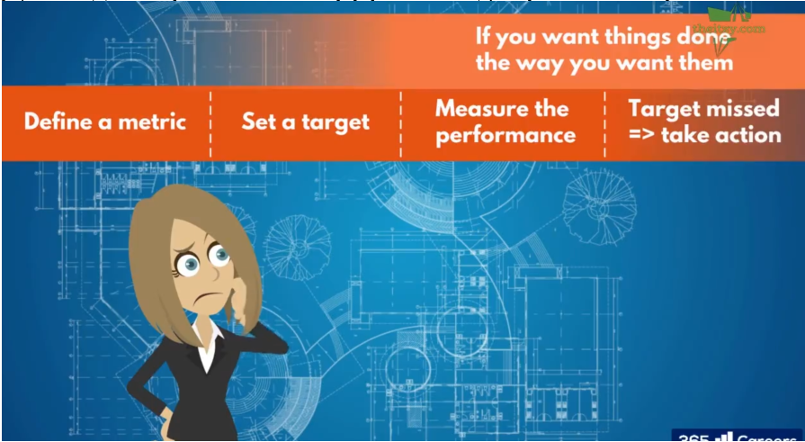

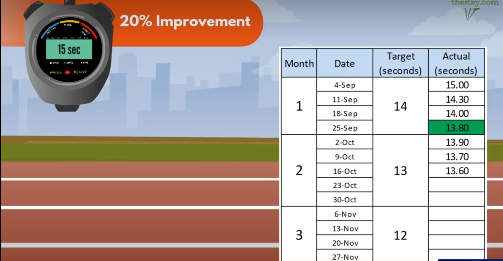

**总结：**

 在项目管理中，**明确定义**和**衡量工作的产出**是至关重要的。使用模糊的术语和表达方式可能导致误解和低效的工作。彼得·德鲁克的名言“你想要完成的事情，就要衡量它”强调了明确的度量标准和目标对于任务完成的重要性。

 以奥运短跑训练为例，设置清晰的度量标准（秒数）和目标（提高20%的速度），并通过每月的实际进展来监控和调整。这种方法确保了对任务完成进展的及时了解，并使得在需要时可以采取纠正措施以实现目标。

 监控和控制活动的<u>**目的**在于确保工作的**质量**、**效率**和**及时性**</u>。项目经理需要时刻关注工作的执行情况，同时采取措施来优化工作流程和确保团队成员的绩效。通过明确的度量标准和目标，项目经理可以更好地管理和引导团队，确保项目按计划进行。

### monitoring and control in project management

#### Controling in a PM environment

**翻译：**

 监控与控制阶段的活动与其名字暗示的一样。分析实际数据与目标进行比较，以便通过数字了解某些方面是否达到预期速度或质量。到目前为止，我们所做的一切都是设定目标，包括范围说明、时间表、预算计划和质量要求。但若没有监控，就无法衡量是否达到这些目标。度量标准可以涵盖多个方面，如产品缺陷率、案例解决率等，但它们必须是可测量且可比较的。

 度量标准就像一盏明灯，帮助我们了解项目进展。在漫长的项目旅程中，我们需要不断收集实际进展的数据，以及时纠正偏差。在项目的各个方面都可能发生偏差，而项目经理的任务就是有效地控制这些系统，确保项目在正确的轨道上。在执行阶段，监控和控制是至关重要的，确保项目朝着正确的方向前进。

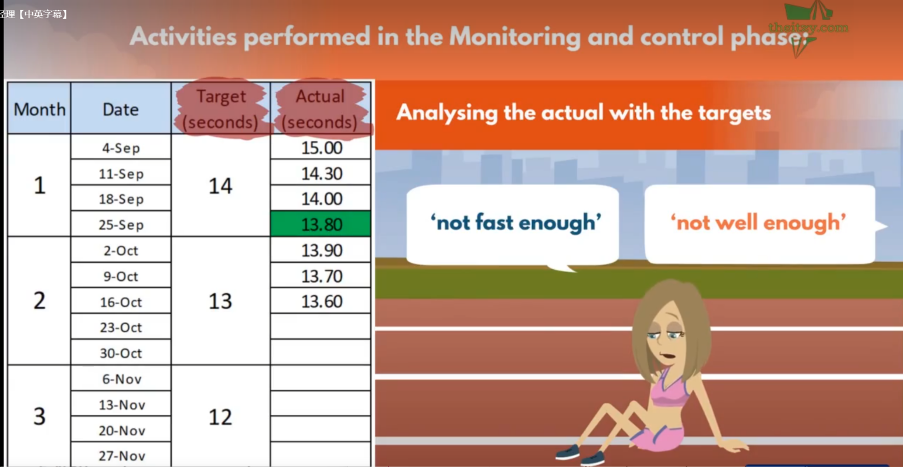

 **总结：** 

监控与控制阶段是项目管理中不可或缺的一环。其核心活动是**分析实际数据与设定的目标进行对比，以便了解项目是否按照计划进行**。度量标准涵盖了多个方面，如质量、时间、成本等，必须是可测量和可比较的。这种监控活动就像一盏明灯，帮助项目经理了解项目进展，及时发现并纠正任何偏差。

 在整个执行阶段，项目经理需要不断收集实际进展的数据，并与团队进行有效的沟通。只有通过监控和控制，项目经理才能确保项目按照预期的轨道前进。监控不仅仅关乎速度，还涉及到质量和符合度。因此，项目经理在执行阶段必须致力于保持项目在正确的方向上，以实现既定的目标。

### Controling timelines

#### How to check if a project is on schedule

**翻译：**

 让我们从时间方面着手。项目经理如何判断项目是否按时进行？他们应该不断观察实际进展与计划的对比。毕竟，我们不是为了装饰而建立项目计划、甘特图和里程碑表。它们是衡量实际进展的超级有用工具。以下是一个小片段。让我们看看这些活动的状态。我们可以看到第一个已经完成。第二个和第三个也都完成了。第四个正在进行中。我们可以看到我们已经完成了一半。然而，计划文件并不告诉我们实际进展是否以足够的速度进行，以便按时完成。那么，如果利益相关方询问这个目标是否按计划进行，我们其实并不知道。是的。但一旦我们了解了PMI所谓的进度偏差，情况就会改变。然后，我们将能够自信地回答利益相关方可能对任务进展的任何问题。

 计算进度偏差的公式是什么呢？首先，我们需要知道计划值。这是我们计划在这一点上完成的工作量，例如，有4个主要的墙要建造。你的意思是每周建一堵墙吗？因此，在中途点上，计划值将是完成一半的工作，并开始第三个工作。然后，我们需要计算第三个值。即到目前为止完成的工作的价值，换句话说，实际值。因此，作为一个有远见的项目经理，你请你的首席工程师每天完成施工进度的性能。为简化起见，我们假设主要工作是建造4个承重墙。你制定了每两周建一个的目标，即10个工作日。你可能会看到类似这样的情况。很好，我们可以看到墙一按时完成，而墙二完成了80%。这使得我们的实际值为1.8墙。那么现在查看我们是否按计划进行的公式。进度偏差为1.8 - 2，结果为-0.2。但确切的偏差是多少呢？让我们计算工作的速度以及延迟的程度，使用PMI的另一个工具，即进度绩效指数。进度绩效指数很容易使用。我们考虑与以前相同的数字，但这次定义为这样。如果进度绩效指数低于1.0，意味着将会有延迟，如果大于1，则我们超前于计划。在我们的案例中，1.8 / 2 = 0.9。这意味着如果团队继续以相同的速度工作，他们将在截止日期前完成90%的墙。因此，我们将需要更多的时间，因此计算20个工作日和四周的10%即需要额外的两个工作日来完成任务。你能感受到这些信息有多有用吗？与其在截止日期时看到只有90%的工作量，然后依赖于缓冲来完成剩下的工作，不如给自己和项目团队足够的时间来做出反应。无论是找到加速进度的解决方案，还是至少为延迟做好准备，推迟其他任务都是不理想的。接下来，我们将看看如何控制成本。感谢观看。

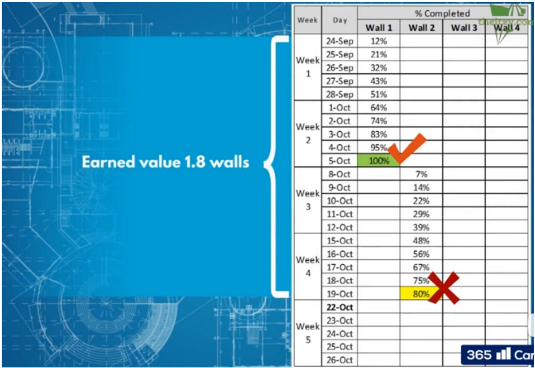

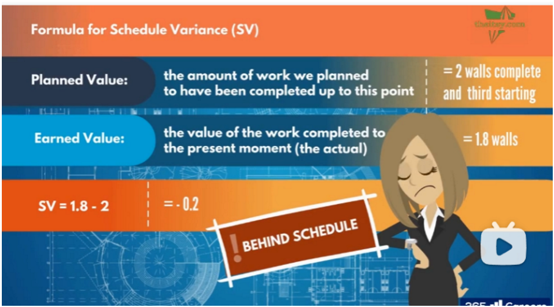

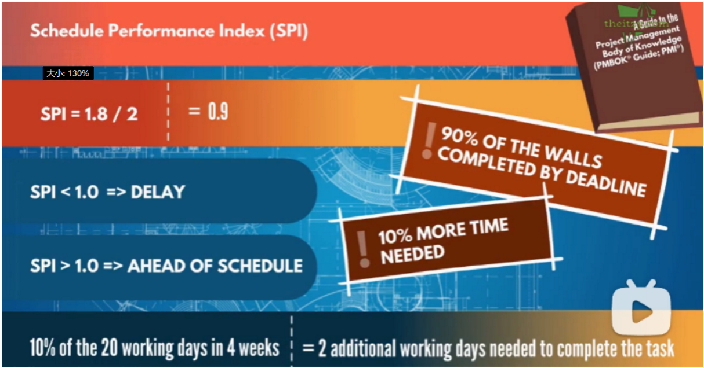

**总结：**

 本节主要介绍了在项目管理中，项目经理如何**通过监控计划进度与实际进展之间的偏差来判断项目是否按时进行**。

通过介绍**进度偏差**和**进度绩效指数**的概念，强调了这些工具在提前识别潜在问题和调整项目计划方面的重要性。通过具体的例子和计算公式，解释了如何计算进度偏差和进度绩效指数，以及如何利用这些数据提前预测可能的延迟，并采取相应的措施。这一过程强调了在项目执行阶段，项目经理需要保持对计划和实际进展的敏锐观察，并及时作出反应，以确保项目保持在正确的轨道上。

### Cost control

#### How to see if a project is on budget

**翻译：**

 那么这一切对我们的成本有什么影响呢？我们能否在预算内完成范围？好吧，让我们积极主动地找出答案，好吗？我们知道计划值和挣值是什么。计划工作的价值和已完成工作的价值。我们计算成本偏差，以了解我们是否符合预算，以及成本绩效指数，以了解我们的支出速度是否能够使我们在这个活动和整个项目内保持在预算内。所以首先要做的事情是，让我们将计划值和挣值转化为美元金额。假设建墙活动的预算为20万美元。这意味着每堵墙的成本为5万美元，到目前为止我们的挣值为1.8墙。为了将其转换为美元，我们将其乘以每堵墙的美元数。因此，1.8 * 5万等于9万美元。我们对计划值执行相同的操作。所以，2.0墙乘以5万等于10万美元。好的，一旦计算了计划值和挣值，我们需要将实际成本纳入方程。作为一位优秀的项目经理，您一直在记录到目前为止花费了多少钱。话虽如此，现在是套用公式的时候了。成本偏差的计算如下。从预算中可以看出，您迄今为止在墙上花费了8.3万美元，所以公式是挣值减去实际成本。因此，9万美元减去8.3万美元，等于7000美元。这是一个正数，这意味着我们的情况比计划的要好，预算有剩余。正如您所猜测的，如果这是一个负数，情况将相反。所以虽然您的团队进度落后，但他们在墙上的支出较少。现在，让我们通过成本绩效指数预测未来。再次定义，挣值除以实际成本为90000美元/83000美元，等于1.08，因为相同的规则适用，如果数字大于1，则我们将在预算内，如果支出速度保持不变的情况下。如果数字小于1，则我们预计会超过预算。真是太棒了。通过这些信息，我们可以看到我们在进度上落后，但在预算上领先。如果您还记得我们的三重约束三角形。我们已经有点失衡。即使在项目上省钱，但超过了截止日期，那么项目仍然是失败的。因此，您必须专注于解决问题所在的领域。但在使用计算之前，您可以看到，也许如果您花一些额外省下的钱，雇更多的劳工，那么您将能够将工作恢复到进度并平衡三角形。下一课，我们将讨论控制质量。我们需要确保我们生成的产出达到我们想要的标准。如果我们生产的东西质量低劣，节省时间和金钱就毫无意义。感谢观看。

**总结：**

 本节主要介绍了在项目管理中如何通过监控成本方面的进度来确保项目是否在预算内进行。通过引入计划值、挣值、实际成本、成本偏差和成本绩效指数等概念，项目经理可以及时了解项目的财务状况。通过具体的计算和例子，强调了在项目执行过程中如何使用这些工具来判断是否在预算范围内，并提前发现可能的问题。同时，强调了在项目管理中需要保持对时间、成本和范围之间的平衡，以确保项目的成功。

### Quality control

#### How to perform quality control

**翻译：**

 

现在我们将关注质量控制。质量标准在项目之间的差异比时间和成本更大，但我们将强调在执行质量控制活动时可以采取的一些常见措施。因此，在质量规划期间，您已经定义了目标和要求，并在执行期间收集了质量检查的实际数据。同样的问题需要再次提出。质量目标是否得到满足？质量标准、目标以及它们的控制在不同项目中会有很大的不同，正如范围一样。但正如我们所说，我们将强调在控制质量活动中需要完成的一些常见事项。

 

我们在三个不同的层面上分析质量，即输入、过程和输出。那么，举个例子，想象一下，您的项目是要烹制一道千层面。您检查原材料，决定使用新鲜面条还是干面条，以及肉馅中的牛肉百分比。在制备过程中，您按照步骤进行，比如预热烤箱、切割蔬菜等。然后，您评估完成的菜品。白汁是否顺滑，面条是否软糯，芝士是否融化？这就是您的输入检查、过程检查和输出检查。

 

好的，现在让我们通过我们的Lambari项目更详细地了解这一点。我们从输入开始。这是当您需要确保工作从正确的一方面开始时。如果您的资源不足以达到所需的范围，那么您是否应该开始呢？以建筑材料为例。在这里，将验证材料的责任交给建筑工作流的所有者是明智的，因为他们是该领域的专家。在执行此操作时，他们可能会执行类似于此清单的操作。他们将确保所有材料达到内部或安全法规规定的必要质量标准。类似的过程显然也会在汽车生产和内饰等领域进行。

 

然后是过程中的质量控制。这是在活动期间确保所有步骤都在进行中，没有采取捷径的时候。例如，在招聘工作流中，如果每个销售人员都了解每种汽车型号的一切，并且我们决定跳过客户服务培训，那么这些知识将是无用的，因为我们的销售代理将没有必要的技能来实际进行销售。同样，将责任委托给市场团队的一员，该团队保持对所有员工及其接受的培训的清单，将是最有意义的。

 

最后是输出的质量控制。这是在可交付成果或活动完成点进行的质量检查。例如，在汽车的增强现实效果完成后，需要进行检查，以确保它们与电子界面快速连接，输入响应灵敏。如果目标是让效果在3秒内发生，那么这个标准在10次中至少有9次达到了吗？很棒。这次没有公式。但这种控制类型的核心仍然是将实际情况与计划期间设置的可测量目标进行比较。

 

然而，请记住，作为项目经理，当涉及到质量检查时，您不是最终的联系点。许多可交付成果将需要由项目利益相关者，尤其是项目客户批准。Lambari在汽车的安全性和排放检查方面非常谨慎，特别是自2015年大众排放丑闻以来。如果不满足这一质量标准，他们将不会批准该项目，这只是一个例子。

 

在项目规划中，质量与时间和资源的三重约束三角形一样重要。如果没有签署质量检查，项目就面临着巨大的风险。承诺在三个月内以10万美元的价格交付一辆在三秒钟内从零加速到100的汽车，并在三个月内以10万美元的价格交付一辆在三秒钟内从零加速到107的汽车，这不是一个成功的项目。增加质量要求将需要更多的时间和资源，反

 

之亦然。很好。我们讨论了一些控制质量的方法，所以让我们跳到我们项目的另一个重要部分，风险。显然，风险本身是无法控制的，但我们对待它们的方式可以。好吧。我们将在下一课中看到。

 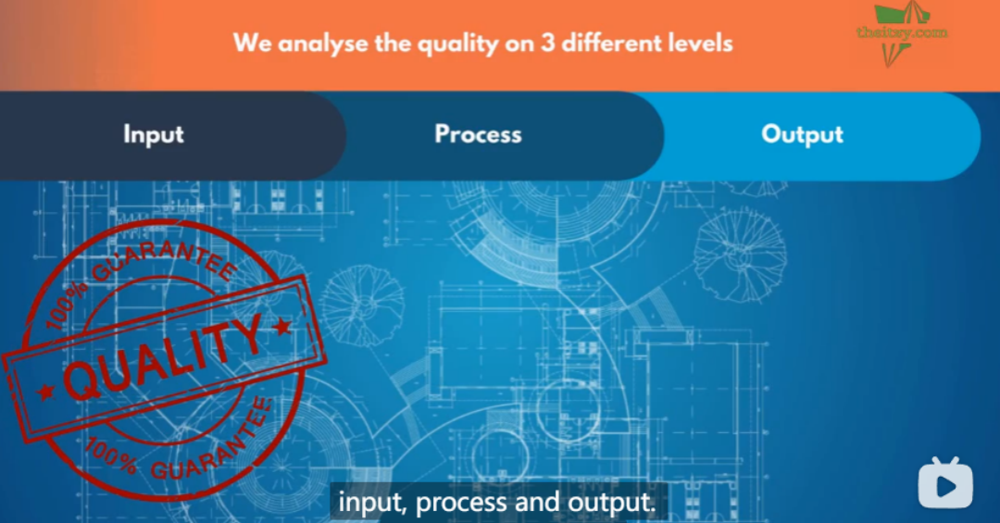

**总结：**

 

本节内容关注质量控制，强调在执行阶段需要采取的措施。在控制质量活动中，我们对质量进行了三个层面的分析，包括输入、过程和输出。在输入方面，强调了确保项目资源足够以达到期望范围的重要性，例如在建筑领域验证建筑材料的质量。在过程控制方面，强调了确保在活动中不采取捷径，而是按照步骤进行，例如在招聘过程中保证员工接受必要培训。在输出控制方面，强调了在可交付成果或活动完成时进行的质量检查，以确保实际结果符合计划期间设定的可测量目标。项目经理在这个过程中不是最终的质量检查点，很多可交付成果需要项目利益相关者，尤其是项目客户的批准。

 

在项目规划中，质量与时间和资源的三重约束三角形一样重要。没有通过质量检查，项目将面临巨大的风险。质量的增加可能需要更多的时间和资源，而降低质量标准可能会减少时间和资源的需求。

### risk control 

#### Keeping the risk log updated

**翻译：**

 

风险的固有特性是你无法控制它们。否则，它们实际上就不是风险了，而是你防止发生的事件。因此，在控制风险方面，更多的是控制它们的演变，并确保作为项目经理的你时刻保持准备状态。你可以做的第一件事是保持风险日志的更新。随着活动的完成，围绕它们的风险就不再是问题，可以在我们的日志中关闭。我们可以对风险一和风险二这样做。此外，随着项目的发展，风险的严重性和概率可能会发生变化，必须定期更新。如果某个风险看起来可能变为现实，那么你必须开始准备应急计划。关于风险的最后一个重要事项是，你需要留意可能出现的任何新风险，并像对待其他风险一样记录它们。作为项目经理，你需要在风险之前走一步。期望最好的结果，为最坏的情况做好准备，那么风险就不会悄悄逼近，让你措手不及。下一堂课？我们将讨论如何控制变更。实际上，没有一项项目是完全按计划执行的。让我们看看项目经理如何处理这种情况。

 

**总结：**

 

风险的本质特点是无法被控制，否则它们就不再是风险，而是被预防的事件。在控制风险方面，重点是控制其演变，并确保项目经理时刻做好准备。

首先，**保持风险日志的更新**是一种有效的方法，随着活动的完成，相关的风险也就不再是问题。

同时，随着项目的发展，**风险的严重性和概率可能会发生变化**，需要进行**定期更新**。如果某个风险看起来可能会成为现实，那么就需要准备好应急计划。

另外，需要时刻留意可能出现的**新风险**，并记录它们。

### Control changes

#### Dealing with change proposals

**翻译：**

 

我们在课程规划的部分讨论了变更流程，但正如你可能已经注意到的那样，你不能计划项目的变更，只能为其做好准备。那么当提交变更请求时会发生什么呢？让我们以我们的Lambari项目为例进行说明。假设你在项目进行了四个月后面临三种情况。

 

首先，负责舞台可视化的软件工程师联系你说，如果修改屋顶，她安装投影仪会更容易。屋顶已经建好，更改将花费10,000美元并额外需要2周的时间。之后，负责培训新员工的营销专家向你解释需要将重要培训添加到培训计划中，耗时三天，费用为1,000美元。就在你以为这一天结束时，汽车制造商打电话告诉你，他们将只在约定的日期交付一半的车辆，另一半将在第二天交付。真是不寻常的一天。

 

那么你会怎么做？你会同意哪一个，并在做决定之前需要回答哪些额外的问题？一方面，你非常清楚任何变更都会耗费时间和资源，当然你付出了很多努力来规划，你想要保护那个计划。但另一方面，随着工作的进行，会发现做事情的更好方法。也许在规划过程中遗漏了一些东西，或者可能有人提出了一个新的想法。并非所有的变更都是不好的，有些是必要的。由你来区分它们。做到这一点的最佳方法是保持警惕。

 

变更流程的简要概述如下。**提供尽可能多的细节，了解变更对范围、时间和成本的影响**。一旦这一点清楚，你可以决定拒绝不必要的变更或那些增加范围、时间或成本超过其价值的变更。你可以通过变更流程提出建议，准备一个包含所有适当信息的变更请求表，并获得项目赞助商的批准。或者，如果变更对时间、范围和成本的影响较小，可以在不经过冗长的批准流程的情况下实施它们。哦。

 

让我们看看你如何处理先前的情况。对于软件工程师的建议，**拒绝**似乎是一个明智的主意。这对项目没有太多好处。这可能会使软件团队的工作变得更容易，但是他们的职责应该在项目范围中详细说明，并且事先达成了一致。当然，你需要提出很多问题。你需要与工程师交流，以确保计划的工作实际上可以完成，而不是一个无法预料的问题。你甚至可能找到一个不会给项目带来太多工作的折衷方案。毕竟，你是一个理性的项目经理。

 

对于营销专家的建议，你需要**调查**以确定培训是否确实对员工而言是相关的，如果是的话，需要确定触发变更是否会给任务带来成本。如果一切顺利，你可能会开始准备一个变更请求表。

至于汽车生产，这似乎是一个较小的变更。一天不会对项目产生影响，所以你可以**同意**并相应更新计划。当然，你会想要获取更多的详细信息，以确保这一延迟不是由于生产中的更大问题引起的，并且质量没有受到影响。你是一个出色的项目经理，因此你不会盲目同意任何事情。干得好。通过这样处理，对项目的成本影响最小化。好的工作，我们已经介绍了如何控制你的项目。你学会了如何阅读实际情况并将其与计划中的目标进行比较。你还学会了如何使用这些信息告诉你是否能够按时、按预算或两者兼

 

而有之地完成任务。你知道如何在每个阶段测量质量，并且能够保持风险评估的最新状态。最后，你学会了如何自信地处理项目中可能出现的任何变更。在执行项目的同时，你一定擅长同时处理所有这些。说到这一点，让我们回到执行，并看看如何向利益相关者更新你的项目。大家做得很好。

 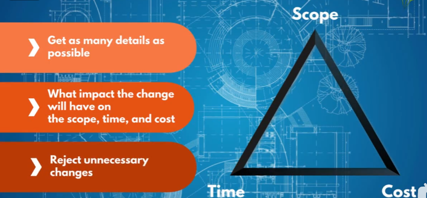

**总结：**

 

在项目管理中，变更是无法避免的，但需要谨慎处理。

对于变更请求，要**提供详细信息**

**评估**其对范围、时间和成本的**影响**

**拒绝**不必要的变更或成本过高的变更。

变更流程可以通过提交变更请求表并获得批准来实现，但对于影响较小的变更，可以简化流程。项目经理需要保持警惕，区分好坏变更，并在处理中平衡项目的整体利益。

### Project reporting

#### How to record and build project report updates

**翻译：**

 

欢迎回到执行阶段，尽管从技术上讲我们并没有真正离开。如果我们不同时执行，就不会有监控和控制阶段。但无论如何，当我们接近执行阶段的尾声时，你可能会开始觉得这个项目就像是你的孩子。在某种程度上，的确如此。但你希望有一个经验丰富的保姆或托儿所老师。这个"孩子"仍然有需要更新进展和状态的父母，也就是项目利益相关者和赞助商。就像老师需要为孩子的各个方面制定报告计划一样，你也需要为项目赞助商和利益相关者制定计划。让我们看看如何做到这一点。

 

定期报告项目状态有两个主要原因。首先是让赞助商和高级利益相关者了解一切的进展情况，并强调任何关键问题。其次是保持井井有条。项目可能涉及许多不同的人，这很容易导致混乱和误解。为了避免低效，项目经理必须保持结构化的沟通和协调。如果每个人都获取相同的信息，混乱就可以避免。为了实现这一点，你必须在启动会议期间就达成一致，确定状态报告和会议的交付方式，例如会议的频率、参与者和标准议程。那么让我们看看每周更新可能是什么样子。在这个时候，PowerPoint是项目经理的最好朋友。演示幻灯片比简单的详细清单更引人入胜，而且能够将焦点放在项目经理想要谈论的内容上。因此，我们从一个简单的封面开始，上面写着项目名称。然后是议程幻灯片，会议主题、会议信息、地点、电话会议号码、日期和时间等。时间表也可以添加在这里。之后，查看甘特图、里程碑表和高层次状态，作为人们快速了解项目进展方向的参考。项目状态可以用红、黄、绿的标度表示。绿色意味着一切都按计划进行，符合预算，范围和质量要求。所有都很好，可以继续。黄色意味着存在可能威胁完成的问题，但团队可以或已经采取措施使事情回到正轨。红色表示事情变得糟糕。超支并且总是不符合项目经理需要向赞助商和利益相关者寻求支持，甚至重新思考项目计划或重新平衡三重约束。这是进入会议的最重要的事情之一，以便每个人都知道接下来的事情会是什么样子。这是一个报告一切都很顺利的会议吗？是一个让每个人相信团队将如何使项目成功的会议吗？还是一个重新评估并提出拯救项目行动的会议？项目经理决定项目的状态，并可以策略性地突出可能会成为大问题的问题。一旦确定了高层次状态，会议就可以进入各个工作流程，进行详细的更新。让我们看看我们Land Burari项目的工作流程。对于每个流程，你或流程所有者可以提供更新、任何挑战或风险，并呈现迄今为止记录的计划和实际数据。在审查每个

 

流程时，你必须能够将情况与项目约束进行比较。之后，是时候审查风险了。有没有任何尚未解决的风险改变了它们的状态？有没有任何风险变得更有可能或更危险？我们需要触发应急计划吗？有没有需要记录的新风险？你和项目团队需要回答这些问题并相应地记录它们。这就是一个核心模板的示例。当然，每个项目甚至每个会议都会有自己的具体差异，但我们刚刚讨论的是几乎每次会议都会出现的要点。作为项目经理，你将决定焦点应该放在哪里。太棒了。这将我们带到了执行阶段的尾声。在课程方面，我的意思是。因为在项目管理中，执行阶段就像一个转圈。项目经理监督执行，通过将实际数据与目标进行比较来进行监控和控制。然后他们向利益相关者报告他们的发现和整体项目状态。执行，监控和控制，然后报告。但接下来呢？好吧，下周又到了，这个过程一遍又一遍地循环，直到项目完成。就是这样。这个轮子一直转到项目的最后。一个漂亮而平稳的过程。但事情真的会那么简单吗？好吧，看起来你已经了解了乐观主义偏见的影响，事情并不总是那么顺利。干得好。如果实际情况与计划相差很大，你将怎么办？请在下一堂课中加入我们，我们将向你展示如何在执行过程中处理问题的一些方法。感谢观看。

 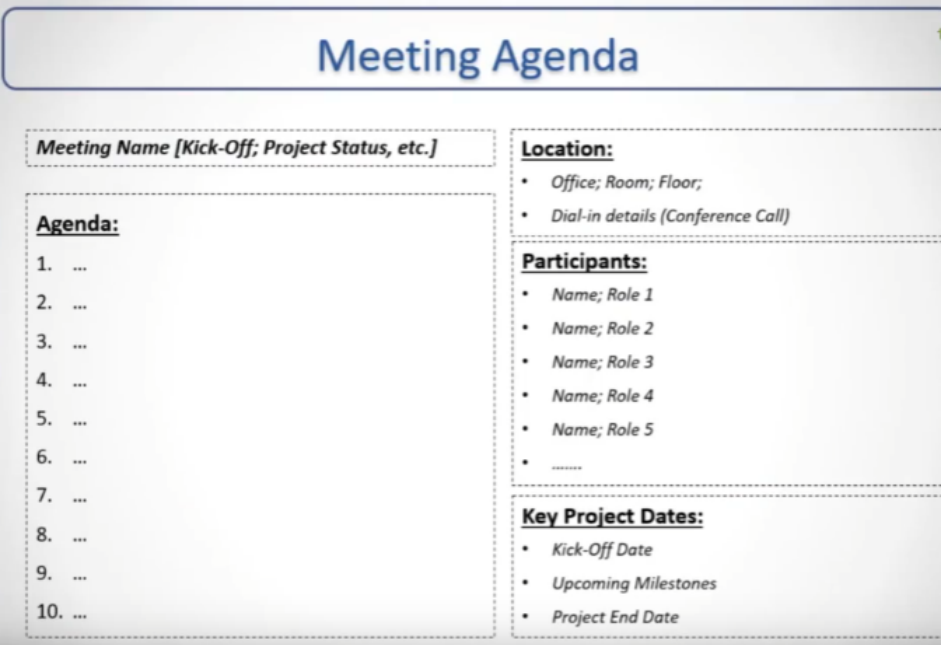

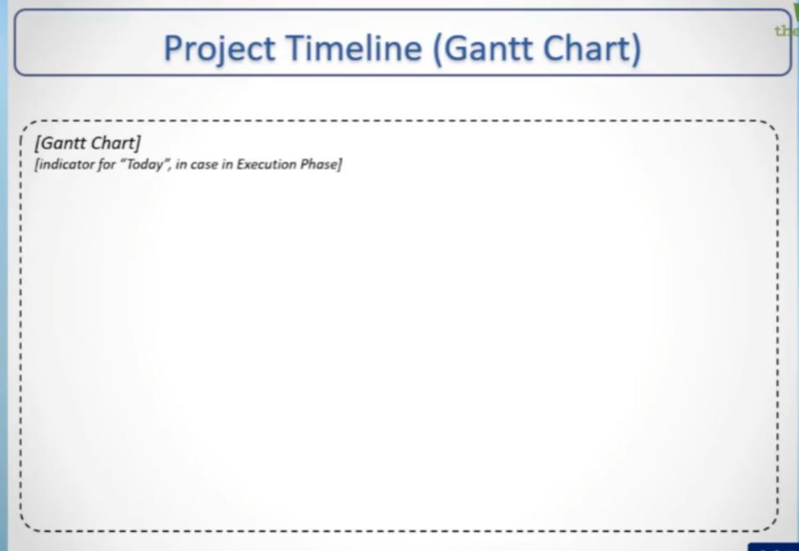

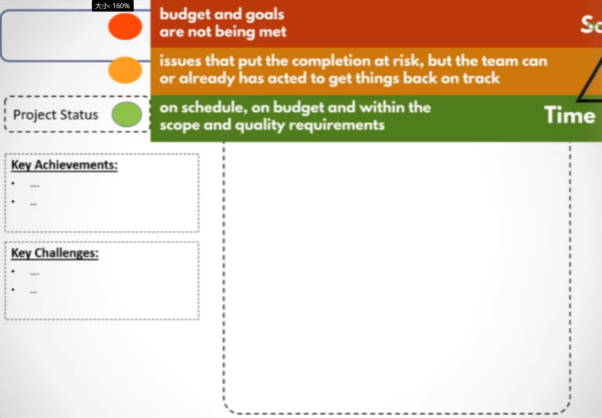

**总结：**

 

在执行阶段结束时，项目经理需要向项目的赞助商和利益相关者提供**定期的状态报告**。这有两个主要**目的**：

第一是通知利益相关方项目的**整体进展**和**突出的关键问题**；

第二是保持项目的有序进行，避免混乱和误解。

为了实现这一点，项目经理在启动会议期间需要与利益相关方达成一致，确定报告和会议的交付方式，包括会议的频率、参与者和标准议程。报告通常采用PowerPoint演示文稿的形式，涵盖项目名称、会议议程、甘特图、里程碑表和高层次状态，以及项目的红黄绿标度，用于表示项目的整体健康状况。

每个会议的焦点可能会不同，取决于项目经理对项目状态的评估，可以是正常进行、需要采取行动以纠正问题、或者需要重新评估和采取拯救项目的措施。在每个工作流程的详细更新中，项目经理或流程所有者需要呈现实际数据、计划进度以及任何面临的挑战或风险。

此外，**需要定期审查项目的风险情况**，检查是否有新的风险出现以及是否需要触发应急计划。总体而言，项目经理需要灵活调整焦点，根据项目的当前状况决定会议的目标，以确保项目朝着成功的方向前进。

，根据项目的当前状况决定会议的目标，以确保项目朝着成功的方向前进。

### Issue management

#### How to deal with any issues that occur during execution

**翻译：**

 

还记得我们说过期望最好，为最坏的情况做好准备吗？嗯，这种态度在整个项目中都是值得拥有的。当然，你必须对项目充满信心和积极性，但这种信心需要来源于你在项目中建立的控制措施，以便在最坏的情况发生时保护自己。

想象一下，在Lambari项目进行了两个月后，你计划完成六辆汽车。但一个也没有完成。或者在培训期间，新销售团队的一半辞职，使你在盛大开业时人手不足。作为超级项目经理，你的另一项任务是能够在这些情况下挺身而出，挽救局面。

因此，当你的项目偏离轨道时，让我们看看你可以采取的四个步骤将其纠正回来，就像你在整个项目中一直在做的那样。通过遵循这些步骤以有组织的方式应对情况。React（反应），Read（分析），Respond（响应）和Resolve（解决），将重复执行。

首先是React，评估损害并进行损害控制。然后是Read，了解问题的原因和根本原因。接下来是Respond，制定行动计划并采取措施纠正问题。最后是Resolve，将重复执行。确认问题是否已从你的响应中解决，通过监控。如果是，继续执行。如果没有，回到前一步或前两步。改变一些东西，直到步骤4得到解决。

让我们来看一个例子，像煮水这么简单的事情。实际上，就用这个例子。想象一下，你一天结束后从Lambari项目回到家，决定给你的伴侣、父母、朋友或宠物做一些美味的意面。你把水放在炉子上煮沸。这会花费几分钟，所以你坐下来看你最喜欢的肥皂剧的最新一集。突然间，溅。水沸腾失控，洒满整个炉灶。但与其惊慌失措，你更像是一个项目经理，执行问题管理。首先，你反应过来，把锅从热源上拿开，停止它的沸腾。你进行损害控制，将锅放在安全的地方，清理水，以防止它淋湿你的食谱。现在你有时间来分析情况了。原因是什么？炉子温度太高，对吗？当然，但这并不是根本原因。根本原因是你没有注意。所以你响应，决定在手机上创建一分钟间隔的提醒，提醒你检查意面。解决。你按照新的行动计划和第一个提醒煮意面。你发现可能会有问题，于是降低温度。一切正常。然后30秒后，溅。哦，不。又发生了。问题没有解决，所以你重复这些步骤。你再次分析情况，但根本原因仍然是你的注意力不足。因此，你调整你的行动计划，将提醒设置为32秒的间隔。下一次你煮意面时，问题没有发生。问题解决了，你继续准备其他餐点，做了一份美味的意大利肉酱面。太棒了。现在让我们看一个关于汽车生产的案例研究，看看这如何与我们的项目相关。见面啦。

 

**总结：**

 

在项目中，当面临问题时，采取有组织的方法是至关重要的。项目经理在处理问题时可以采取四个步骤：React（反应），Read（分析），Respond（响应）和Resolve（解决）。首先，React阶段需要迅速评估损害并采取损害控制措施。接下来，Read阶段要深入了解问题的原因和根本原因。然后是Respond阶段，制定行动计划并采取纠正问题的措施。最后，Resolve阶段通过监控确认问题是否已经解决，如果是，则继续执行，如果不是，则返回前一步或前两步，重复这一过程。通过这种有条不紊的方法，项目经理可以更有效地解决问题，确保项目保持在正确的轨道上。

##  3.5.The closure phase

### Why do we close a project

**翻译：**

 

那么，您已经成功完成了整个手术过程。您四处走动，看着所有人为两周后的盛大开幕筹备。您感到一种兴奋与成就感交织的情绪，开始最后的阅读。

 

所有利益相关方和项目赞助商都被邀请听您告诉他们项目已经完成，并且范围已经最终确定。您祝贺他们完成了出色的工作时，看到了经理们脸上的笑容。您带领他们参观车间；您看到软件工程师正在测试可视化效果，销售团队正在练习推销技巧，机械师正在调试汽车，最后的修饰工作也正在进行。突然间，制造总监Jeff走向您。

 

他告诉您他有一个让项目取得更大成功的绝妙主意。附近有一个废弃的停车场，他认为可以将其改建成人们可以测试驾驶汽车的区域。您转身告诉Jeff这是个好主意。然而，现在不是他应该与您交谈的时候。您的项目几乎结束了。您有明确的范围和目标，并且已经实现了它们。他需要启动自己的项目，并找到赞助商开始像我们一样的启动阶段。您给了Jeff一些建议，并指导他朝正确的方向前进。

 

您微笑着并在心里想。是时候开始项目闭环了。但是为什么呢？所有的工作都已经完成了？为什么要给自己增加更多的工作？好吧，不仅是因为您是一位关心自己工作的彻底的项目经理，还有其他四个非常重要的原因需要进行闭环阶段。一，获得对可交付成果的正式验收。二，传达项目完成的信息。三，反思所学到的经验。四，庆祝成功。

 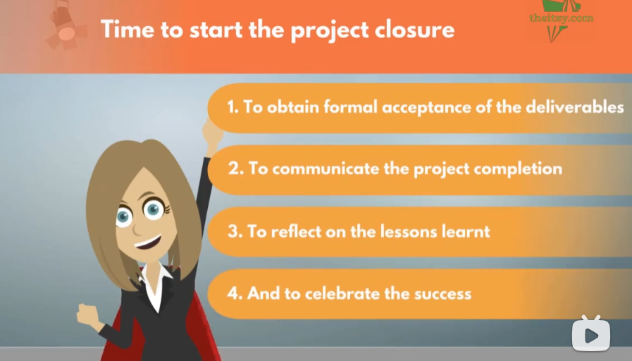

**总结：**

 

成功达到目标，项目即将完成。在庆祝活动筹备期间，项目经理通过邀请所有利益相关方和赞助商参与项目完成宣告，展示了项目的成功。然而，当制造总监提出一个新的、可能使项目更加成功的想法时，项目经理明智地指导他启动自己的项目。

 

即将进入项目闭环阶段，尽管所有工作都已完成，但项目经理明确了进行项目闭环的四个重要原因：正式验收交付成果、传达项目完成信息、反思经验教训以及庆祝成功。这进一步体现了项目经理对工作的严谨态度和对项目管理流程的深刻理解。

### What steps to take to close a project

**翻译：**

好的，让我们总结一下为什么结束一个项目很重要的四个原因，它们是？

 

1. 获得交付物的正式验收：即使你的项目按照计划和甘特图完成了，赞助商仍然需要最终批准。记得在启动会议上，你们必须就需要达到的标准和谁将最终批准达成一致。对于小项目，可能只需一封电子邮件，而对于大型项目，则可能需要正式的合同签署。这也是在项目期间保持打开的任何其他协议的时间，并进行最终支付。

 

2. 向组织通报项目完成情况：在项目的最后12个月中，你一直是几乎所有事务的联系人。这个展厅将继续存在问题，员工将继续提出想法，但这不再是你的项目。这个临时计划已经完成并转入日常业务。这不再是你的责任，除非你想在下一个项目上班时不断被打电话，否则你需要确保每个人都知道项目已经完成。最常见的做法是通过电子邮件。保持热情友好，表达你有多么喜欢，团队有多么出色，并提到任何特别的事项。是时候继续前进了，但你想以一个好的方式离开。

 

3. 总结吸取经验教训：之后，你应该总结经验教训。如果当时你知道现在知道的一切，所有那些你本可以预防的问题和本可以更快完成的活动。好吧，通过收集和记录所有经验教训，你有机会为下一个项目提前准备。最好的方式是组织一次会议，要求项目参与者分享两件事：哪些方面做得好，哪些方面做得不好，以及下次如何更好地完成？简单。只要你鼓励开放性，你将获得许多有用的指导意见。你必须保存这些指导意见并将它们添加到你不断增长的知识库中。

 

4. 庆祝成功：最后，庆祝成功。你的展厅不是自己建造的，也不是一个人的工作。祝贺你的团队非常重要。尽管他们可能已经准备好迎接下一个挑战，但花点时间祝贺完成的工作对士气是很有好处的。如何庆祝完全取决于你。无论什么方式都合适。可以简单地是一张感谢卡，也许是在酒吧吃晚餐并喝一瓶香槟，或者是一些特别的事情，比如一次太空之旅。然后，你结束了项目。每个人都对你的工作印象深刻

 

。甚至首席执行官亲自走到你跟前，送上一大束花感谢你的工作。他们还告诉你，由于这个项目的成功，亚洲正在启动另一个展厅项目，你应该随时保持手机畅通，因为你可能会接到电话。太棒了。你一直想在亚洲工作。你对大家说你可以给大家发声，就在你即将离开时，人力资源的史蒂芬告诉你已经很晚了，他应该给你叫辆出租车。你回应说没有必要，因为你计划工作到很晚，并为自行车带了灯。项目经理一生。结尾

 

**总结：**

结束一个项目的四个重要原因是：获得交付物的正式验收、向组织通报项目完成情况、总结吸取经验教训和庆祝成功。对于交付物的验收，需要获得赞助商的最终批准，并关闭项目期间的任何其他协议。项目完成后，必须通过热情友好的邮件告知组织，并强调离开时留下良好印象。总结经验教训的步骤包括组织会议，让项目参与者分享工作中的亮点和改进之处。庆祝成功对于团队的士气至关重要，可以通过多种方式，如感谢卡、晚餐庆祝或者特别的活动。这样，你就成功地结束了项目，受到了大家的赞赏。

# 4.项目管理工具

## 4.1. Introduction

**翻译：**

嗨。在这个计划中，我们将努力提升我们的技术技能，变得更擅长创建和维护一些关键的项目管理文档。这些工具对于任何项目经理来说都至关重要，以便紧握所有重要的项目事件。

 

其中很大一部分基于某种表格。好吧，不完全是这个。好的，好多了。所以列和行。那么，哪个著名的程序能让你创建无数个表格？是的，你猜对了。Microsoft Excel。这就是我们将要学习的内容。我们将学习如何在Excel中创建五个最重要的项目管理文档：

 

1. 工作追踪器
2. 从项目日记到RAID风险日志的日志
3. 项目调度
4. 甘特图
5. 预算

 

前两个文档主要在监控和控制阶段使用。工作追踪器使项目经理能够跟踪项目团队与既定目标的进展，而RAID日志有助于管理和跟踪对项目进展和成功有重要意义的所有事件。

 

后面三个，我们已经很熟悉了，是在规划阶段创建的，并在项目结束之前一直维护和使用。正如解释的那样，从技术角度来看，不需要担心，因为不需要繁重的公式。我们将专注于表格的内容，了解从项目经理的角度来看哪些因素重要，并同时了解一些经常使用的Excel功能，如条件格式设置、数据验证和一些基本的格式设置。

 

我们将在课程中使用Microsoft Excel 365，但版本并不那么重要，因为这些功能是基本的，可以在任何版本中找到。请注意，即使您使用Google Sheets，这些教程也将非常有用，因为两个程序都具有我们将要学习的功能和非常相似的结构。

 

好的，很好。让我们从第一个文档开始。所以项目经理，想象一下你正在进行第一次项目状态会议。你展示了甘特图，团队可以看到前两项活动已经完成，第三项正在进行，因为我们目前是第6周。你报告说团队现在正在进行1/3的活动，但你得到了一个问题，比如。这项活动的进展如何或者已经完成了多少？我们在进展吗？你会怎么说？看起来是。不是。项目经理必须知道如何回答所有这些问题。事实上，首先需要向项目经理提出这些问题的人是项目经理自己。在这个个人问答中，必须创建一张表格，可以轻松回答这个问题。这就是所谓的工作追踪器。它的目的是跟踪工作的实际进展与计划的对比。请注意，跟踪发生在详细的任务级别上。因此，项目计划文档不会提供这些信息。它正好相反。这是一个文档，将向您提供有关整体活动进展情况的信息。

 

在接下来的课程中，我们将看到如何为几种不同情况构建追踪器。在那里见。

 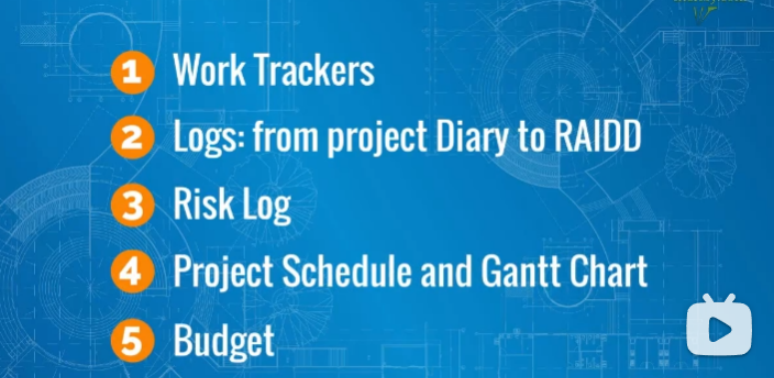

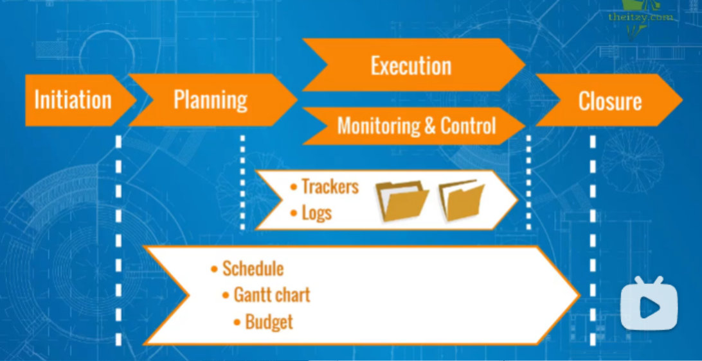

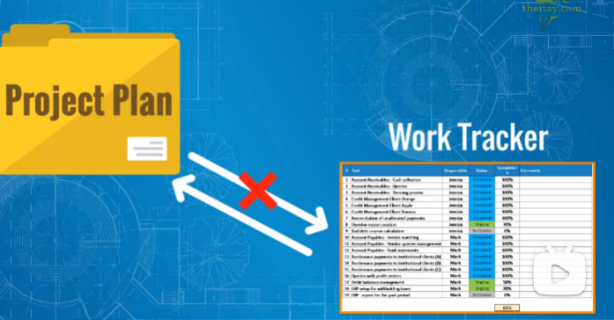

**总结：**

 这篇文章介绍了在项目管理中使用Microsoft Excel创建关键文档的重要性。包括工作跟踪器、项目日志、RAID风险日志、项目调度、甘特图和预算等五个关键文档。工作跟踪器和RAID日志主要用于监控和控制阶段，帮助项目经理跟踪项目团队的进展和重要事件。其余三个文档在规划阶段创建，并在项目结束前维护和使用。文章强调不需要过于复杂的技术，而是关注表格内容，学习项目经理视角的重要因素，并了解Excel中常用的功能。提到将使用Microsoft Excel 365进行教程，但版本并不重要，因为这些基本功能在任何版本中都可用。

## 4.2. Tracker

### Tracker 1_ High-level

翻译：

欢迎回来。让我们看看第一个案例，一个高级跟踪器。当您需要追踪为几个类别、不同地区、不同国家、不同业务线等执行的活动的进展时，可以使用这个。例如，您的项目是实施新的会计软件流程。您的公司在德国、法国、新加坡和日本都有业务，并且新系统将由所有当地的会计部门使用。

 

计划中的下一个活动是收集所有需要使用该软件的员工的姓名。由于组织包括数千人，您已要求每个国家的财务和会计经理提供他们本地部门名单。

 

### Tracker 2_ Standard tasks

**翻译：**

我们现在将建立一个用于管理项目任务的追踪器，这些任务在种类上相似且数量较多，例如10/20/30个相似类型的任务。几乎在任何类型的项目中都可以找到类似的例子。

 

比如，在建筑项目中，木工们安装室内门的过程，或者在精益6 Sigma项目中，业务分析师制作流程图的文档，又或者在软件实施项目中，IT支持专家创建用户帐户等等。正如我们所说，这是相似或相同类型的任务。让我们打开Excel。作为第一步，我们将再次遵循将整个表标记为白色并调整第一行和第一列的最佳实践。

 

然后，我们需要逐列创建我们的追踪器。在这种情况下，我们将有更多的行，因此我将对它们进行编号，并将第一列标记为N，例如。我们将按照前一课程中所做的方式格式化列标题。您可以通过在前两个单元格中键入一和二来在下面编写数字。然后选择这两个单元格并向下拖动。Excel会理解您想要创建一个列表，因此会填充并给出一个序列。假设我们这里有19个任务。

 

对于这个表格，我们将从主页选项卡上的边框菜

 

单应用所有边框。然后，我们通过双击其上面的白色边框来优化列宽。

 

下一列是任务名称。请注意，添加一个不令人困惑的名称非常重要，所以请记住始终清晰地命名任务。以业务分析师在精益6 Sigma项目中制作流程图的文档为例。例如，假设这些流程与F和A部门有关，我们列出了流程的确切名称。

 

好的，我们现在在任务列中列出了流程名称。毋庸置疑，这个列表必须在业务分析师开始工作之前与利益相关者达成一致。

 

接下来，下一个关键信息将是。谁负责每个任务？假设在我们的情况下，有两位业务分析师，Jessica和Mark。在确定谁将负责什么之后，我们可以在每个任务旁边加上一个名字。请注意，在您的项目中，如果只有一个人负责所有任务，那么在这一列中就没有太多意义。这只会浪费空间而不提供有价值的信息。因此，在这种情况下，您可以跳过它。

 

下一个是我们最喜欢的状态列。我们已经知道如何在Excel中设置它，因此我们不会在这里重复步骤。然而，如果您仍然有疑问，请随时再次查看前一课程。

 

下一列是关于完成百分比的。在这里，我们将使用概念性的0%到100%范围来跟踪进度。当任务需要超过一天的时间，比如说，这一列会提供有关实际状态的宝贵信息。如果一个过程映射平均需要五个工作日，业务分析师将每天更新完成百分比。例如，在第三天之后，进度超过60%。这将是一个良好的指标，表明事情正在正常进行。然而，如果在第2天之后进度是10%，比如说，这将使项目经理立即提出问题。

 

注意。这一列非常有用，但需要小心管理，因为百分比的决定往往是主观的。您不希望有一个良好的完成百分比，但这并没有反映现实。这将误导项目经理和利益相关者认为一切正常，而实际进展实际上要低得多。在这里，项目管理需要仔细进行期望管理。我的建议是始终站在安全的一方，在您或您的团队成员在此处添加百分比时更加保守。

 

好的，百分比已经就绪，我们可以计算一个总数，指示到目前为止的整体进度。我们可以选择同一列底部的单元格，或者如果列表太长，可以选择顶部的单元格。我们将在Excel中使用平均公式，键入等号然后是平均值。现在，您需要选择将计算平均值的单元格。选择所有完成百分比单元格后，点击Enter。您现在有了一个总体完成百分比数字。注意，如果任务在完成一个任务所需的努力方面非常相似，那么这个总数将是现实的。然而，如果其中一些流程需要两天，而其他流程需要十天，那么简单的平均值将不是对现实的正确表示。在同意如何以这种方式呈现进度时，需要考虑到这一点。

 

最后，我们留下一个自由文本列供评论使用。我们已经熟悉了这一列的用途，对吧？好的，我们可以进行一些格式设置。再次将总行放粗。我们可以增加行高，然后使用垂直对齐，使文本在垂直方向上居中。我们已经为其中有意义的列发送了文本，在这种情况下是负责人状态和完成百分比列。最后，我们可以通过双击它们的主列边框来为完成和负责标题提供所需的空间。

 

完美。我们现在有了我们的工作追踪器。通过这个文档，项目经理和团队可以掌控所有任务，及时发现任何延误，并透明地监视工作进展。非常有用。在下一个视频中，我们将继续使用Excel中的最终追踪模板。到时候见。

 

**总结：**

本文介绍了如何建立一个用于管理相似且数量较多项目任务的追踪器。文章详细解释了在Excel中创建追踪器的步骤，包括标记整个表格、调整行列、逐列创建追踪器、任务名称的添加、负责人的确定、状态列和完成百分比的设置，以及如何计算总体进度百分比。文章强调了在更新百分比时要小心管理，以避免误导项目经理和利益相关者。最后，文章提到了留下一个自由文本列用于评论，以及最后的格式设置。整体而言，该追踪器可帮助项目经理和团队及时了解所有任务，监控工作进展。

 

### Tracker 3_ Few steps & statuses

**翻译：**

我们将要讨论的第三种情况是项目经理需要监控任务在几个连续步骤中的进展。想象一下，作为项目的一部分，将建立一个新的部门或新团队。需要招聘5名新员工，然后将其纳入公司，最后为其提供重要企业系统的访问权限。因此，将有3个步骤：招聘、纳入和提供系统访问。整个活动周期较长，可能需要两到三个月，您希望能够仔细跟踪进展。因此，每当一步准备就绪时，下一步就会立即开始，中间不浪费任何时间。

 

我们像往常一样逐列开始。首先可以是一个数字指示器。在通常添加类别或任务名称的第二列中，这次我们将使用新员工的名字。接下来，我们将有状态。然而，我们将为每个步骤设置一个状态列。在这种情况下，有3列：一列用于招聘，一列用于纳入，一列用于访问。这里需要进行一些格式调整，因为每个单元格中的文本较多。我会选择单元格并像这样换行文本，然后一起调整列宽。

 

好的，我们可以使用先前创建的状态下拉框。我们将这些复制并粘贴到三个标题下的所有行中。现在，如果您想避免在每个标题框中都有“状态”一词，我们可以在标题区域下插入一个额外的行。在较低的行中，我们将复制并粘贴上面单元格的内容。我们可以通过选择它们并按键盘上的删除按钮来删除上面行的文本。然后，我们合并状态名称上面的三个单元格，并将其命名为“状态”。我们可以从下面的三个单元格中删除“状态”一词。我们需要通过选择它们然后双击其中一个主边界来优化这两行的高度，就像这样。好的。

 

由于其他列标题现在有了这一行，我们需要逐个合并它们并重新居中。好的。最后，对于最后一列名为“注释”的自由文本，同样的技巧。我们完成了。现在我们可以全面跟踪招聘的进展，按照每个新员工的关键步骤进行跟踪。请注意，由于这些是连续的步骤，一步的状态不能比其左侧的上一步更先进。例如，如果人员尚未接受工作邀约，纳入不能有进行中的状态。和往常一样，我们可以对标题行进行一些最终格式设置。同时，我们也完成了Excel中的第三个追踪器课程。

 

 

 

您能看出追踪器实际上有多么有用吗？它们是项目经理监控和控制重要项目任务的秘密武器之一，这些任务通常隐藏在项目计划的某个活动背后。如果该活动在关键路径上，您已经知道对项目进度的影响将更糟。但多亏了工作追踪器，项目经理可以每天观察进展。现在您知道如何创建不同的追踪器，您可以使用它来定制适合您特定项目需求的追踪器。需要一个只有几列的标准追踪器，任务、负责人和状态？简单，您知道如何做了。您想要添加完成百分比，或者需要跟踪几个步骤，因此包括几个状态列。没有问题。无论现在出现什么项目，您都将能够制定自己的工具来监控任何任务的进展。全能的项目工作追踪器。

 

**总结：**

文章介绍了第三种追踪器类型，用于监控项目经理在几个连续步骤中任务的进展。以建立新部门或新团队为例，涉及招聘、纳入和提供系统访问等3个步骤。作者详细说明了如何在Excel中创建此类追踪器，包括逐列设置数字指示器、添加任务名称、设置状态列等步骤。通过合并单元格和调整格式，最终完成了整个追踪器。文章强调了追踪器在项目管理中的重要性，是项目经理监控和控制项目任务的秘密武器。作者鼓励读者根据项目需求定制追踪器，并总结了使用追踪器监控任务进展的好处。

## 4.3. RAIDD Log

### Action log

翻译：

在接下来的几节课中，我们将学习如何使用Microsoft Excel创建另一个强大的项目管理工具——日志文档或日志文件。好的，这样说更好。那么什么是日志？基本上，这是一个记录重要事件、写下或记录的文件。一旦记录，人们可以获取有关这些事件的信息。是关于什么的？谁参与其中？有什么下一步？关闭案例的截止日期是多少？在执行阶段的课程中，我们已经介绍了所有这些日志的基础——项目日记。记得它包含了哪三个字段吗？动作、负责人和截止日期。这是通过书面格式明确记录必须由谁在何时完成的终极项目管理秘诀。记住这个公式，它有巨大的效果。

 

那么让我们切换到Excel并制作我们的第一个日志。我们将从一个数字字段开始。在更大的项目中，项目管理日志可能有数百行，因此编号是必不可少的。然后是动作。这里我们需要一个简短的标题或句子来解释这个动作是关于什么的。在我们在高级追踪器课程中使用的示例中，FAA经理必须收集用户名，以便为这些员工在新系统中创建帐户。请记住，对于法国，经理需要为公司外的供应商员工准备一个额外的列表，他们也需要帐户。Frank收集了这个额外的列表，但发现这些新帐户需要从法国预算中支付，而不是在项目开始之前未经验证的项目预算。尽管金额不重要，但在没有CFO批准的情况下，预算无法获得。有了，我们在日志中有一个动作：法国CFO批准额外预算。我们将其键入到我们的Excel表中。注意，我会使文本变小并使用文本换行功能以使其更易读。我还将使行更高，因为在日志文档中通常会添加更多文本。我将通过选择所有行，然后更改其中一个的高度来执行。所有选定的行将相同地更改。

 

好的，移动到所有者列，这基本上与我们之前看到的负责人列相同。您可以选择您喜欢的标题，因为它们是同义词。在这里，我们会有Frank作为与

 

CFO联系、解释情况并跟进直至完成的最佳人选。他同意成为所有者，所以我们写下他的名字。到了第三个关键元素，截止日期的时间。在这里，使用Excel选项格式化日期是很重要的。让我们想象截止日期是5月5日。我们键入5/05/2025。日期、月份和年份。结果并不容易阅读。因此，我们选择该单元格，并通过单击小箭头进入数字格式。在类别字段中，出现一个弹出窗口。您需要选择它。在右侧，您有各种日期格式。选择最适合您需求的。我喜欢使用数字表示日期和用字母表示月份。您还可以决定是否要显示年份。我的建议是在行动应在接下来的几天或几周内关闭且不预计在以下行动结束时跳过年份。好的，我还将将日期列的内容放在该单元格的中心。

 

现在，我们已经锁定了强制的动作、所有者、截止日期信息。从这里开始，我们可以继续添加有助于更好管理活动的列。我们熟知的状态列是一个有价值的下一步。我们已经知道如何构建它，所以让我们快速添加它，使用我们熟悉的格式。最后，我们添加自由文本注释列，以确保捕捉任何超出前面类别的重要信息。完美。我们在此格式中有用于管理项目动作的基本日志。这个项目管理工具被称为动作日志。在下一课中，我们将看到如何拓展此日志的范围的一些额外场景。

### Actions, Issues, Dependencies Log

翻译：

在上一节课中，我们了解了项目动作如何在动作日志中注册，其中记录了动作所有者、截止日期和最佳实践。全面的监控和控制确保项目动作及时执行，以避免问题。然而，在项目中，事情从来都不是完全可预测的，项目经理几乎总会遇到令人惊讶的事情。实际影响项目的问题称为问题。

 

比如，在之前的例子中，CFO拒绝批准供应商员工帐户的额外预算。我们有一个问题，需要注册。大部分字段将与我们的动作日志相同。主要区别在于这不是一个动作而是一个问题。因此，为了在同一个日志中跟踪这两种类型的事件，我们可以添加一个额外的列，指示我们是否有一个动作或一个问题。我们在所有者列之前插入一列，并将其命名为“动作/问题”。然后我们创建下拉菜单，这是我们已经学过的——选择表格下方的单元格，转到主选项卡，然后转到验证。在设置选项卡中，有一个下拉菜单。在“允许”菜单下，选择“列表”。下面，您可以看到出现了一个新的字段：“来源”。您可以输入您希望列表具有的值。单击“确定”。准备好了。现在我们可以选择此行上的事件是动作还是问题。在我们的情况下，是后者。

 

还有一件事，第二列的标题仍然显示“动作”。我们需要将其更改为，比如说，“描述”，以避免与下一列之间的矛盾。好的，让我们也居中这一列“动作/问题”以获得更好的美感。但这两个选项足够吗？在我们的项目中会发生各种事件。项目经理将注意力转向由FAA经理收集姓名的高级追踪器。项目经理注意到新加坡的工作仍未开始。迅速安排了一次会议，George解释了原因。原来在新加坡有另一个并行运行的项目。先前较小的财务部门现在在扩大，正在招聘新员工。该项目团队仍在努力确定该部门的新角色和责任。因此，George不知道应在列表中提供哪些确切的姓名。你的项目的可交付成果的输入取决于另一个项目的结果。这种事件称为项目依赖。

 

为了捕捉依赖关系，我们将对我们的日志执行相同的更新。我们选择我们的下拉单元格范围并转到数据验证。在“来源”字段中，我们添加“依赖关系”作为下拉菜单的另一个可能值。也许现在我们还可以将这个补充整合到我们的文档中，并更新这个新列的标题：“动作/问题/依赖关系”（A.I.D.）。

 

到目前为止，我们的项目经理在记录项目事件方面做得相当不错。让我们看看下一个视频中可能会发生什么。

### RAIDD Log

翻译：

欢迎回来。在分析额外预算的问题时，我们的项目经理突然注意到只有法国分部通报了支持财务会计流程的供应商员工。如果我们的其他财务和会计经理也有这种情况呢？项目经理给他们发了封电子邮件，然后炸了。结果，日本分部也是由外部公司支持的。存在很大的风险，与法国情况相同的问题可能会发生。项目经理应该在哪里查看这个问题？为什么不在Outlook中查看动作、问题、依赖关系和风险呢？

 

因此，我们使用Excel通过数据验证功能添加风险选项。我们还更新了列标题，包括字母R。我们描述了风险，并指定了所有者和截止日期。好的，看。作为下一步，项目经理要求当地的FNA经理Akira向当地CFO请求预算批准。几天后，项目经理收到了一封与Akira和当地CFO的在线会议的邀请。在那次会议上，Akira更详细地向CFO解释了预算问题。CFO问道，如果供应商员工不提供系统的用户访问权限，我们自己组织的人是否能执行相关任务？Akira确认这是可能的，但这将增加员工的工作量。CFO问有多少。她解释说她现在不知道，需要估算。三人一致同意Akira将这样做，并在本周末之前通过邮件发送工作负担的估算增加。

 

作为项目经理，你会怎么做？是的，将其记录为一个动作。在星期五，Akira发送了一封电子邮件，估计每周一个员工的工作量将增加约两天。替代方案？供应商员工获得访问权限的成本每位员工约为$500.00。Akira解释说，4名供应商员工将需要此访问权限，总成本为每年$2000。CFO回复说，他现在要考虑一下。项目经理和团队实际上无法再做什么。现在轮到CFO了，对吧？这是项目事件的又一类型，决策。在确认决策之前，项目团队实际上无法取得真正的进展。这在由上层管理人员延迟决策的项目中也是一个常见情况。

 

那么该怎么办呢？让我们进一步扩展我们的下拉菜单，以便我们还能捕捉到这一类型的事件并记录下来。在标题中添加第二个D。这就是所谓的RAID日志，代表风险、动作、问题、依赖关系和决策。这是一个单一文档，记录了这些宝贵的项目信息。现在，你能想象当一个项目经理使用一个结构良好的文档来管理项目工作时，会有何等的差异吗？让我告诉你，从实践中来看，这是一个很大的差异。使用这个工具的项目经理可以掌握所有重要事件，有效地监控和控制团队成员和利益相关者的工作。另一方面，如果没有这样的工具，错过重要事项的机会就会...哦，巨大。所以，项目经理，我确信在你的下一个项目中，这将是你首先创建的文档之一。在下一课中，我们将对如何构建RAID日志进行更多的考虑。到时候见。

### RAIDD Log - Structures

**翻译：** 

因此，通过使用常青的Microsoft Excel，我们创建了RAID日志。这是管理项目事件的基本工具。现在。让我们看看这个文档还可以采用哪些形式。在现实生活中，我们经常看到这个文档的许多变体。简单的动作，看起来的动作和问题日志风险，动作，问题和依赖关系日志独立的风险锁等。在项目管理社区中，对于这个文档没有任何确认的最佳选择，除了这个文档必须以某种形式存在于每个项目中。因此，我们将根据我们自己的项目管理经验为您提供实际的建议。

选项与一个单一的表。如前面的课程所述。将一切都放在一个文件中，甚至在一个表中是非常方便的。另一方面，不同的事件性质，风险，动作等等可能需要不同的列。例如，我们已经知道在管理风险时，我们需要添加严重性和发生概率。我们可以在我们的RAID表中添加这两列，但你需要同意这个表格。变得太重。而且这两列对于其他类型的事件没有内容。这将使表格更难阅读，并减少其实用性。在现实生活中，过于复杂的结构会导致文档的使用频率降低。

一种替代方法是在同一文件的不同Excel表中将不同类型的事件放在不同的表中。一个表用于动作，一个用于问题，一个用于风险，依赖关系和决策。通过这种方式，您可以根据具体情况定制每个表格，并真正高效，因为您将根据每种类型的事件定制您的管理。这种选择的缺点是项目经理的注意力。当情况变得困难时，你需要记住定期浏览每张表。在现实生活中，项目经理可能会开始忘记定期检查所有表格，并习惯于只使用两三台Mac。是的，这听起来不好，但毕竟，项目经理也是人类。

在A和B之间，我们认为B将是更好的选择。它会更清洁，但是是否可能有选项C介于两者之间？当然可以。因此，这是我们在构建RAID日志时的额外建议。逐一。

动作。这是必须的。您至少需要以审核的格式拥有这个。对于问题也是一样。然而，我们将这些问题与动作放在同一表中。它们可以很容易地锁定在同一个框架中，因为它们足够相似。

然后。决策。当你考虑一下，决策就是一种行动形式。因此，除了一些例外，我不建议为决策创建单独的表。往往决策可以被记录为一种动作。只要描述得当，捕捉需要在何时由谁做出决策，它们在同一表中也可以有效地管理。

依赖关系。从实际的角度来看，您需要记录的依赖关系主要是外部的，来自其他项目，其他企业或法规事项。大多数内部依赖关系应该已经在您的其他项目管理文件中考虑和捕捉，例如关键路径分析或甘特图。此外，这些事件通常具有较长的寿命，可能需要在一般的动作和问题被锁定，工作和关闭的几个月内进行跟踪。因此，您可以在同一文件的单独表中跟踪这些依赖关系。

最后，风险。我们强烈建议将风险保存在单独的Excel表中，甚至是单独的文件中。这也符合已建立的项目管理最佳实践。风险管理是一个大课题，也是相当具体的，所以它值得特别关注。在此装备中分析和记录严重性，发生概率以及可能的缓解措施和应急措施，此外，风险的寿命也较长，可能会在项目的开始到结束之间保持打开状态。

这是我们构建有效RAID日志的实际建议。但在结束这个话题之前，让我们通过在Excel中执行步骤来刷新我们对风险日志应包含什么的知识，并进一步加强实际技能。在下一课中见。

**总结与概括：**

 

1. **RAID日志的创建：** 通过使用Microsoft Excel，我们创建了RAID日志，这是管理项目事件的基本工具。

 

2. **文档的多样性：** 在实际应用中，RAID日志有许多变体，包括简单的动作日志、外观动作和问题日志、风险、动作、问题和依赖项日志，以及独立的风险日志等。

 

3. **选项讨论：** 讨论了使用一个单一表格或将不同类型的事件放在不同的表格中的选项。提到了在选择之间找到平衡的可能性。

 

4. **建议结构：** 建议将动作和问题保留在同一表格中，因为它们相似。决策可以被记录为动作。依赖项可能需要单独的表格来更好地进行跟踪。风险强烈建议保持在单独的表格或文件中。

 

5. **实用建议：** 强调了实际项目管理中的建议，如将动作和问题放在同一表格中，以及将风险保持独立。还提到了注意力分散的问题和如何在不同选项之间找到平衡。

 

总体而言，RAID日志是一个重要的项目管理工具，可以有效地追踪和管理项目中的动作、问题、风险、依赖项和决策。选择适合项目需求的结构是关键，根据实际情况进行调整和平衡。

## 4.4. Risk Log

嗨，你好。你已经可以看到，使用Excel进行项目管理工作非常有用且简便。一点风险都没有。正如承诺的那样，让我们快速浏览一下创建风险锁的Excel步骤。但首先，让我们快速看一下我们的模板。

 

你看，它与我们已经看到的其他文档相似。我们从数字开始，然后用几个词描述风险，旁边是第二列，其中更详细地描述了风险。这是另一种有用但更有效的技术。你保持一个简短而简单的标题列，并使用第二个字段来存储所有细节，你可能需要读一两次，但之后你不会在每次打开文档时都参考它。这个建议也可以应用于一般的风险锁。

 

然后我们有严重性和发生概率。评估这两个特征的其余方式可以是一个百分比，从零到100，尤其是在概率的情况下。然而，如果选择这种方式，请确保你有可靠的数据和专业的统计学家或数据科学家为你在这些数字上提供建议。如果你正在分析地震摧毁一个价值十亿美元的建筑项目的风险，但你不想搞错这些数字，严重性也有不同的选项。例如，这可以用金额来衡量，以估计风险可能带来的对公司收入或利润的损害。

 

某些项目需要全面分析。在一般情况下，你可以使用相似的尺度跟踪这两个特征，例如低和高的范围。我们相信你已经知道如何配置下拉菜单和对其进行额外格式设置，所以我们不会重复下一步。

 

在最后一列中，我们有应变和缓解措施。这可以是一个自由文本列，你可以在其中描述你的计划，以准备好应对风险并限制危险，然后在它显现时如何遏制它。如果事情是可控的，准备好你的B计划。

 

完美。我们的风险锁已经准备好了。所以我们有了这个。我们的费率锁文档或文档已经创建。我们现在已经完全准备好为下一个项目建立RAID日志，并根据我们自己的工作方式进行调整。哦，你想知道一些已记录事件发生了什么？在我们结束RAID章节之前，让我们在下一个视频中快速看一下。

### Outro

让我们首先看看依赖性案例发生了什么。事件发生在新加坡分部，当地团队无法提供准确的员工姓名，因为另一个项目正在并行运行。两位项目经理安排了一次会议来讨论这一问题。另一位项目经理解释说有这个精益6西格玛项目。正在分析正在进行的流程，完成后就可以提供姓名。我们的项目经理问另一位，他们是否知道这将何时准备好。另一位回答说，当然。我正在使用一个工作跟踪器来跟踪进展。在那里。我们已经完成了约80％，计划在下周结束之前完全准备好。这意味着我们可以在下周提供姓名。可以吗？是的，我们的项目经理同意。只要我们在指定日期之前获得名单，这对我的项目不会成为问题。这是个好消息。我们的项目经理在RAID日志中更新了这一事件。

 

然后我们有一个情况，决策陷入了日本CFO的桌面。他们审查了详细信息。每年500美元的3个许可证总共是1500美元。将内部工作人员专用于另一种选择似乎效益较低。因此，CFO确认了首选解决方案的决定最终被做出，并且项目经理关闭了日志中的此项。

 

嗯。这个问题解决了，但在法国，预算请求被拒绝了。项目经理决定专注于已记录的问题。项目经理与Frank组织了一次会议以更好地了解情况。我们的项目经理问总成本是多少。Frank。大约10000美元。项目经理对此感到惊讶，因为这比在日本支付的要多得多。每个许可证的价格是多少？Frank回答说。是500美元。这与日本相同，那么为什么总成本如此不同呢？Frank说，嗯，我们的承包商有20名员工。成本将是20 * 500美元，相当于10000美元。因此，项目经理问，但是所有20名员工都需要这个系统的许可证吗？Frank感到困惑。实际上我不知道。我们需要在下一次会议中与他们交流，那将在六天后。现在不需要提及将在RAID日志中记录一个动作，对吧？两人同意一周后再次见面。

 

在下一次会议上，Frank带来了好消息。结果只有五名员工需要这个访问权限。在这种情况下的总成本是2500美元，而不是10000美元。他们通知了CFO。两天后，CFO确认预算已获批准。动作在RAID日志和跟踪器中标记为完成。干得好，项目经理。你创建RAID日志和跟踪器的新技能，并将它们付诸实践，不断建设你的项目管理档案，继续保持良好的工作。

## 4.5.Gantt Chart

### months

通过已列出的活动及其目标开始和结束日期，我们已准备好将计划布置在类似日历的表格上，使其更加直观，即创建甘特图。

 

我们从活动和日期开始。我们已经有了这些信息。接下来，我们需要准备右侧的日历表。在甘特图中，列按照时间轴以日、周或月的形式组织。让我们使用月份作为频率，看看我们的甘特图会是什么样子。

 

我们从关键路径和目标日期的主要活动开始。我们在这里的右侧的第一列中写入"Jan"。点击、按住并向右滚动。接下来的几个月将自动显示。您希望列出您需要拖动的月份。在我们的情况下，到次年的二月。接下来，在月份上方，最好标明年份。我们可以添加一个新行，然后合并上面第一个年份月份的单元格。然后我们命名它，并对后面的年份做同样的操作。选择颜色和格式，我们就完成了行和列。

 

在主要空间中，我们将标明何时发生哪个活动。在我们开始之前，我建议您将所有这些单元格的颜色更新为无填充，以便默认的单元格边框可见。这样更容易阅读，您可以通过选择空白空间来实现。然后将颜色更改为无填充。很好。

 

现在，我们需要根据开始和结束日期的要求填充主要空间。需求定义将会发生，因此我们在日历上标记这些单元格的颜色。您可以选择您喜欢的颜色，我将使用橙色。然后，项目启动将在四月进行，而系统开发将从四月一直持续到七月底。这些活动分别位于相应的月份和相应活动的右侧。很好，我们对整个列表都这样做。

 

很好。这对于向高层管理层展示项目是适当的详细级别。我们现在在高层次上已经很好了，但我们非常清楚对于项目经理来说，这永远不够。为了做到这一点，我们需要能够模拟周甚至天。例如，您可以看到第一个活动应该在四月10日结束。然而，我们现在唯一的选择是标记整个四月份。看到了吧。因此，让我们使用周作为频率的另一种选项。我们将在下一堂课中了解这个。到那时见。

### weeks

现在我们将使用周作为日历频率创建甘特图。首先，我们将列出项目经理为项目确定的所有活动、子活动和任务的完整列表。然后，您可以从活动列表旁边的第一个单元格重新开始。这个单元格现在将指示一个特定的日历周。我喜欢标记给定周的第一个工作日的日期。例如，我们可以使用2026年3月的第一个星期一，即3月2日。让我们继续填写其余的周。

 

在三月，我将手动添加到接下来的一个月的三月。从现在开始，我可以自动填写以下周的开始日期。我通过选择两个日期单元格并向右拖动两次来完成三月的一个月。我们完成了。现在三月的周的开始日期已经填写。每一列代表一个特定的日历周。同样，我将把周添加到整个项目的时间段。很好，周标题已经准备好了。现在我们可以像在上一课中那样，在这个空间中标记每周的活动。我们现在还可以在甘特图中更详细地跟踪计划。活动应该在哪一周开始和结束的确切周数现在是可见的。

 

正如我们在上一课中所做的，我们将在上面的两个新行中添加月份和年份。将上面三月的单元格合并起来，命名为三月。我们将以相同的方式继续处理剩下的月份。然后我们为年份重复相同的步骤。很好，现在日历非常容易看到。好的，现在我们需要改进前四列标题的外观。标题只显示在周标题的对面。我们可以简单地将每个单元格与上面的行合并，使它们与整个日历、周、月和年的行对齐。我们一个一个地合并和对齐。不错。

 

最后，我们将看到一些格式设置的技巧，以优化图表的主要空间。以下是来自更长时间段的宽度的优化的几个选项。选择所有列，包括周日期，并双击顶部的任意边框。这将优化列的宽度并为您节省一些空间。如果这对您来说仍然太宽，您可以更改周中日期的格式。仅写2个数字。我们从“数字格式”菜单中执行此操作。在执行此操作后，我们需要再次优化整个表的宽度。好的。

 

另一个选项是更改日期文本的方向。选择所有日期单

 

元格，单击“方向”菜单，然后选择“旋转文本 U”。同样，我们重复选择一个。空间现在已经优化。最后，最好选择整个表，并从“边框”菜单中应用外边框。这样，您就有了自己的甘特图。它非常有用，原因有很多。它说明了活动与日历的关系。您可以看到哪些活动是并行进行的，哪些是顺序进行的。您可以在几秒钟内通过项目团队了解今天的情况以及即将发生的事情。它不仅在规划阶段非常有用，而且在监控和控制方面也非常有用。

 

好的，在下一课中，我们将看到最后的Excel教程并创建一些预算文件。资金正在等待我们。

## 4.6. Budget

### Simple Table

**翻译：**

嗯。我们将一起创建的 Microsoft Excel 文档的最后一组与预算和成本管理相关。在这个领域，项目经理及其组织的最终目标是拥有两样东西。一个包含所有相关估算的现实预算，以及追踪实际支出与该预算对比的流程。

 

我们已经熟悉了成本规划课程中的预算点，记得吧。让我们快速重复这些步骤。

 

1. 通过查看活动列表确定项目的成本生成活动。
2. 为确定的活动估算财务开支。
3. 在需要的地方添加缓冲。
4. 确定支出将发生的预期时间段。

 

这从理论上来说听起来很简单，但在实际项目中可能存在许多变化和隐藏的步骤。成本可能因情况、合同和协议而异。较大的成本应与供应商协商并在合同或协议中记录。另一方面，较小的成本可能仅在规划阶段进行估算，但在执行阶段没有签署任何合同的情况下，相关费用可以在执行过程中得到批准并支付。

 

一旦所有成本都估算完成并计算并获得批准的总体项目预算，项目将进入执行阶段。最好准备好你的银行账户。此刻钱开始飞出你的口袋。

 

让我们开始创建我们的 Excel 表格。我们照常开始，用一个数字列。然后是费用名称，项目经理将在其中描述所谓的成本生成活动上将花费的钱。接下来是预算金额。现在让我们将这 96,000 美元添加到表格中。我们为费用命名，然后在预算列中添加金额。我们需要正确格式化财务数字。为此，请选择单元格并使用会计数字格式选择货币，在我们的案例中是美元。如果数字很大，您还可以使用减少小数点功能隐藏小数。最后，我们添加一个“实际”列，项目经理将在其中添加所有发生的实际成本。每当从项目预算中支付款项时，都必须在此列中注册。我们在这里有财务数字，所以我们使用格式刷功能。好的。以同样的方式，我们还可以在这个表格中添加其他成本元素。例如，另一个成本生成活动可能是一名工程师的服务，该工程师必须将新的生产线与地板上的其他现有机器集成起来。然而，这一次供应商无法事先指定必须支付的金额。他们只能与贵公司就工程师的小时费率和他可能需要使用的各种材料的价格达成协议。那么我们如何追踪这个？我们将在下一个视频中看到。

**总结：**

本文介绍了与预算和成本管理相关的最后一组Microsoft Excel文档的创建。项目经理和组织的最终目标是实现一个包含所有相关估算的现实预算，并建立一个追踪实际支出的过程。通过重复成本规划课程中的预算步骤，包括确定成本生成活动、估算财务开支、添加缓冲和确定支出发生的时间段。在实际项目中，

 

成本会因情况、合同和协议而有所不同。文章还提到了在执行阶段处理不同成本的方式，包括与供应商协商大额费用并在合同中记录，以及在执行过程中批准和支付较小费用。最后，文章介绍了在Excel表格中创建预算的步骤，包括添加费用名称、预算金额和实际成本列，以及正确格式化财务数字。

### Time&Materials2

2. 翻译：

  我们可以继续进行最终预算列。这里的内容将是通过单价乘以单位数量或体积得出的结果。计算很简单。您只需在公式的开头放一个=。然后选择相应行的单价单元格。然后使用星号乘以下一个单元格，代表估计数量。按Enter，计算就完成了。

 

  然后我们简单地向下拖动。相同的公式适用于所有剩余的行。很好。接下来，我们需要计算所有这些费用的总和，以查看工程服务的完整预算。这里不需要什么高深的技巧。我们选择表格下方和预算列下方的单元格，并使用最简单的SUM公式。再次键入=，然后sum，最后选择所有上方的单元格。点击Enter。这就是工程服务的总预算。

 

  正如您所知，预算是在规划过程中进行的，但当项目转入执行阶段时，支出就开始发生。为了将您的预算表转化为监控和控制的目的，您将需要一个专用的列。没错，这是用于实际成本的列。在这里，您将添加为项目进行的所有支出。格式相同，但如果您愿意，您可以只是添加不同的颜色来突出这里。

 

  我们可以给出的最后一条建议是添加另一列，您可以在其中突出显示实际金额是否低于或高于预算金额。在此平衡单元格中，您需要添加一个公式来计算预算金额减去实际金额。从逻辑上讲，如果差异为负，那就意味着您的支出超过了预算。

 

  为了使表格完整，我们将使用条件格式设置选项来突出显示需要项目经理立即关注的负数金额。选择单元格范围，然后在主页选项卡上单击条件格式设置，选择新规则。选择包含单元格的格式。在下面的菜单中选择小于。在最后一个字段中输入0。下一步。单击格式按钮，选择一种颜色。在这种情况下，红色是合适的。点击确定，设置完成。现在无法忽视负数金额，必须分析超支的原因。

 

  我们将对表格和最后一行的总计进行一些格式设置，以获得更好的外观。完美。现在我们可以轻松跟踪开支，了解我们是否按照每个成本元素和总体预算的预期进行进展，所有的预算课程都已经完成了。因此，我们祝愿您是一位开支愉快的项目经理。

 

3. 总结：

  本文介绍了如何进行最终预算列的计算，通过单价与单位数量或体积相乘得到结果。然后详细说明了如何计算所有费用的总和，以获取工程服务的整体预算。在项目执行阶段，为监控和控制目的，需要添加一个专用的实际成本列，其中记录项目的所有支出。最后，提供了一个实用的建议，即通过添加额外的列来突出实际金额与预算金额之间的差异，并使用条件格式设置突出显示超支的情况。希望这些建议有助于项目经理轻松跟踪开支，了解是否按照预算进行进展。

# **遗留问题:**

* 3.2.Project Planning ->How to build a milestone table and its uses的图1和图2的关系以及转换逻辑?
* 是完整的复习项目规划阶段还是继续往下？
  * 继续往下，第一遍先**快速通读**了解整个课程的内容以及章节与章节之间关系，第二遍再**理解并应用**进行补全

